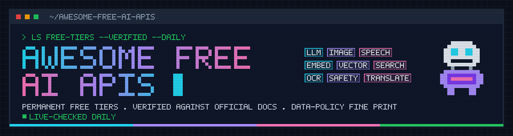

<div align="center">

<a href="https://github.com/IdoY12/awesome-free-ai-apis"></a>

<br>

**Every AI API with a *permanent* free tier — verified against official docs, re-checked daily, with the data-policy fine print nobody else lists.**

<br>

[](https://awesome.re)


[](data/status.json)
[](https://github.com/IdoY12/awesome-free-ai-apis/actions/workflows/verify.yml)
[](LICENSE)
[](CONTRIBUTING.md)
[](https://github.com/IdoY12/awesome-free-ai-apis/stargazers)

<sub>If this saves you a signup or a surprise bill, a ⭐ helps others find it.</sub>

</div>

```text
$ curl -s https://raw.githubusercontent.com/IdoY12/awesome-free-ai-apis/main/data/providers.json | jq '.providers[] | select(.free_tier.api_key_required == false) | .name'
"Kilo Gateway"  "LLM7.io"  "OVHcloud AI Endpoints"  "Pollinations.ai"  "Jina Reader"  "MyMemory"
```

## Why this list is different

| | |
|:--|:--|
| 🔬 **Primary sources only** | Every number links to the provider's own rate-limit, pricing or terms page — never a blog, never a screenshot. Each entry shows its *confidence* and *last-verified* date. |
| 🟢 **Live status, daily** | A GitHub Action calls each API (or pings its docs) every day and turns the badges red when something breaks. Keyless endpoints are exercised for real; keyed ones when a secret is configured. |
| 🧾 **The fine print** | Does the free tier **train on your prompts**? Is **commercial use** allowed? Is a **DPA** offered? Where is it **hosted**? That's a column here, not a footnote. |
| 🧰 **Beyond chat** | 10 more categories a real app needs: image, speech, embeddings, vector DBs, web search, OCR, moderation, translation, vision. |
| ☠️ **The graveyard** | 69 providers people *think* are free and aren't — retired tiers, one-time credits, paid-only. Checked so you don't have to. |
| 🧩 **Machine-readable** | Everything lives in [`data/providers.json`](data/providers.json) (schema in [`data/schema.json`](data/schema.json)). The README is generated from it. |

**Ground rules.** Only tiers that renew forever (per day / per month) count. One-time sign-up credits, 30-day trials and "free for the first N calls" go to the [Graveyard](#-graveyard). Limits shown are the ones the provider publishes; "unclear" means we looked and the official page doesn't say.

## Contents

- [💬 Text & chat LLMs](#-text--chat-llms) <sub>24</sub>
- [🎨 Image generation](#-image-generation) <sub>3</sub>
- [🎙️ Speech-to-text](#-speech-to-text) <sub>4</sub>
- [🔊 Text-to-speech](#-text-to-speech) <sub>8</sub>
- [🧭 Embeddings & reranking](#-embeddings--reranking) <sub>4</sub>
- [🗄️ Vector databases](#-vector-databases) <sub>11</sub>
- [🔎 Web search, scraping & crawling](#-web-search-scraping--crawling) <sub>11</sub>
- [📄 OCR & document parsing](#-ocr--document-parsing) <sub>4</sub>
- [🛡️ Moderation & safety](#-moderation--safety) <sub>3</sub>
- [🌍 Translation](#-translation) <sub>3</sub>
- [👁️ Vision & other](#-vision--other) <sub>4</sub>
- [🧾 Compliance matrix](#-compliance-matrix)
- [☠️ Graveyard](#-graveyard)
- [🙋 Help wanted](#-help-wanted)
- [⚙️ How verification works](#-how-verification-works)
- [🤝 Contributing](#-contributing)

## Quick picks

<sub>Opinionated starting points; check the per-provider limits before you build on them.</sub>

| If you want… | Start with | Why |
|:--|:--|:--|
| The most generous general-purpose free chat API | [Google Gemini API](#-google-gemini-api) | Whole Gemini Flash family free of charge; 1M context. Trade-off: free-tier prompts are used to improve Google products (except EEA/UK/CH). |
| Fastest responses, no training on your data | [Groq](#-groq) | GPT-OSS 120B / 20B and Qwen at LPU speed; contract says Groq may not train on inputs. |
| Many open models behind one key | [OpenRouter](#-openrouter-free-models) | A rotating set of `:free` models (14 on 2026-09-26) + an `openrouter/free` router. 50 RPD, or 1,000 RPD once you've ever bought $10 of credit. |
| Zero signup, zero key | [OVHcloud AI Endpoints](#-ovhcloud-ai-endpoints), [LLM7.io](#-llm7io), [Kilo Gateway](#-kilo-gateway), [Pollinations](#-image-generation) | Anonymous access by IP. Low limits, great for prototypes and CI. |
| EU hosting + no training | [OVHcloud AI Endpoints](#-ovhcloud-ai-endpoints) (France), [Mistral](#-mistral-ai-experiment-plan) (EU, opt-out) | For GDPR-sensitive workloads. |
| A free tier baked into a full platform | [Cloudflare Workers AI](#-cloudflare-workers-ai) | 10,000 neurons/day across text, image, embeddings, STT, TTS — plus Vectorize on the same free plan. |
| Speech in & out | [Groq](#-speech-to-text) (Whisper), [Google Cloud TTS](#-text-to-speech) | 8 free audio-hours/day of Whisper; 4M chars/month of WaveNet TTS. |
| A vector store for a side project | [Qdrant Cloud](#-vector-databases), [Pinecone](#-vector-databases), [Supabase](#-vector-databases) | Permanent free clusters (Qdrant calls its "free forever"); Supabase/Neon give you Postgres + pgvector. |
| Web search for an agent | [Tavily](#-web-search-scraping--crawling) (1,000 credits/mo), [Exa](#-web-search-scraping--crawling) ($10/mo credit) | Both train on queries — see the matrix. [Jina Reader](#-web-search-scraping--crawling) is keyless and doesn't. |

### Legend

| Symbol | Meaning |
|:--|:--|
| 🔑 / 🔓 | API key required / works anonymously |
| 💳 / 🟢 No | Credit card required / not required · 🪪 identity or phone verification |
| 🔴 Yes · 🟡 Opt-out · 🟢 No · ⚪ Unclear | Whether **free-tier** API traffic is used to train the provider's models |
| 🟢 verified · 🟡 partial · 🟠 community-sourced | All key numbers from official pages · some numbers unpublished by the provider · relies on forum/staff statements |
|  | Real API call succeeded in the last daily run ·  docs reachable, no API probe ·  probe failed |
| Tools / JSON / Vision / Reason | Tool calling · JSON / structured output · image input · reasoning model (✅ documented · — no · · unknown) |

---

## 💬 Text & chat LLMs

<sub>24 providers · 98 model rows · 3 need no key at all · 21 need no credit card. (Whole list: 6 keyless, 45 of 79 without a card.)</sub>

### At a glance

| Provider | Free tier in one line | Key · Card | Trains | Commercial | Hosting | Status |
|:--|:--|:--|:--|:--|:--|:--|
| 🇺🇸 [Google Gemini API](#-google-gemini-api) | Gemini Flash / Flash-Lite family free of charge; per-project limits visible only in AI Studio | 🔑 Yes · 🟢 No | 🔴 Yes | 🟢 Yes | Global (Google) |  |
| 🇺🇸 [Groq](#-groq) | 30 RPM · 1K RPD · 8K TPM · 200K TPD per model (GPT-OSS 120B/20B, Qwen3.8 27B) | 🔑 Yes · 🟢 No | 🟢 No | ⚪ Unclear | US |  |
| 🇺🇸 [OpenRouter (free models)](#-openrouter-free-models) | All `:free` models: 20 RPM, 50 RPD (1,000 RPD once you have ever bought ≥$10 credit) | 🔑 Yes · 🟢 No | 🔴 Yes | ⚪ Unclear | Varies (upstream) |  |
| 🇺🇸 [Cloudflare Workers AI](#-cloudflare-workers-ai) | 10,000 Neurons/day across all Workers AI models (≈ 300K input tokens of GPT-OSS 120B) | 🔑 Yes · 🟢 No | 🟢 No | 🟢 Yes | Global edge |  |
| 🇫🇷 [Mistral AI (Experiment plan)](#-mistral-ai-experiment-plan) | Experiment plan: all models, phone verification, limits shown in console only; trains by default (opt-out) | 🔑 Yes · 🟢 No | 🟡 Opt-out | ⚪ Unclear | EU (opt. US) |  |
| 🇨🇦 [Cohere (Trial key)](#-cohere-trial-key) | Trial key: 20 RPM chat, 1,000 API calls/month, all Command models | 🔑 Yes · 🟢 No | 🔴 Yes | ⚪ Unclear | US (GCP) |  |
| 🇺🇸 [SambaNova Cloud](#-sambanova-cloud) | 20 RPM · 20 RPD · 200K TPD per model (DeepSeek-V3.x, Llama 3.3 70B, gpt-oss-120b, Gemma 4) | 🔑 Yes · 🟢 No | 🟢 No | ⚪ Unclear | US |  |
| 🇫🇷 [OVHcloud AI Endpoints](#-ovhcloud-ai-endpoints) | Anonymous: 2 RPM per IP per model, no signup; EU-hosted (Gravelines) | 🔓 None · 🟢 No | 🟢 No | ⚪ Unclear | EU 🇫🇷 Gravelines |  |
| 🇺🇸 [NVIDIA NIM](#-nvidia-nim) | Free with NVIDIA Developer account; ~40 RPM per staff forum post — limits not officially published | 🔑 Yes · 🟢 No | ⚪ Unclear | ⚪ Unclear | Not stated |  |
| 🇺🇸 [Hugging Face Inference Providers](#-hugging-face-inference-providers) | $0.10/month of Inference Provider credit (tiny; routes to 18 providers) | 🔑 Yes · 🟢 No | 🟢 No | 🟢 Yes | Varies (upstream) |  |
| 🇺🇸 [Ollama Cloud](#-ollama-cloud) | Free plan: undisclosed monthly "starter" usage, 1 concurrent request, no logging/training | 🔑 Yes · 🟢 No | 🟢 No | ⚪ Unclear | US (+EU/SG overflow) |  |
| 🇨🇳 [Z.ai (Zhipu GLM Flash)](#-zai-zhipu-glm-flash) | GLM-4.7-Flash, GLM-4.5-Flash, GLM-4.6V-Flash priced Free on the international platform | 🔑 Yes · 🟢 No | 🟢 No | ⚪ Unclear | Singapore |  |
| 🇮🇱 [Aion Labs](#-aion-labs) | 15 RPM · 20K TPM · 20K tokens/day; Israeli lab, reasoning + roleplay models | 🔑 Yes · 🟢 No | ⚪ Unclear | 🟢 Yes | Not stated |  |
| 🇺🇸 [Kilo Gateway](#-kilo-gateway) | No key needed: 200 req/hour per IP on `kilo-auto/free` and `:free` models (logged upstream) | 🔓 None · 🟢 No | 🔴 Yes | ⚪ Unclear | Varies (upstream) |  |
| 🇬🇧 [LLM7.io](#-llm7io) | Anonymous 10 RPM / 60 req/h / 500K tokens/day; free token doubles it (40 RPM, 1M tokens/day) | 🔓 None · 🟢 No | ⚪ Unclear | ⚪ Unclear | Varies (upstream) |  |
| 🇺🇸 [OpenCode Zen](#-opencode-zen) | Rotating set of free (often stealth/preview) models; limits unpublished; free-period data may train | 🔑 Yes · 🟢 No | 🔴 Yes | ⚪ Unclear | US |  |
| 🇺🇸 [Vercel AI Gateway](#-vercel-ai-gateway) | Monthly free credit on Hobby teams (card required); only a few free-tier models | 🔑 Yes · 💳 Yes | 🟢 No | 🟢 Yes | Varies (upstream) |  |
| 🇺🇸 [IBM watsonx.ai (Lite)](#-ibm-watsonxai-lite) | Lite plan: 300,000 tokens/month on Granite + selected models; IBM Cloud regions incl. Frankfurt/London | 🔑 Yes · ⚪ Unclear | ⚪ Unclear | ⚪ Unclear | US/EU/JP/AU regions |  |
| 🇫🇷 [NLP Cloud](#-nlp-cloud) | Free plan for testing only ("must not be used in production"); limits unpublished | 🔑 Yes · 🟢 No | 🟢 No | 🔴 No | Not stated |  |
| 🇸🇬 [Novita AI (Ling free models)](#-novita-ai-ling-free-models) | inclusionAI Ling 3.0 Flash Fin / Sante priced Free (input + output); 256K context | 🔑 Yes · ⚪ Unclear | 🟢 No | ⚪ Unclear | Not stated |  |
| 🇨🇳 [SiliconFlow (CN)](#-siliconflow-cn) | Older 7B-class models (Qwen2 7B, GLM-4 9B…) free on the .cn platform; ID verification | 🔑 Yes · 🟢 No | ⚪ Unclear | ⚪ Unclear | China |  |
| 🇨🇳 [ModelScope API-Inference (CN)](#-modelscope-api-inference-cn) | 2,000 API calls/day on API-Inference-enabled community models; Alibaba account | 🔑 Yes · 🟢 No | ⚪ Unclear | ⚪ Unclear | China |  |
| 🇨🇳 [Baidu Qianfan (CN)](#-baidu-qianfan-cn) | ERNIE Speed / ERNIE Lite free since 2024; Chinese real-name ID; permanence not re-confirmed | 🔑 Yes · 🟢 No | ⚪ Unclear | ⚪ Unclear | China |  |
| 🇨🇳 [iFlytek Spark Lite (CN)](#-iflytek-spark-lite-cn) | Spark Lite (8K in / 4K out) marked free to use; QPS not published | 🔑 Yes · 🟢 No | ⚪ Unclear | ⚪ Unclear | China |  |

---

### 🇺🇸 [Google Gemini API](https://ai.google.dev/)

 <sub>live: skipped · docs: ok</sub> <sub>🟡 partial</sub>

> **Gemini Flash / Flash-Lite family free of charge; per-project limits visible only in AI Studio**

Free usage tier ('Free' usage tier) with per-model RPM/TPM/RPD limits that are no longer published on the docs page; current limits are shown in AI Studio (aistudio.google.com/rate-limit). Most Flash / Flash-Lite / TTS / Live models are 'Free of charge' on the free tier; Pro and image models are 'Not available' on the free tier.

**Get a key:** <https://aistudio.google.com/apikey>  
**Base URL:** `https://generativelanguage.googleapis.com/v1beta` · OpenAI-compatible: 🟡 partial

| API key | Credit card | Trains on your data | Commercial use | DPA / GDPR | Hosting |
|:--|:--|:--|:--|:--|:--|
| 🔑 Yes · 🪪 Google account; must be 18+ and may need to verify age on t… | 🟢 No | 🔴 Yes | 🟢 Yes | 🟢 Yes | Global (Google) |

**Limits:** Not published per model on the docs page as of 2026-09-26: 'Rate limits depend on a variety of factors (such as your usage tier) and can be viewed in Google AI Studio'. Limits are per project (not per key); RPD resets at midnight Pacific. Free tier: spend-based limit N/A. Tier 1 requires linking a billing account.

| Model | ID | Context | Max out | Modality | Tools | JSON | Vision | Reason | Rate limit |
|:--|:--|--:|--:|:--|:-:|:-:|:-:|:-:|:--|
| Gemini 3.8 Flash | `gemini-3.8-flash` | 1M | 64K | text, image, video, audio,… | ✅ | ✅ | ✅ | ✅ | see AI Studio |
| Gemini 3.7 Flash | `gemini-3.7-flash` | — | — | multimodal -> text | ✅ | ✅ | ✅ | ✅ | see AI Studio |
| Gemini 3.6 Flash | `gemini-3.6-flash` | — | — | multimodal -> text | ✅ | ✅ | ✅ | ✅ | see AI Studio |
| Gemini 3.5 Flash | `gemini-3.5-flash` | 1M | 64K | multimodal -> text | ✅ | ✅ | ✅ | ✅ | see AI Studio |
| Gemini 3.5 Flash-Lite | `gemini-3.5-flash-lite` | 1M | 64K | text, image, video, audio,… | ✅ | ✅ | ✅ | ✅ | see AI Studio |
| Gemini 3.1 Flash-Lite | `gemini-3.1-flash-lite` | 1M | 64K | text, image, video, audio,… | ✅ | ✅ | ✅ | ✅ | see AI Studio |
| Gemini 3 Flash Preview | `gemini-3-flash-preview` | — | — | multimodal -> text | ✅ | ✅ | ✅ | ✅ | see AI Studio |

<details><summary><b>Notes &amp; sources</b> · last verified 2026-09-26</summary>

- **Training:** Unpaid Services: 'Google uses the content you submit ... to provide, improve, and develop Google products' (free tier only; paid tier 'No'). EXCEPTION: EEA/Switzerland/UK users get Paid Services data terms on unpaid quota.
- **Commercial use:** No prohibition; terms say use 'is for developers building with Google AI models for professional or business purposes, not for consumer use'. Terms also say 'Do not submit sensitive, confidential, or personal information to the Unpaid Services.'
- **DPA / GDPR:** Paid Services processed 'in accordance with the Data Processing Addendum for Products Where Google is a Data Processor'; for EEA/CH/UK users those Paid Services data terms apply to unpaid quota too. Outside those regions the DPA does not apply to the free tier.
- **Retention:** 55 days abuse monitoring (prompts, context, outputs; human review of flagged content); Grounding with Google Search/Maps stores prompts+output 30 days
- **Hosting:** not stated; 'may be stored transiently or cached in any country in which Google or its agents maintain facilities'
- **Alt endpoint:** OpenAI-compatible: https://generativelanguage.googleapis.com/v1beta/openai/
- **Notes:** Change vs. earlier lists: the public per-model free-tier table (15-30 RPM, 1,500 RPD etc.) is gone from the docs; only AI Studio shows your project's live limits. Model generation is now Gemini 3.x (3.5/3.6/3.7/3.8 Flash); 2.x models are no longer on the pricing page. Live and TTS models are listed under Speech.

**Model notes**
- **Gemini 3.8 Flash:** Free of charge on free tier; 'Used to improve our products: Yes'.
- **Gemini 3.5 Flash:** '1M token context window, 65k max output tokens' (whats-new page). Free of charge on free tier.
- **Gemini 3 Flash Preview:** Preview; free of charge on free tier.

**Official sources**
- [Gemini API rate limits](https://ai.google.dev/gemini-api/docs/rate-limits) <sub>2026-09-26</sub>
- [Gemini API pricing (Free tier column)](https://ai.google.dev/gemini-api/docs/pricing) <sub>2026-09-26</sub>
- [Gemini models](https://ai.google.dev/gemini-api/docs/models) <sub>2026-09-26</sub>
- [Gemini 3.8 Flash model page](https://ai.google.dev/gemini-api/docs/models/gemini-3.8-flash) <sub>2026-09-26</sub>
- [Gemini API additional terms (Unpaid Services data use; EEA/UK/CH exception)](https://ai.google.dev/gemini-api/terms) <sub>2026-09-26</sub>
- [Available regions](https://ai.google.dev/gemini-api/docs/available-regions) <sub>2026-09-26</sub>
- [Gemini API abuse monitoring](https://ai.google.dev/gemini-api/docs/abuse-monitoring) <sub>2026-09-26</sub>

</details>

### 🇺🇸 [Groq](https://groq.com/)

 <sub>live: skipped · docs: ok</sub> <sub>🟢 verified</sub>

> **30 RPM · 1K RPD · 8K TPM · 200K TPD per model (GPT-OSS 120B/20B, Qwen3.8 27B)**

Free plan with per-model RPM/RPD/TPM/TPD limits; 'Upgrade to Developer plan to access higher limits, Batch and Flex processing, and more.'

**Get a key:** <https://console.groq.com/keys>  
**Base URL:** `https://api.groq.com/openai/v1` · OpenAI-compatible: ✅

| API key | Credit card | Trains on your data | Commercial use | DPA / GDPR | Hosting |
|:--|:--|:--|:--|:--|:--|
| 🔑 Yes | 🟢 No | 🟢 No | ⚪ Unclear | 🟢 Yes | US |

**Limits:** Free plan (per model): gpt-oss-120b / gpt-oss-20b / gpt-oss-safeguard-20b / qwen3.8-27b: 30 RPM, 1K RPD, 8K TPM, 200K TPD. llama-prompt-guard-2 (22m/86m): 30 RPM, 14.4K RPD, 15K TPM, 500K TPD. whisper-large-v3 / -turbo: 20 RPM, 2K RPD. Orpheus TTS: 10 RPM, 100 RPD, 1.2K TPM, 3.6K TPD. (llama-3.3-70b-versatile, llama-3.1-8b-instant, minimaxai/minimax-m2.7 are still on the models page but had no rows in the free-tier table fetched.)

| Model | ID | Context | Max out | Modality | Tools | JSON | Vision | Reason | Rate limit |
|:--|:--|--:|--:|:--|:-:|:-:|:-:|:-:|:--|
| GPT-OSS 120B | `openai/gpt-oss-120b` | 128K | 64K | text | ✅ | ✅ | — | ✅ | 30 RPM / 1K RPD / 8K TPM / 200K TPD |
| GPT-OSS 20B | `openai/gpt-oss-20b` | 128K | 64K | text | ✅ | ✅ | — | ✅ | 30 RPM / 1K RPD / 8K TPM / 200K TPD |
| GPT-OSS Safeguard 20B | `openai/gpt-oss-safeguard-20b` | 128K | 64K | text | · | · | — | ✅ | 30 RPM / 1K RPD / 8K TPM / 200K TPD |
| Qwen3.8 27B | `qwen/qwen3.8-27b` | 128K | 16K | text+image -> text | ✅ | ✅ | ✅ | ✅ | 30 RPM / 1K RPD / 8K TPM / 200K TPD |

<details><summary><b>Notes &amp; sources</b> · last verified 2026-09-26</summary>

- **Training:** Services Agreement: 'Groq is not permitted to use Inputs or Outputs for training or fine-tuning any AI Model Services or other models, unless explicitly granted permission or instructed by Customer.'
- **Commercial use:** No restriction found; Services Agreement only says services 'are not for consumer use'.
- **DPA / GDPR:** Public 'Groq Customer Data Processing Addendum' incorporated into the Groq Services Agreement.
- **Retention:** Customer Data deleted within 30 days after termination; no per-request retention period stated
- **Hosting:** US and other countries ('Groq may transfer and Process Personal Data to and in the United States and other countries where Groq or its Subprocessors maintain Processing operations')
- **Notes:** Change vs. earlier lists: Llama 3.x and Llama 4 models are deprecated; free text catalog is now gpt-oss-120b/20b + qwen3.8-27b. Free TPM is only 8K on the main models (RPD 1K). llama-3.3-70b-versatile and llama-3.1-8b-instant are still listed as Production models but have no rows in the Free-plan rate-limit table, so they are omitted. Whisper STT and Orpheus TTS appear in their own sections.

**Model notes**
- **GPT-OSS 120B:** Production. Tool Use, Browser Search, Code Execution, JSON Object Mode, JSON Schema Mode, Reasoning.
- **GPT-OSS Safeguard 20B:** Preview; safety classifier.
- **Qwen3.8 27B:** Preview. Tool Use, JSON Object Mode, JSON Schema Mode, Reasoning, Vision.

**Official sources**
- [Rate limits](https://console.groq.com/docs/rate-limits) <sub>2026-09-26</sub>
- [Supported models](https://console.groq.com/docs/models) <sub>2026-09-26</sub>
- [Model deprecations](https://console.groq.com/docs/deprecations) <sub>2026-09-26</sub>
- [Services agreement (no training on inputs/outputs)](https://console.groq.com/docs/legal/services-agreement) <sub>2026-09-26</sub>
- [gpt-oss-120b model page](https://console.groq.com/docs/model/openai/gpt-oss-120b) <sub>2026-09-26</sub>
- [Groq Customer Data Processing Addendum](https://console.groq.com/docs/legal/customer-data-processing-addendum) <sub>2026-09-26</sub>
- [Groq legal index](https://console.groq.com/docs/legal) <sub>2026-09-26</sub>

</details>

### 🇺🇸 [OpenRouter (free models)](https://openrouter.ai/)

 <sub>live: up · docs: ok</sub> <sub>🟢 verified</sub>

> **All `:free` models: 20 RPM, 50 RPD (1,000 RPD once you have ever bought ≥$10 credit)**

Models with IDs ending in ':free' are $0. Limits: 20 RPM; 50 requests/day if you have bought < 10 credits (all time), 1,000 requests/day once you have bought >= 10 credits (granted from 9 credits to absorb fees). Daily counter resets on UTC day.

**Get a key:** <https://openrouter.ai/settings/keys>  
**Base URL:** `https://openrouter.ai/api/v1` · OpenAI-compatible: ✅

| API key | Credit card | Trains on your data | Commercial use | DPA / GDPR | Hosting |
|:--|:--|:--|:--|:--|:--|
| 🔑 Yes | 🟢 No | 🔴 Yes | ⚪ Unclear | ⚪ Unclear | Varies (upstream) |

**Limits:** FREE_MODEL_RATE_LIMIT_RPM = 20; FREE_MODEL_NO_CREDITS_RPD = 50; FREE_MODEL_HAS_CREDITS_RPD = 1000; FREE_MODEL_CREDITS_THRESHOLD = 10. Check GET /api/v1/key -> free_model_daily_requests. A negative balance blocks free models too.

| Model | ID | Context | Max out | Modality | Tools | JSON | Vision | Reason | Rate limit |
|:--|:--|--:|--:|:--|:-:|:-:|:-:|:-:|:--|
| Free Models Router | `openrouter/free` | — | — | text | · | · | · | · | 20 RPM / 50 or 1000 RPD |
| NVIDIA Nemotron 3 Ultra | `nvidia/nemotron-3-ultra-550b-a55b:free` | 1M | — | text | ✅ | · | — | ✅ | shared free limits |
| NVIDIA Nemotron 3 Super | `nvidia/nemotron-3-super-120b-a12b:free` | 262K | — | text | ✅ | · | — | ✅ | shared free limits |
| NVIDIA Nemotron 3.5 Lightning | `nvidia/nemotron-3.5-lightning:free` | 1M | — | text | ✅ | · | — | · | shared free limits |
| NVIDIA Nemotron 3 Nano Omni | `nvidia/nemotron-3-nano-omni-30b-a3b-reasoning:free` | 256K | — | text, image, video, audio -… | · | · | ✅ | ✅ | shared free limits |
| Qwen3.8 27B | `qwen/qwen3.8-27b:free` | 262K | — | text+image | ✅ | · | ✅ | ✅ | shared free limits |
| Cohere North Mini Code | `cohere/north-mini-code:free` | 256K | — | text (code) | ✅ | · | — | · | shared free limits |
| Thinking Machines Inkling / Inkling Small | `thinkingmachines/inkling:free, thinkingmachines/inkling-sma…` | 1.1M | — | text, image, audio | ✅ | · | ✅ | ✅ | shared free limits |
| Poolside Laguna S 2.1 / XS 2.1 | `poolside/laguna-s-2.1:free, poolside/laguna-xs-2.1:free` | 262K | — | text (code) | ✅ | · | — | ✅ | shared free limits |
| InclusionAI Ling 3.0 Flash Fin / Sante | `inclusionai/ling-3.0-flash-fin:free, inclusionai/ling-3.0-f…` | 262K | — | text | · | · | — | ✅ | shared free limits |
| Dots Studio Dots3-Note Preview | `dots-studio/dots-3-note-preview:free` | 512K | — | multimodal | ✅ | · | ✅ | ✅ | shared free limits |
| Space Bunny Alpha (stealth) | `stealth/space-bunny-alpha` | 1M | — | multimodal | · | · | ✅ | ✅ | shared free limits |
| Liquid LFM2.5 2.6B | `liquid/lfm-2.5-2.6b:free` | 64K | 8K | text | · | · | — | — | shared free limits |

<details><summary><b>Notes &amp; sources</b> · last verified 2026-09-26</summary>

- **Training:** (upstream) OpenRouter itself: 'your prompts are not retained unless you specifically opt in to prompt logging'. Free endpoints: 'If either is off, free endpoints that train or publish get filtered out' — i.e. most :free models require enabling the training and publishing toggles in privacy settings.
- **Commercial use:** No prohibition; FAQ says free models 'are usually not suitable for production use' due to rate limits (50 req/day, 1000 with $10 credits).
- **DPA / GDPR:** Enterprise page: 'Data protection and privacy agreements' offered ('we can provide ours, or review yours'); 'GDPR-compatible, SOC 2 compliant'. Not stated for self-serve accounts.
- **Retention:** OpenRouter: zero retention by default ('OpenRouter itself has a ZDR policy'); upstream providers have their own retention; ZDR-only routing available
- **Hosting:** varies by upstream provider; 'EU/US region locking' available (route only to providers inside the EU or the US)
- **Notes:** Free model catalog rotates constantly; 14 listed on the collection page on 2026-09-26.

**Model notes**
- **Free Models Router:** 'selects free models at random from the models available on OpenRouter'.
- **Poolside Laguna S 2.1 / XS 2.1:** XS: 256K.
- **InclusionAI Ling 3.0 Flash Fin / Sante:** Domain models (finance / medical).
- **Space Bunny Alpha (stealth):** Stealth model; may be withdrawn at any time.
- **Liquid LFM2.5 2.6B:** 'Prompts and outputs may be retained and used to train Liquid models.'

**Official sources**
- [API credit & rate limits](https://openrouter.ai/docs/api_reference/limits) <sub>2026-09-26</sub>
- [Free models collection](https://openrouter.ai/collections/free-models) <sub>2026-09-26</sub>
- [Why do all free models return a 404 (privacy toggles)](https://openrouter.zendesk.com/hc/en-us/articles/51690904755227) <sub>2026-09-26</sub>
- [Provider logging / privacy settings](https://openrouter.ai/docs/guides/privacy/provider-logging) <sub>2026-09-26</sub>
- [openrouter/free router](https://openrouter.ai/openrouter/free) <sub>2026-09-26</sub>
- [OpenRouter FAQ](https://openrouter.ai/docs/faq) <sub>2026-09-26</sub>
- [OpenRouter Zero Data Retention](https://openrouter.ai/docs/features/zdr) <sub>2026-09-26</sub>
- [OpenRouter Privacy and Logging](https://openrouter.ai/docs/features/privacy-and-logging) <sub>2026-09-26</sub>
- [OpenRouter Enterprise](https://openrouter.ai/enterprise) <sub>2026-09-26</sub>

</details>

### 🇺🇸 [Cloudflare Workers AI](https://developers.cloudflare.com/workers-ai/)

 <sub>live: n/a · docs: unknown</sub> <sub>🟢 verified</sub>

> **10,000 Neurons/day across all Workers AI models (≈ 300K input tokens of GPT-OSS 120B)**

'Our free allocation allows anyone to use a total of 10,000 Neurons per day at no charge.' Free Workers plan cannot exceed the allocation; overage requires Workers Paid ($0.011 / 1,000 Neurons). Limits reset 00:00 UTC.

**Get a key:** <https://dash.cloudflare.com/profile/api-tokens>  
**Base URL:** `https://api.cloudflare.com/client/v4/accounts/{account_id}/ai/v1` · OpenAI-compatible: ✅

| API key | Credit card | Trains on your data | Commercial use | DPA / GDPR | Hosting |
|:--|:--|:--|:--|:--|:--|
| 🔑 Yes | 🟢 No | 🟢 No | 🟢 Yes | 🟢 Yes | Global edge |

**Limits:** 10,000 Neurons/day. Text generation: 300 requests per minute by default; models that require Workers Paid: 20 RPM (standard billing) or 50 RPM (prepaid AI Gateway credits).

| Model | ID | Context | Max out | Modality | Tools | JSON | Vision | Reason | Rate limit |
|:--|:--|--:|--:|:--|:-:|:-:|:-:|:-:|:--|
| GPT-OSS 120B | `@cf/openai/gpt-oss-120b` | 128K | — | text | ✅ | · | — | ✅ | $0.35/$0.75 per M = 31,818 / 68,182 neu… |
| GPT-OSS 20B | `@cf/openai/gpt-oss-20b` | — | — | text | ✅ | · | — | ✅ | 18,182 / 27,273 neurons per M in/out |
| Llama 3.3 70B Instruct FP8 Fast | `@cf/meta/llama-3.3-70b-instruct-fp8-fast` | 24K | — | text | ✅ | · | — | — | 26,668 / 204,805 neurons per M in/out |
| Qwen3.8 27B | `@cf/qwen/qwen3.8-27b` | 256K | — | text+image | ✅ | · | ✅ | ✅ | 40,909 / 290,909 neurons per M in/out |
| GLM-4.7-Flash | `@cf/zai-org/glm-4.7-flash` | 128K | — | text | ✅ | · | — | ✅ | 5,500 / 36,400 neurons per M in/out |
| Nemotron 3 120B A12B | `@cf/nvidia/nemotron-3-120b-a12b` | 256K | — | text | ✅ | · | — | ✅ | 45,455 / 136,364 neurons per M |
| Gemma 4 26B A4B IT | `@cf/google/gemma-4-26b-a4b-it` | — | — | text | · | · | · | · | 9,091 / 27,273 neurons per M |
| Llama 4 Scout 17B 16E | `@cf/meta/llama-4-scout-17b-16e-instruct` | — | — | text+image | · | · | ✅ | — | 24,545 / 77,273 neurons per M |
| Mistral Small 3.1 24B | `@cf/mistralai/mistral-small-3.1-24b-instruct` | 128K | — | text+image | · | · | ✅ | — | 31,876 / 50,488 neurons per M |
| Qwen3 30B A3B FP8 | `@cf/qwen/qwen3-30b-a3b-fp8` | — | — | text | · | · | — | ✅ | $0.051/$0.335 per M |
| Granite 4.0 H Micro | `@cf/ibm-granite/granite-4.0-h-micro` | — | — | text | ✅ | · | — | — | $0.017/$0.112 per M |
| Other free-eligible text models | `@cf/meta/llama-3.2-1b-instruct, @cf/meta/llama-3.2-3b-instr…` | — | — | text | · | · | · | · | see pricing table |

<details><summary><b>Notes &amp; sources</b> · last verified 2026-09-26</summary>

- **Training:** 'Cloudflare does not use your Customer Content to (1) train any AI models made available on Workers AI or (2) improve any Cloudflare or third-party services'.
- **DPA / GDPR:** Self-Serve Subscription Agreement 6.1: Cloudflare's Data Processing Addendum 'is hereby incorporated by reference into this Agreement'.
- **Retention:** Workers AI does not store Customer Content unless you use a storage service (R2, KV, DO, Vectorize)
- **Hosting:** Cloudflare global network (not documented per model); DPA anticipates processing outside EEA/UK/CH
- **Alt endpoint:** OpenAI-compatible; native REST at /ai/run/{model}
- **Notes:** CHANGE: seven frontier models (Kimi K2.6/K2.7, GLM-5.x, DeepSeek V4) are excluded from the free allocation and require Workers Paid or prepaid AI Gateway credits.

**Model notes**
- **GPT-OSS 120B:** ~314K input tokens/day on free neurons if output-free.
- **Llama 3.3 70B Instruct FP8 Fast:** Context on model page: 24,000 tokens.
- **GLM-4.7-Flash:** Cheapest strong model on free neurons; NOT in the paid-only list.

**Official sources**
- [Workers AI pricing](https://developers.cloudflare.com/workers-ai/platform/pricing/) <sub>2026-09-26</sub>
- [Workers AI limits](https://developers.cloudflare.com/workers-ai/platform/limits/) <sub>2026-09-26</sub>
- [Models catalog](https://developers.cloudflare.com/workers-ai/models/) <sub>2026-09-26</sub>
- [Workers AI product page (no credit card)](https://www.cloudflare.com/products/workers-ai/) <sub>2026-09-26</sub>
- [Workers AI data usage](https://developers.cloudflare.com/workers-ai/platform/data-usage/) <sub>2026-09-26</sub>
- [Cloudflare Service-Specific Terms: Developer Platform](https://www.cloudflare.com/service-specific-terms-developer-platform/) <sub>2026-09-26</sub>
- [Cloudflare Self-Serve Subscription Agreement](https://www.cloudflare.com/terms/) <sub>2026-09-26</sub>
- [Cloudflare Customer DPA](https://www.cloudflare.com/cloudflare-customer-dpa/) <sub>2026-09-26</sub>

</details>

### 🇫🇷 [Mistral AI (Experiment plan)](https://mistral.ai/)

 <sub>live: skipped · docs: unknown</sub> <sub>🟡 partial</sub>

> **Experiment plan: all models, phone verification, limits shown in console only; trains by default (opt-out)**

Two free paths: (1) Experiment plan — 'You can try Mistral's API for free with the Experiment plan. All you need is a verified phone number (one phone number per plan). No credit card is required.' 'API requests made under the Experiment plan may be used to train Mistral's models.' Rate limits 'restrictive', shown only at console.mistral.ai/limits. (2) mistral.ai/pricing 'Free' plan ($0) now lists '$10 /mo in API credits' among its features ('Subject to fair usage limits and Mistral's Terms of Service'); expiry/conditions of the monthly credits are not stated.

**Get a key:** <https://console.mistral.ai/api-keys>  
**Base URL:** `https://api.mistral.ai/v1` · OpenAI-compatible: 🟡 partial

| API key | Credit card | Trains on your data | Commercial use | DPA / GDPR | Hosting |
|:--|:--|:--|:--|:--|:--|
| 🔑 Yes · 🪪 Verified phone number (one per plan). | 🟢 No | 🟡 Opt-out | ⚪ Unclear | 🟢 Yes | EU (opt. US) |

**Limits:** Not published; docs say 'Please visit https://console.mistral.ai/limits/ for detailed information on the current rate limit and usage tiers for your workspace.' Limits are workspace-level, expressed as requests per second and tokens per minute/month.

| Model | ID | Context | Max out | Modality | Tools | JSON | Vision | Reason | Rate limit |
|:--|:--|--:|--:|:--|:-:|:-:|:-:|:-:|:--|
| Mistral Medium 3.5 | `mistral-medium-latest` | — | — | multimodal -> text | ✅ | ✅ | ✅ | · | console |
| Mistral Small 4 | `mistral-small-latest` | — | — | multimodal -> text | ✅ | ✅ | ✅ | ✅ | console |
| Mistral Large 3 | `mistral-large-latest` | — | — | multimodal -> text | ✅ | ✅ | ✅ | · | console |
| Ministral 3 (14B / 8B / 3B) | `ministral-14b-latest, ministral-8b-latest, ministral-3b-lat…` | — | — | text | ✅ | ✅ | · | · | console |
| Codestral | `codestral-latest` | — | — | text (code) | · | · | — | — | console |

<details><summary><b>Notes &amp; sources</b> · last verified 2026-09-26</summary>

- **Training:** Free mode (Studio): 'we may use your data (input and output) to train our artificial intelligence models'; users 'have the right to opt out at any time' via account control. Commercial ToS 4.2: no training except when not opted out on opt-in-by-default products.
- **Commercial use:** No prohibition found; docs: free tier 'designed to allow you to try and explore our API' and 'For actual projects and production use, we recommend upgrading to a higher tier.'
- **DPA / GDPR:** Public Data Processing Addendum at legal.mistral.ai; Commercial ToS 12.3: 'the Data Processing Agreement ... will apply between the Parties' when Mistral processes personal data on Mistral infrastructure.
- **Retention:** Input/Output kept 'for thirty (30) rolling days to monitor abuse (unless zero data retention is activated)'; Agents API data kept until account termination
- **Hosting:** EU by default ('your data is hosted in the European Union'); US endpoint optional ('explicitly use our US API endpoint')
- **Notes:** Change vs. earlier lists: no official statement of '500K TPM / 1 RPS' — those numbers are not on any official page; the plan is now called 'Experiment' and requires phone verification. Model IDs above use the -latest aliases documented by Mistral; exact context lengths not on the overview page.

**Model notes**
- **Mistral Medium 3.5:** Docs do not state which models the Experiment plan excludes; help center says the Scale plan adds 'access to additional features' incl. frontier models.
- **Mistral Small 4:** Apache 2.0 open-weight; hybrid instruct/reasoning/coding.
- **Mistral Large 3:** Apache 2.0.
- **Ministral 3 (14B / 8B / 3B):** Apache 2.0.
- **Codestral:** v25.08.

**Official sources**
- [How can I try the API for free with the Experiment plan?](https://help.mistral.ai/en/articles/450104-how-can-i-try-the-api-for-free-with-the-experiment-plan) <sub>2026-09-26</sub>
- [Rate limits and usage tiers](https://docs.mistral.ai/deployment/laplateforme/tier) <sub>2026-09-26</sub>
- [Do you use my user data to train your models?](https://help.mistral.ai/en/articles/323757-do-you-use-my-user-data-to-train-your-artificial-intelligence-models) <sub>2026-09-26</sub>
- [Models overview](https://docs.mistral.ai/getting-started/models/models_overview) <sub>2026-09-26</sub>
- [mistral.ai/pricing/](https://mistral.ai/pricing/) <sub>2026-09-26</sub>
- [Mistral Privacy Policy](https://legal.mistral.ai/terms/privacy-policy) <sub>2026-09-26</sub>
- [Mistral Commercial Terms of Service](https://legal.mistral.ai/terms/commercial-terms-of-service) <sub>2026-09-26</sub>
- [Mistral Data Processing Addendum](https://legal.mistral.ai/terms/data-processing-addendum) <sub>2026-09-26</sub>
- [Help: Do you use my user data to train your AI models?](https://help.mistral.ai/en/articles/347617-do-you-use-my-user-data-to-train-your-artificial-intelligence-models) <sub>2026-09-26</sub>
- [Help: Where do you store my data?](https://help.mistral.ai/en/articles/347629-where-do-you-store-my-data-or-my-organization-s-data) <sub>2026-09-26</sub>
- [Mistral docs: tiers](https://docs.mistral.ai/deployment/laplateforme/tier/) <sub>2026-09-26</sub>

</details>

### 🇨🇦 [Cohere (Trial key)](https://cohere.com/)

 <sub>live: skipped · docs: ok</sub> <sub>🟢 verified</sub>

> **Trial key: 20 RPM chat, 1,000 API calls/month, all Command models**

'Every Cohere user receives a free, rate-limited trial key.' 'Trial API key usage is free, but limited.' Chat: 20 requests/min; 'Trial keys (and prod keys on newer Chat model variants) are limited to 1,000 API calls a month.'

**Get a key:** <https://dashboard.cohere.com/api-keys>  
**Base URL:** `https://api.cohere.com/v2` · OpenAI-compatible: 🟡 partial

| API key | Credit card | Trains on your data | Commercial use | DPA / GDPR | Hosting |
|:--|:--|:--|:--|:--|:--|
| 🔑 Yes | 🟢 No | 🔴 Yes | ⚪ Unclear | 🟢 Yes | US (GCP) |

**Limits:** Chat (all Command models): 20 req/min trial; 1,000 API calls/month. Embed 2,000 inputs/min (images 5/min); Rerank 10 req/min; Tokenize 100 req/min; Audio transcriptions 5 req/min; default 500 req/min.

| Model | ID | Context | Max out | Modality | Tools | JSON | Vision | Reason | Rate limit |
|:--|:--|--:|--:|:--|:-:|:-:|:-:|:-:|:--|
| Command A+ | `command-a-plus-05-2026` | 128K | 64K | text+image -> text | ✅ | ✅ | ✅ | ✅ | 20 RPM; 1,000 calls/month |
| Command A | `command-a-03-2025` | 256K | 8K | text | ✅ | ✅ | — | — | 20 RPM; 1,000 calls/month |
| Command A Reasoning | `command-a-reasoning-08-2025` | 256K | 32K | text | ✅ | ✅ | — | ✅ | 20 RPM; 1,000 calls/month |
| Command A Vision | `command-a-vision-07-2025` | 128K | 8K | text+image -> text | · | · | ✅ | — | 20 RPM; 1,000 calls/month |
| Command A Translate | `command-a-translate-08-2025` | 8K | 8K | text | — | — | — | — | 20 RPM; 1,000 calls/month |
| Command R7B | `command-r7b-12-2024` | 128K | 4K | text | ✅ | ✅ | — | · | 20 RPM; 1,000 calls/month |
| Command R+ / Command R | `command-r-plus-08-2024, command-r-08-2024` | 128K | 4K | text | ✅ | ✅ | — | — | 20 RPM; 1,000 calls/month |
| North Mini Code | `north-mini-code-1-0` | 256K | 64K | text (code) | ✅ | · | — | · | 20 RPM trial |

<details><summary><b>Notes &amp; sources</b> · last verified 2026-09-26</summary>

- **Training:** Privacy Policy: trial inputs/outputs may be used 'to conduct research and development'; trial users are told not to submit personal information. The dashboard opt-out is documented only under Enterprise Data Commitments for paying customers.
- **Commercial use:** No non-commercial clause found; Terms of Use forbid 'personal, family or household purposes' only; docs describe trial keys as evaluation keys.
- **DPA / GDPR:** On request: 'Contact privacy@cohere.com if you are a SaaS Platform customer and need a Data Processing Addendum'; Privacy Policy: 'Enterprise Users ... can request a DPA'.
- **Retention:** 'We automatically delete logged prompts and generations after 30 days' (Enterprise Data Commitments); zero data retention available on approval
- **Hosting:** US (GCP) per privacy policy ('cloud infrastructure provided by GCP in the United States')
- **Alt endpoint:** OpenAI-compatible: https://api.cohere.ai/compatibility/v1
- **Notes:** earlier circulated lists's 'non-commercial use only' claim could not be confirmed on the fetched official pages (may be in the ToS).

**Model notes**
- **Command A+:** MoE; production key = contact sales.
- **Command R+ / Command R:** Older generation.
- **North Mini Code:** Listed in the rate-limit table; also on OpenRouter as cohere/north-mini-code:free.

**Official sources**
- [Different types of API keys and rate limits](https://docs.cohere.com/docs/rate-limits) <sub>2026-09-26</sub>
- [Cohere FAQs](https://docs.cohere.com/docs/cohere-faqs) <sub>2026-09-26</sub>
- [Going live](https://docs.cohere.com/docs/going-live) <sub>2026-09-26</sub>
- [Models](https://docs.cohere.com/docs/models) <sub>2026-09-26</sub>
- [cohere.com/terms-of-use](https://cohere.com/terms-of-use) <sub>2026-09-26</sub>
- [Cohere Privacy Policy](https://cohere.com/privacy) <sub>2026-09-26</sub>
- [Cohere Enterprise Data Commitments](https://cohere.com/enterprise-data-commitments) <sub>2026-09-26</sub>
- [Cohere Security](https://cohere.com/security) <sub>2026-09-26</sub>

</details>

### 🇺🇸 [SambaNova Cloud](https://cloud.sambanova.ai/)

 <sub>live: skipped · docs: ok</sub> <sub>🟢 verified</sub>

> **20 RPM · 20 RPD · 200K TPD per model (DeepSeek-V3.x, Llama 3.3 70B, gpt-oss-120b, Gemma 4)**

Rate-limits page still lists a 'Free Tier' with 20 RPM, 20 RPD and 200,000 tokens/day per model. Developer tier requires linking a payment method.

**Get a key:** <https://cloud.sambanova.ai/apis>  
**Base URL:** `https://api.sambanova.ai/v1` · OpenAI-compatible: ✅

| API key | Credit card | Trains on your data | Commercial use | DPA / GDPR | Hosting |
|:--|:--|:--|:--|:--|:--|
| 🔑 Yes | 🟢 No | 🟢 No | ⚪ Unclear | ⚪ Unclear | US |

**Limits:** Free tier per model: 20 RPM, 20 RPD, 200,000 TPD (DeepSeek-V3.1, Meta-Llama-3.3-70B-Instruct, gpt-oss-120b; preview DeepSeek-V3.2, gemma-4-31B-it). Developer tier: 60 RPM / 12,000 RPD (Llama 3.3 70B: 240 RPM / 48,000 RPD), 20M tokens/day across models.

| Model | ID | Context | Max out | Modality | Tools | JSON | Vision | Reason | Rate limit |
|:--|:--|--:|--:|:--|:-:|:-:|:-:|:-:|:--|
| DeepSeek-V3.1 | `DeepSeek-V3.1` | — | — | text | · | · | — | ✅ | 20 RPM / 20 RPD / 200K TPD |
| Meta-Llama-3.3-70B-Instruct | `Meta-Llama-3.3-70B-Instruct` | — | — | text | ✅ | · | — | — | 20 RPM / 20 RPD / 200K TPD |
| gpt-oss-120b | `gpt-oss-120b` | — | — | text | ✅ | · | — | ✅ | 20 RPM / 20 RPD / 200K TPD |
| DeepSeek-V3.2 (preview) | `DeepSeek-V3.2` | — | — | text | · | · | — | ✅ | 20 RPM / 20 RPD / 200K TPD |
| Gemma 4 31B IT (preview) | `gemma-4-31B-it` | — | — | text | · | · | · | · | 20 RPM / 20 RPD / 200K TPD |

<details><summary><b>Notes &amp; sources</b> · last verified 2026-09-26</summary>

- **Training:** Terms of Service define Service Usage Data as 'any data (but not Customer Content)…' — Customer Content is excluded from usage data.
- **Commercial use:** No restriction found; docs: 'Preview models ... are offered as early access models primarily for trial purposes'.
- **DPA / GDPR:** No DPA link on legal page; privacy policy references SCCs for EEA transfers.
- **Hosting:** US ('As SambaNova is located in the United States, your Personal Information needs to be transferred to the United States')
- **Notes:** Only 20 requests/day per model — effectively a smoke-test tier. Some third-party lists claim SambaNova discontinued free access; the official rate-limit page still documents the Free tier rows as of today, so it is included with that caveat. MiniMax-M2.7 is Developer-tier only.

**Official sources**
- [Rate limits policy](https://docs.sambanova.ai/docs/en/models/rate-limits) <sub>2026-09-26</sub>
- [Developer tier launch blog ($5 credit expires in 3 months — separate from the Free tier rows)](https://sambanova.ai/blog/sambanova-cloud-developer-tier-is-live) <sub>2026-09-26</sub>
- [SambaCloud Terms of Service](https://sambanova.ai/cloud-end-user-license-agreement) <sub>2026-09-26</sub>
- [SambaNova Privacy Policy](https://sambanova.ai/privacy-policy) <sub>2026-09-26</sub>

</details>

### 🇫🇷 [OVHcloud AI Endpoints](https://www.ovhcloud.com/en/public-cloud/ai-endpoints/)

 <sub>live: up · docs: broken</sub> <sub>🟢 verified</sub>

> **Anonymous: 2 RPM per IP per model, no signup; EU-hosted (Gravelines)**

Anonymous (no API key, no signup): '2 requests per minute, per IP and per model'. Authenticated: 400 requests/minute per project per model — but 'Access keys created from Public Cloud projects in Discovery mode (without a payment method) cannot use the service.' So the free path is anonymous only.

**Get a key:** <https://www.ovh.com/manager/>  
**Base URL:** `https://oai.endpoints.kepler.ai.cloud.ovh.net/v1` · OpenAI-compatible: ✅

| API key | Credit card | Trains on your data | Commercial use | DPA / GDPR | Hosting |
|:--|:--|:--|:--|:--|:--|
| 🔓 None | 🟢 No | 🟢 No | ⚪ Unclear | ⚪ Unclear | EU 🇫🇷 Gravelines |

**Limits:** Anonymous (no token): '2 requests per minute, per IP and per model'. Authenticated: '400 requests per minute, per Public Cloud project and per model' (429 on excess). Payload: '2 MB per request body' (VLMs '10 MB per request body'). 'No usage limits currently apply beyond rate and payload restrictions', OVHcloud may add token-consumption limits in future.

| Model | ID | Context | Max out | Modality | Tools | JSON | Vision | Reason | Rate limit |
|:--|:--|--:|--:|:--|:-:|:-:|:-:|:-:|:--|
| gpt-oss-120b | `gpt-oss-120b` | 131K | — | text -> text | · | · | — | ✅ | anon 2 RPM/IP/model; auth 400 RPM |
| gpt-oss-20b | `gpt-oss-20b` | 131K | — | text -> text | · | · | — | ✅ | anon 2 RPM/IP/model; auth 400 RPM |
| Qwen3.8-27B | `qwen-3-8-27b` | 262K | — | text, image -> text | · | · | ✅ | · | anon 2 RPM/IP/model; auth 400 RPM |
| Qwen3.6-27B | `qwen-3-6-27b` | 262K | — | text, image -> text | · | · | ✅ | · | anon 2 RPM/IP/model; auth 400 RPM |
| Qwen3.5-397B-A17B | `qwen-3-5-397b` | 262K | — | text, image -> text | · | · | ✅ | · | anon 2 RPM/IP/model; auth 400 RPM |
| Qwen3.5-9B | `qwen-3-5-9b` | 262K | — | text, image -> text | · | · | ✅ | · | anon 2 RPM/IP/model; auth 400 RPM |
| Qwen2.5-VL-72B-Instruct | `qwen-2-5-vl-72b-instruct` | 32K | — | text, image -> text | · | · | ✅ | — | anon 2 RPM/IP/model; auth 400 RPM |
| Mistral-Small-3.2-24B-Instruct-2506 | `mistral-small-3-2-24b-instruct-2506` | 128K | — | text, image -> text | · | · | ✅ | — | anon 2 RPM/IP/model; auth 400 RPM |
| Meta-Llama-3.3-70B-Instruct | `llama-3-3-70b-instruct` | 131K | — | text -> text | · | · | — | — | anon 2 RPM/IP/model; auth 400 RPM |
| Mistral-Nemo-Instruct-2407 | `mistral-nemo-instruct-2407` | 118K | — | text -> text | · | · | — | — | anon 2 RPM/IP/model; auth 400 RPM |
| Mistral-7B-Instruct-v0.3 | `mistral-7b-instruct-v0-3` | 32K | — | text -> text | · | · | — | — | anon 2 RPM/IP/model; auth 400 RPM |
| Qwen3-Coder-30B-A3B-Instruct | `qwen-3-coder-30b-a3b-instruct` | 256K | — | text -> text | · | · | — | — | anon 2 RPM/IP/model; auth 400 RPM |
| Qwen3Guard-Gen-8B / Qwen3Guard-Gen-0.6B | `qwen-guard-gen-8b, qwen-guard-gen-06b` | 32K | — | text -> safety classificati… | — | · | — | — | anon 2 RPM/IP/model; auth 400 RPM |

<details><summary><b>Notes &amp; sources</b> · last verified 2026-09-26</summary>

- **Training:** 'Data is not stored or shared during or after model use.'
- **DPA / GDPR:** OVHcloud is an EU (French) provider and states data is not stored; a DPA page was not among the sources read.
- **Hosting:** Gravelines, France (EU)
- **Notes:** Model list and contexts now verified directly from the official catalog API (catalog.endpoints.ai.ovh.net/rest/v1/models_v2) and the public catalog page. Qwen3Guard-Gen (8B/0.6B), nvr-tts-* and stable-diffusion-xl-base-v10 are listed with price 'Free' on the catalog page (i.e. free even with an authenticated key). Data: 'Data is not stored or shared during or after model use.' Hosted in Gravelines, France. Keys: Public Cloud project → AI Endpoints → API keys (only needed for the 400 RPM authenticated tier).

**Model notes**
- **gpt-oss-120b:** Reasoning LLM; paid price 0.08/0.4 EUR per Mtoken
- **gpt-oss-20b:** Reasoning LLM
- **Qwen3.8-27B:** Vision LLM
- **Qwen3.6-27B:** Vision LLM
- **Qwen3.5-397B-A17B:** Vision LLM
- **Qwen3.5-9B:** Vision LLM
- **Qwen2.5-VL-72B-Instruct:** Vision LLM
- **Mistral-Small-3.2-24B-Instruct-2506:** Vision LLM
- **Qwen3-Coder-30B-A3B-Instruct:** Code LLM
- **Qwen3Guard-Gen-8B / Qwen3Guard-Gen-0.6B:** Catalog price: 'Free' (also for authenticated use)

**Official sources**
- [AI Endpoints — features, capabilities and limitations (rate limits, data)](https://docs.ovhcloud.com/en/guides/public-cloud/ai-machine-learning/ai-endpoints-capabilities) <sub>2026-09-26</sub>
- [AI Endpoints — getting started (Discovery-mode keys cannot use the service)](https://docs.ovhcloud.com/en/guides/public-cloud/ai-machine-learning/ai-endpoints-getting-started) <sub>2026-09-26</sub>
- [AI Endpoints — catalog API](https://docs.ovhcloud.com/en/guides/public-cloud/ai-machine-learning/ai-endpoints-catalog-api) <sub>2026-09-26</sub>
- [catalog.endpoints.ai.ovh.net/rest/v1/models_v2](https://catalog.endpoints.ai.ovh.net/rest/v1/models_v2) <sub>2026-09-26</sub>
- [www.ovhcloud.com/en/public-cloud/ai-endpoints/catalog/](https://www.ovhcloud.com/en/public-cloud/ai-endpoints/catalog/) <sub>2026-09-26</sub>

</details>

### 🇺🇸 [NVIDIA NIM](https://build.nvidia.com/)

 <sub>live: skipped · docs: ok</sub> <sub>🟠 community-sourced</sub>

> **Free with NVIDIA Developer account; ~40 RPM per staff forum post — limits not officially published**

'Free serverless APIs for development' (build.nvidia.com). NVIDIA does not publish per-model limits; staff on the developer forum describe a 40 RPM trial rate limit and state 'We do not plan to publish specific model limits'. Older forum posts describe 1,000 sign-up credits (5,000 with business email); current forum threads reference the same figures but no official page confirms credits or expiry.

**Get a key:** <https://build.nvidia.com/settings/api-keys>  
**Base URL:** `https://integrate.api.nvidia.com/v1` · OpenAI-compatible: ✅

| API key | Credit card | Trains on your data | Commercial use | DPA / GDPR | Hosting |
|:--|:--|:--|:--|:--|:--|
| 🔑 Yes · 🪪 NVIDIA developer account (business email unlocks more credi… | 🟢 No | ⚪ Unclear | ⚪ Unclear | ⚪ Unclear | Not stated |

**Limits:** Not officially documented. Forum (NVIDIA staff): ~40 requests/min for trial APIs; 'There is no official way to circumvent this rate limit or to receive a rate limit increase on that same tier.'

| Model | ID | Context | Max out | Modality | Tools | JSON | Vision | Reason | Rate limit |
|:--|:--|--:|--:|:--|:-:|:-:|:-:|:-:|:--|
| Full catalog (100+ models): Nemotron 3 family, Llama 3.x/4, Qwen, DeepSeek, GPT-OSS, Mistral | <sub>not published</sub> | — | — | text / multimodal | · | · | · | · | ~40 RPM (forum) |

<details><summary><b>Notes &amp; sources</b> · last verified 2026-09-26</summary>

- **Training:** NVIDIA Technology Access Terms: 'NVIDIA may collect data, such as the NVIDIA Content you have downloaded or NVIDIA Services you have accessed ... for improving NVIDIA products and services' (usage data). Resellers (Kilo, OpenCode) reproduce an NVIDIA notice: 'Your use is logged for security purposes and to improve NVIDIA products and services' -- not verifiable on nvidia.com (pages JS-only).
- **Commercial use:** Terms: 'NVIDIA may offer free or discounted pricing programs for the Technology for trial, evaluation or academic use.'
- **DPA / GDPR:** NVIDIA Cloud Services DPA exists but Appendix 3 lists DGX Cloud, Brev and Omniverse on DGX Cloud only; API catalog / build.nvidia.com not listed.
- **Hosting:** not stated for API catalog; privacy policy: 'in most cases we need to securely transfer and store your information in the United States'
- **Notes:** Qualifies only on the basis of NVIDIA's own 'free serverless APIs for development' wording + staff forum statements; the '10,000 RPD' in the earlier circulated lists is not on any official page. Whether credits are finite (trial) or unlimited is not officially documented — flag as 'permanence unverified'.

**Model notes**
- **Full catalog (100+ models): Nemotron 3 family, Llama 3.x/4, Qwen, DeepSeek, GPT-OSS, Mistral:** Catalog page could not be enumerated by the fetcher; list is dynamic.

**Official sources**
- [build.nvidia.com discover ('Free serverless APIs for development')](https://build.nvidia.com/explore/discover) <sub>2026-09-26</sub>
- [NVIDIA forum: Model limits (staff: limits not published; 40 RPM)](https://forums.developer.nvidia.com/t/model-limits/331075) <sub>2026-09-26</sub>
- [NVIDIA forum: API credits for build.nvidia.com (staff, 2024: 1,000 credits, up to 5,000)](https://forums.developer.nvidia.com/t/api-credits-for-build-nvidia-com/306633/2) <sub>2026-09-26</sub>
- [NVIDIA forum: rate limit increase request (moderator: no increase on free tier)](https://forums.developer.nvidia.com/t/request-for-nvidia-nim-api-rate-limit-increase-40-to-200-rpm/374542) <sub>2026-09-26</sub>
- [NVIDIA Technology Access Terms of Use](https://developer.nvidia.com/legal/terms) <sub>2026-09-26</sub>
- [NVIDIA Cloud Services Data Processing Addendum](https://www.nvidia.com/en-us/agreements/data-processing-addendum/nvidia-cloud-services-data-processing-addendum/) <sub>2026-09-26</sub>
- [NVIDIA Privacy Policy](https://www.nvidia.com/en-us/about-nvidia/privacy-policy/) <sub>2026-09-26</sub>

</details>

### 🇺🇸 [Hugging Face Inference Providers](https://huggingface.co/docs/inference-providers)

 <sub>live: skipped · docs: unknown</sub> <sub>🟡 partial</sub>

> **$0.10/month of Inference Provider credit (tiny; routes to 18 providers)**

Free users get '$0.10, subject to change' in monthly credits spendable on Inference Providers; PRO $2.00/month; Team/Enterprise $2.00 per seat. Beyond credits: 'credits purchase required'. Custom provider keys (BYOK) do not use credits.

**Get a key:** <https://huggingface.co/settings/tokens>  
**Base URL:** `https://router.huggingface.co/v1` · OpenAI-compatible: ✅

| API key | Credit card | Trains on your data | Commercial use | DPA / GDPR | Hosting |
|:--|:--|:--|:--|:--|:--|
| 🔑 Yes | 🟢 No | 🟢 No | 🟢 Yes | 🟢 Yes | Varies (upstream) |

**Limits:** No RPM figure published; usage is metered against the $0.10 monthly credit at each provider's price.

| Model | ID | Context | Max out | Modality | Tools | JSON | Vision | Reason | Rate limit |
|:--|:--|--:|--:|:--|:-:|:-:|:-:|:-:|:--|
| Any Inference-Providers model, e.g. `openai/gpt-oss-120b`, `Qwen/Qwen3-…`, `meta-llama/Llama-…` (append `:provider` to pin a host) | <sub>not published</sub> | — | — | text / multimodal | · | · | · | · | $0.10/month credit |

<details><summary><b>Notes &amp; sources</b> · last verified 2026-09-26</summary>

- **Training:** (HF routing only) 'Hugging Face does not store any user data for training purposes. We do not store the request body or response when routing requests through Hugging Face.' Routed providers' own policies apply.
- **Commercial use:** Pricing page: free credits usable on Inference Providers; 'All users can continue using the API after exhausting their monthly credits ... for production workloads'. No non-commercial clause.
- **DPA / GDPR:** 'GDPR data processing agreements are available through an Enterprise Plan' (Hub security docs) -- paid plan only.
- **Retention:** 'Logs are kept for debugging purposes for up to 30 days, but no user data or tokens are stored.'
- **Hosting:** HF servers in the US ('The Company and its servers are located in the United States'); inference runs at the routed provider
- **Notes:** Matches earlier circulated lists. $0.10/month is tiny (a few hundred K tokens on cheap models).

**Model notes**
- **Any Inference-Providers model, e.g. `openai/gpt-oss-120b`, `Qwen/Qwen3-…`, `meta-llama/Llama-…` (append `:provider` to pin a host):** Public AI provider usage was 'free of charge' at time of its launch blog.

**Official sources**
- [Pricing and billing](https://huggingface.co/docs/inference-providers/pricing) <sub>2026-09-26</sub>
- [Inference Providers index](https://huggingface.co/docs/inference-providers/index) <sub>2026-09-26</sub>
- [Public AI on Inference Providers (blog)](https://huggingface.co/blog/inference-providers-publicai) <sub>2026-09-26</sub>
- [Inference Providers: Security & Compliance](https://huggingface.co/docs/inference-providers/en/security) <sub>2026-09-26</sub>
- [Inference Providers pricing](https://huggingface.co/docs/inference-providers/en/pricing) <sub>2026-09-26</sub>
- [Hub security](https://huggingface.co/docs/hub/security) <sub>2026-09-26</sub>
- [Hugging Face Privacy Policy](https://huggingface.co/privacy) <sub>2026-09-26</sub>

</details>

### 🇺🇸 [Ollama Cloud](https://ollama.com/cloud)

 <sub>live: skipped · docs: ok</sub> <sub>🟡 partial</sub>

> **Free plan: undisclosed monthly "starter" usage, 1 concurrent request, no logging/training**

Free plan: 'Free accounts include a starter amount of usage for a smaller set of starter models'; 'On the Free plan, usage resets monthly from the date you signed up'; 'Free includes 1 concurrent request'; 'Add credits to unlock all models'. Starter amount and starter-model list are not published.

**Get a key:** <https://ollama.com/settings/keys>  
**Base URL:** `https://ollama.com/api` · OpenAI-compatible: 🟡 partial

| API key | Credit card | Trains on your data | Commercial use | DPA / GDPR | Hosting |
|:--|:--|:--|:--|:--|:--|
| 🔑 Yes · 🪪 One account per person. | 🟢 No | 🟢 No | ⚪ Unclear | ⚪ Unclear | US (+EU/SG overflow) |

**Limits:** 1 concurrent request (Free); monthly included usage amount not disclosed; usage metered in tokens at per-model rates.

| Model | ID | Context | Max out | Modality | Tools | JSON | Vision | Reason | Rate limit |
|:--|:--|--:|--:|:--|:-:|:-:|:-:|:-:|:--|
| Cloud catalog: gemma4, gpt-oss, qwen3.5, glm-5.x, deepseek-v4.x, kimi-k2.x/k3, minimax-m3, nemotron-3, mistral-large-3 (which are "starter models" is not published) | <sub>not published</sub> | — | — | text / multimodal | ✅ | · | ✅ | ✅ | monthly starter usage |

<details><summary><b>Notes &amp; sources</b> · last verified 2026-09-26</summary>

- **Training:** 'We do not use your inputs or outputs to train any AI models' (Privacy Policy); cloud page: 'Prompt or response data is never logged or trained on.'
- **Commercial use:** No restriction found in Terms; free accounts 'include a starter amount of usage for a smaller set of starter models'.
- **DPA / GDPR:** Privacy Policy mentions GDPR rights only; no DPA found.
- **Retention:** transient: 'content is not stored beyond the time required to fulfill the request'
- **Hosting:** US primarily; may route to Europe and Singapore ('Ollama hosts models and compute resources primarily in the United States. To serve global demand, we may route to Europe and Singapore')
- **Alt endpoint:** native); OpenAI- and Anthropic-compatible clients supported per docs (endpoint page not fetched
- **Notes:** Change vs. earlier lists: Ollama moved to per-token pricing; the free plan is now 'a small amount of monthly usage for a set of starter models' (amount undisclosed), not the old session/weekly limits.

**Model notes**
- **Cloud catalog: gemma4, gpt-oss, qwen3.5, glm-5.x, deepseek-v4.x, kimi-k2.x/k3, minimax-m3, nemotron-3, mistral-large-3 (which are "starter models" is not published):** gemma4:31b-cloud page: 256K context, native function calling, thinking modes, image input; $0.14/$0.40 per M in/out.

**Official sources**
- [Ollama pricing + FAQ](https://ollama.com/pricing) <sub>2026-09-26</sub>
- [Ollama's transparent pricing (blog)](https://ollama.com/blog/transparent-pricing) <sub>2026-09-26</sub>
- [Cloud docs](https://docs.ollama.com/cloud) <sub>2026-09-26</sub>
- [Cloud model search](https://ollama.com/search?c=cloud) <sub>2026-09-26</sub>
- [Ollama Privacy Policy](https://ollama.com/privacy) <sub>2026-09-26</sub>
- [Ollama Terms of Service](https://ollama.com/terms) <sub>2026-09-26</sub>
- [Ollama Cloud](https://ollama.com/cloud) <sub>2026-09-26</sub>

</details>

### 🇨🇳 [Z.ai (Zhipu GLM Flash)](https://z.ai/)

 <sub>live: skipped · docs: broken</sub> <sub>🟡 partial</sub>

> **GLM-4.7-Flash, GLM-4.5-Flash, GLM-4.6V-Flash priced Free on the international platform**

Official pricing page lists GLM-4.7-Flash, GLM-4.5-Flash (text) and GLM-4.6V-Flash (vision) as 'Free' for input and output. Release notes describe GLM-4.7-Flash as 'the free-tier version of GLM-4.7'. No rate-limit or concurrency numbers are published for free models.

**Get a key:** <https://z.ai/manage-apikey/apikey-list>  
**Base URL:** `https://api.z.ai/api/paas/v4` · OpenAI-compatible: ✅

| API key | Credit card | Trains on your data | Commercial use | DPA / GDPR | Hosting |
|:--|:--|:--|:--|:--|:--|
| 🔑 Yes | 🟢 No | 🟢 No | ⚪ Unclear | 🟢 Yes | Singapore |

**Limits:** Not published for free models (only paid GLM Coding Plan limits are documented). Third-party sources report 1 concurrent request; unverified.

| Model | ID | Context | Max out | Modality | Tools | JSON | Vision | Reason | Rate limit |
|:--|:--|--:|--:|:--|:-:|:-:|:-:|:-:|:--|
| GLM-4.7-Flash | `glm-4.7-flash` | — | — | text | ✅ | · | — | ✅ | — |
| GLM-4.5-Flash | `glm-4.5-flash` | — | — | text | ✅ | · | — | ✅ | — |
| GLM-4.6V-Flash | `glm-4.6v-flash` | — | — | text+image/video -> text | · | · | ✅ | · | — |

<details><summary><b>Notes &amp; sources</b> · last verified 2026-09-26</summary>

- **Training:** Terms of Use (API/enterprise): 'We will not use End User Content to develop or improve Services, unless you explicitly agree to such use'. (Individual chat users: Z.ai reserves right to process User Content to improve Services.)
- **Commercial use:** No restriction found for free Flash models on pricing page or terms.
- **DPA / GDPR:** Privacy Policy includes a public 'Data Processing Addendum for API Services' (Z.ai as Data Processor).
- **Retention:** 'The Company do not store any of the content the Customer or its End Users provide or generate'; processed in real time, temporary storage only as needed
- **Hosting:** Singapore ('Company generally provide the Services from Singapore')
- **Alt endpoint:** OpenAI-compatible); https://api.z.ai/api/anthropic (Anthropic-compatible
- **Notes:** Matches the previously circulated figure of model names. GLM-5.3-Flash is NOT free on Z.ai ($0.15/$0.50); only 4.x Flash models are free.

**Model notes**
- **GLM-4.7-Flash:** Free. (Cloudflare's copy documents 131,072 context + function calling + reasoning; Z.ai model page returned 404 to the fetcher.)
- **GLM-4.6V-Flash:** Free (vision).

**Official sources**
- [Z.ai pricing (Flash models 'Free')](https://docs.z.ai/guides/overview/pricing) <sub>2026-09-26</sub>
- [Z.ai release notes (GLM-4.7-Flash = free-tier version)](https://docs.z.ai/release-notes/new-released) <sub>2026-09-26</sub>
- [Z.ai quick start (base URL)](https://docs.z.ai/guides/overview/quick-start) <sub>2026-09-26</sub>
- [Z.ai Privacy Policy incl. DPA for API Services](https://docs.z.ai/legal-agreement/privacy-policy) <sub>2026-09-26</sub>
- [Z.ai Terms of Use](https://docs.z.ai/legal-agreement/terms-of-use) <sub>2026-09-26</sub>

</details>

### 🇮🇱 [Aion Labs](https://www.aionlabs.ai/)

 <sub>live: skipped · docs: ok</sub> <sub>🟢 verified</sub>

> **15 RPM · 20K TPM · 20K tokens/day; Israeli lab, reasoning + roleplay models**

Free tier ('Default on signup'): 15 RPM, 20,000 TPM, 20,000 tokens/day. Pricing page: 'A daily credit allowance to try agent jobs, the API, and browser chat. No card required.' 'Once reached, a tier is never reduced.'

**Get a key:** <https://www.aionlabs.ai/app/api-keys/>  
**Base URL:** `https://api.aionlabs.ai/v1` · OpenAI-compatible: ✅

| API key | Credit card | Trains on your data | Commercial use | DPA / GDPR | Hosting |
|:--|:--|:--|:--|:--|:--|
| 🔑 Yes | 🟢 No | ⚪ Unclear | 🟢 Yes | ⚪ Unclear | Not stated |

**Limits:** Free: 15 RPM / 20,000 TPM / 20,000 tokens per day. Tier 1 (any top-up): 50 RPM / 1M TPM / unlimited daily; up to Tier 5 ($1,000 lifetime): 1,000 RPM / 20M TPM.

| Model | ID | Context | Max out | Modality | Tools | JSON | Vision | Reason | Rate limit |
|:--|:--|--:|--:|:--|:-:|:-:|:-:|:-:|:--|
| Aion 3.5 | `aion-labs/aion-3.5` | — | — | text | · | · | · | · | free tier limits |
| Aion 3.5 Mini | `aion-labs/aion-3.5-mini` | — | — | text | · | · | · | · | free tier limits |
| Aion 3.0 / 3.0 Mini | `aion-labs/aion-3.0, aion-labs/aion-3.0-mini` | — | — | text | · | · | · | · | free tier limits |
| Aion 2.0 | `aion-labs/aion-2.0` | — | — | text | · | · | · | · | free tier limits |
| Aion RP Llama 3.1 8B | `aion-labs/aion-rp-llama-3.1-8b` | — | — | text | · | · | — | — | free tier limits |

<details><summary><b>Notes &amp; sources</b> · last verified 2026-09-26</summary>

- **Training:** Privacy: 'we do not review the content of your prompts or generated outputs'; prompts 'are transmitted to one or more third-party providers for processing'. No statement on training by Aion or upstream.
- **Commercial use:** ToS 5.1 grants license 'in commercial contexts such as building and operating products and services using the Aion Labs API' (no free-tier distinction).
- **DPA / GDPR:** GDPR rights acknowledged; no DPA found.
- **Hosting:** not stated (company in Poland; 'may be transferred to, stored, and processed in countries' with different laws)
- **Notes:** Matches earlier circulated lists; adds aion-3.5 / 3.5-mini.

**Model notes**
- **Aion 3.5:** Paid price $3/$6 per M; free tier not stated to exclude any model.
- **Aion RP Llama 3.1 8B:** Roleplay model.

**Official sources**
- [Aion Labs rate limits](https://www.aionlabs.ai/docs/rate-limits/) <sub>2026-09-26</sub>
- [Aion Labs pricing page (no card required)](https://www.aionlabs.ai/pricing/) <sub>2026-09-26</sub>
- [Aion Labs docs (base URL, OpenAI compatibility)](https://www.aionlabs.ai/docs/) <sub>2026-09-26</sub>
- [Model prices](https://www.aionlabs.ai/docs/pricing/) <sub>2026-09-26</sub>
- [Aion Labs Terms](https://www.aionlabs.ai/terms) <sub>2026-09-26</sub>
- [Aion Labs Privacy](https://www.aionlabs.ai/privacy) <sub>2026-09-26</sub>

</details>

### 🇺🇸 [Kilo Gateway](https://kilo.ai/gateway)

 <sub>live: up · docs: broken</sub> <sub>🟢 verified</sub>

> **No key needed: 200 req/hour per IP on `kilo-auto/free` and `:free` models (logged upstream)**

'The gateway allows unauthenticated access for free models only' (IDs tagged ':free'); 'Anonymous requests are identified by IP address and are subject to rate limiting (200 requests per hour per IP).' Router 'kilo-auto/free' is 'Free with limited capability. No credits required.'

**Get a key:** <https://kilo.ai/>  
**Base URL:** `https://api.kilo.ai/api/gateway` · OpenAI-compatible: ✅

| API key | Credit card | Trains on your data | Commercial use | DPA / GDPR | Hosting |
|:--|:--|:--|:--|:--|:--|
| 🔓 None | 🟢 No | 🔴 Yes | ⚪ Unclear | 🟢 Yes | Varies (upstream) |

**Limits:** 200 requests/hour per IP for anonymous/free models (kilo-auto/free). Upstream providers may add their own limits.

| Model | ID | Context | Max out | Modality | Tools | JSON | Vision | Reason | Rate limit |
|:--|:--|--:|--:|:--|:-:|:-:|:-:|:-:|:--|
| Auto Free router | `kilo-auto/free` | — | — | text | · | · | · | · | 200 req/hour/IP |
| `:free`-suffixed models in the live catalog (e.g. `minimax/minimax-m2.5:free`); set changes often | <sub>not published</sub> | — | — | text | · | · | · | · | 200 req/hour/IP |

<details><summary><b>Notes &amp; sources</b> · last verified 2026-09-26</summary>

- **Training:** (upstream) 'Auto Free may route your requests to providers that log prompts and outputs and use them to improve their services.' NVIDIA free endpoints: 'Trial use only - do not submit personal or confidential data.' Kilo ToS grants license to use Customer Data 'to provide and improve the Service'.
- **Commercial use:** No free-tier commercial restriction found; NVIDIA endpoints marked 'Trial use only'.
- **DPA / GDPR:** ToS references 'Kilo's data processing agreement'; Privacy Policy mentions SCCs. EU Data Residency offered to enterprise (kilo.ai/eu).
- **Hosting:** US ('The Services are hosted in the United States'); EU data residency for enterprise; inference at upstream providers
- **Alt endpoint:** OpenRouter-compatible listing at /api/openrouter/models
- **Notes:** Matches earlier circulated lists. Note the router is spelled kilo-auto/free in the docs.

**Model notes**
- **Auto Free router:** 'Availability changes; check the live model catalog for current free options and model IDs' via GET https://api.kilo.ai/api/gateway/models (no auth).
- **`:free`-suffixed models in the live catalog (e.g. `minimax/minimax-m2.5:free`); set changes often:** Catalog not enumerable by the fetcher; third-party trackers report ~40 free models.

**Official sources**
- [Gateway authentication (anonymous free access, 200 req/hour/IP)](https://kilo.ai/docs/gateway/authentication) <sub>2026-09-26</sub>
- [Models & providers (free models, data caution)](https://kilo.ai/docs/gateway/models-and-providers) <sub>2026-09-26</sub>
- [Rate limits and costs](https://kilo.ai/docs/getting-started/rate-limits-and-costs) <sub>2026-09-26</sub>
- [Using Kilo for free](https://kilo.ai/docs/getting-started/using-kilo-for-free) <sub>2026-09-26</sub>
- [Kilo Terms of Service](https://kilo.ai/terms) <sub>2026-09-26</sub>
- [Kilo Privacy Policy](https://kilo.ai/privacy) <sub>2026-09-26</sub>

</details>

### 🇬🇧 [LLM7.io](https://llm7.io/)

 <sub>live: up · docs: ok</sub> <sub>🟢 verified</sub>

> **Anonymous 10 RPM / 60 req/h / 500K tokens/day; free token doubles it (40 RPM, 1M tokens/day)**

Anonymous: 1 RPS, 10 RPM, 60 requests/hour, 500,000 tokens per 24 hours. Free token: 2 RPS, 40 RPM, 100 requests/hour, 1,000,000 tokens per 24 hours. Pro $12/month: 25 RPS, 1,500 RPM, 15,000/hour.

**Get a key:** <https://token.llm7.io>  
**Base URL:** `https://api.llm7.io/v1` · OpenAI-compatible: ✅

| API key | Credit card | Trains on your data | Commercial use | DPA / GDPR | Hosting |
|:--|:--|:--|:--|:--|:--|
| 🔓 None | 🟢 No | ⚪ Unclear | ⚪ Unclear | ⚪ Unclear | Varies (upstream) |

**Limits:** See summary (docs.llm7.io/limits). Image/video endpoints billed separately.

| Model | ID | Context | Max out | Modality | Tools | JSON | Vision | Reason | Rate limit |
|:--|:--|--:|--:|:--|:-:|:-:|:-:|:-:|:--|
| Rotating `turbo` catalog — GPT-OSS, Gemma 4, MiniMax M2.7, Codestral, Mistral Nemo per README; list via `GET /v1/models` | <sub>not published</sub> | — | — | text / multimodal | · | · | · | · | tier limits above |

<details><summary><b>Notes &amp; sources</b> · last verified 2026-09-26</summary>

- **Training:** not on the limits page; project is AGPL open source and proxies to third-party providers.
- **Hosting:** upstream providers (Azure, Cloudflare, OpenAI and others per README)
- **Notes:** Matches earlier circulated lists; adds 'Free token' tier (40 RPM / 100 per hour / 1M tokens per day).

**Model notes**
- **Rotating `turbo` catalog — GPT-OSS, Gemma 4, MiniMax M2.7, Codestral, Mistral Nemo per README; list via `GET /v1/models`:** Model IDs from third-party snapshot; official model list not fetched.

**Official sources**
- [LLM7 limits](https://docs.llm7.io/limits) <sub>2026-09-26</sub>
- [llm7.io README (base URL, OpenAI-compatible)](https://github.com/chigwell/llm7.io/blob/main/README.md) <sub>2026-09-26</sub>

</details>

### 🇺🇸 [OpenCode Zen](https://opencode.ai/zen)

 <sub>live: skipped · docs: broken</sub> <sub>🟢 verified</sub>

> **Rotating set of free (often stealth/preview) models; limits unpublished; free-period data may train**

Docs list a set of models 'available at no cost': Big Pickle, Space Bunny Free, MiMo-V2.6-Flash Free, MiMo-V2.5 Free, Ling 3.0 Flash Fin Free, Nemotron 3 Ultra Free, Nemotron 3.5 Lightning Free, Muse Spark 1.3 Contributor Free, Jev 1.13 Free. Usable from any app with a Zen API key.

**Get a key:** <https://opencode.ai/auth>  
**Base URL:** `https://opencode.ai/zen/v1` · OpenAI-compatible: ✅

| API key | Credit card | Trains on your data | Commercial use | DPA / GDPR | Hosting |
|:--|:--|:--|:--|:--|:--|
| 🔑 Yes | 🟢 No | 🔴 Yes | ⚪ Unclear | ⚪ Unclear | US |

**Limits:** Not published.

| Model | ID | Context | Max out | Modality | Tools | JSON | Vision | Reason | Rate limit |
|:--|:--|--:|--:|:--|:-:|:-:|:-:|:-:|:--|
| Rotating free models — IDs listed on the Zen docs page | <sub>not published</sub> | — | — | text | ✅ | · | · | · | — |

<details><summary><b>Notes &amp; sources</b> · last verified 2026-09-26</summary>

- **Training:** Free/trial models: 'During its free period, collected data may be used to improve the model' (Big Pickle, MiMo, Ling Flash); Nemotron: 'logged ... to improve NVIDIA products'; Muse Spark Contributor Free: permission for Meta to train. Other models: 'zero-retention policy and do not use your data for model training'.
- **Retention:** zero retention for most providers; OpenAI/Anthropic 30 days; free-period models collect data
- **Hosting:** US ('All our models are hosted in the US.')
- **Alt endpoint:** OpenAI-compatible: /v1/chat/completions, /v1/responses; Anthropic-compatible: /v1/messages
- **Notes:** NEW vs earlier circulated lists. Free models are 'trial period' style previews per the data-policy note; permanence not guaranteed.

**Model notes**
- **Rotating free models — IDs listed on the Zen docs page:** Catalog rotates; several are stealth/preview models.

**Official sources**
- [OpenCode Zen docs](https://opencode.ai/docs/zen/) <sub>2026-09-26</sub>

</details>

### 🇺🇸 [Vercel AI Gateway](https://vercel.com/ai-gateway)

 <sub>live: n/a · docs: ok</sub> <sub>🟢 verified</sub>

> **Monthly free credit on Hobby teams (card required); only a few free-tier models**

'The free tier is a monthly included credit, not an expiring trial. It covers a subset of models with lower per-model rate limits.' Amount of the monthly credit is not stated in the docs (third parties say $5). A valid payment method must be added before free credits can be used (403 customer_verification_required).

**Get a key:** <https://vercel.com/d?to=/[team]/~/ai-gateway/api-keys>  
**Base URL:** `https://ai-gateway.vercel.sh/v1` · OpenAI-compatible: ✅

| API key | Credit card | Trains on your data | Commercial use | DPA / GDPR | Hosting |
|:--|:--|:--|:--|:--|:--|
| 🔑 Yes · 🪪 Payment method on the Vercel team ('customer_verification_r… | 💳 Yes | 🟢 No | 🟢 Yes | ⚪ Unclear | Varies (upstream) |

**Limits:** Free tier: 'Lower limit per model' — numbers not published ('Limits can change, so this page describes behavior rather than fixed numbers'). Paid tier: no AI Gateway limits.

| Model | ID | Context | Max out | Modality | Tools | JSON | Vision | Reason | Rate limit |
|:--|:--|--:|--:|:--|:-:|:-:|:-:|:-:|:--|
| Free-tier-eligible subset (4 models on 2026-09-26) | `stealth/pixel-canary, inclusionai/ling-3.0-flash-sante, inc…` | — | — | text | · | · | · | · | lower per-model limits |

<details><summary><b>Notes &amp; sources</b> · last verified 2026-09-26</summary>

- **Training:** (gateway) — 'Vercel does not train on your prompts, and AI Gateway itself does not retain prompt or response content'. Upstream provider policies apply; ZDR / disallow-prompt-training controls are Pro/Enterprise features.
- **Hosting:** varies by upstream provider (regional inference controls on paid plans)
- **Notes:** NEW vs earlier circulated lists. Borderline: permanent monthly credit, but a card must be on file and the free catalog is tiny.

**Model notes**
- **Free-tier-eligible subset (4 models on 2026-09-26):** Browse https://vercel.com/ai-gateway/models?freeTier=true.

**Official sources**
- [AI Gateway pricing (free and paid tiers)](https://vercel.com/docs/ai-gateway/pricing) <sub>2026-09-26</sub>
- [AI Gateway FAQ (free tier not a trial; payment method required; no training)](https://vercel.com/docs/ai-gateway/faq) <sub>2026-09-26</sub>
- [AI Gateway rate limits](https://vercel.com/docs/ai-gateway/rate-limits) <sub>2026-09-26</sub>
- [Free tier models](https://vercel.com/ai-gateway/models?freeTier=true) <sub>2026-09-26</sub>

</details>

### 🇺🇸 [IBM watsonx.ai (Lite)](https://www.ibm.com/products/watsonx-ai)

 <sub>live: n/a · docs: ok</sub> <sub>🟢 verified</sub>

> **Lite plan: 300,000 tokens/month on Granite + selected models; IBM Cloud regions incl. Frankfurt/London**

Pricing page free plan: 'Foundation Models: Up to 300,000 tokens per month', '20 Compute Usage Hours (CUH) per month', 'Text Extraction: Up to 100 documents per month'.

**Get a key:** <https://cloud.ibm.com/iam/apikeys>  
**Base URL:** `https://{region}.ml.cloud.ibm.com/ml/v1` · OpenAI-compatible: ❌

| API key | Credit card | Trains on your data | Commercial use | DPA / GDPR | Hosting |
|:--|:--|:--|:--|:--|:--|
| 🔑 Yes | ⚪ Unclear | ⚪ Unclear | ⚪ Unclear | 🟢 Yes | US/EU/JP/AU regions |

**Limits:** 300,000 tokens/month (foundation models).

| Model | ID | Context | Max out | Modality | Tools | JSON | Vision | Reason | Rate limit |
|:--|:--|--:|--:|:--|:-:|:-:|:-:|:-:|:--|
| IBM Granite family + selected third-party models (see catalog) | <sub>not published</sub> | — | — | text | · | · | · | · | 300K tokens/month |

<details><summary><b>Notes &amp; sources</b> · last verified 2026-09-26</summary>

- **Hosting:** IBM Cloud regions (Dallas, Frankfurt, London, Tokyo, Sydney per IBM Cloud)
- **Notes:** NEW vs earlier circulated lists. Expiry and credit-card requirement not stated on the pricing page; IBM Cloud Lite accounts have historically not required a card, but this was not verified today.

**Official sources**
- [watsonx.ai pricing](https://www.ibm.com/products/watsonx-ai/pricing) <sub>2026-09-26</sub>

</details>

### 🇫🇷 [NLP Cloud](https://nlpcloud.com/)

 <sub>live: n/a · docs: ok</sub> <sub>🟡 partial</sub>

> **Free plan for testing only ("must not be used in production"); limits unpublished**

'All the models can be tested for free thanks to the Free plan without a credit card, but the throughput on this plan is very limited.'

**Get a key:** <https://nlpcloud.com/home/token>  
**Base URL:** `https://api.nlpcloud.io/v1` · OpenAI-compatible: ❌

| API key | Credit card | Trains on your data | Commercial use | DPA / GDPR | Hosting |
|:--|:--|:--|:--|:--|:--|
| 🔑 Yes | 🟢 No | 🟢 No | 🔴 No | ⚪ Unclear | Not stated |

**Limits:** Not published ('very limited').

| Model | ID | Context | Max out | Modality | Tools | JSON | Vision | Reason | Rate limit |
|:--|:--|--:|--:|:--|:-:|:-:|:-:|:-:|:--|
| All hosted models, testing only | <sub>not published</sub> | — | — | text | · | · | · | · | — |

<details><summary><b>Notes &amp; sources</b> · last verified 2026-09-26</summary>

- **Training:** 'We cannot see your data, we do not store your data, and we do not use your data to train our own AI models.' Privacy: 'we DO NOT keep any data sent to our API'.
- **Commercial use:** ToS on the free plan: 'must only be used for development and testing. It must not be used in production.'
- **DPA / GDPR:** Claims 'HIPAA / GDPR / CCPA compliant'; no DPA document found.
- **Retention:** no request data stored; only request metadata (account id, service, status) kept for accounting
- **Hosting:** 'controlled from its facilities in the United States, and operated in various countries worldwide'; specific-region hosting is a paid add-on
- **Notes:** Marginal: free plan exists but limits are undisclosed; pay-as-you-go plan gives $15 initial credit (card required).

**Official sources**
- [NLP Cloud home (free plan statement)](https://nlpcloud.com/) <sub>2026-09-26</sub>
- [NLP Cloud Terms of Service](https://nlpcloud.com/tos.html) <sub>2026-09-26</sub>
- [NLP Cloud Privacy Policy](https://nlpcloud.com/privacy.html) <sub>2026-09-26</sub>

</details>

### 🇸🇬 [Novita AI (Ling free models)](https://novita.ai/)

 <sub>live: n/a · docs: ok</sub> <sub>🟡 partial</sub>

> **inclusionAI Ling 3.0 Flash Fin / Sante priced Free (input + output); 256K context**

Official pricing page lists 'Ling 3.0 Flash Fin' and 'Ling 3.0 Flash Sante' (inclusionAI) with 'Input: Free' and 'Output: Free' (256K context). No duration or expiry stated. All other models are paid per token; no signup credits stated.

**Get a key:** <https://novita.ai/settings/key-management>  
**Base URL:** `https://api.novita.ai/openai` · OpenAI-compatible: ✅

| API key | Credit card | Trains on your data | Commercial use | DPA / GDPR | Hosting |
|:--|:--|:--|:--|:--|:--|
| 🔑 Yes | ⚪ Unclear | 🟢 No | ⚪ Unclear | ⚪ Unclear | Not stated |

**Limits:** Tiered by monthly spend (T1 < $50/month … T5 ≥ $10,000); exact RPM/TPM per model shown in a dynamic table on the rate-limits page (not extractable).

| Model | ID | Context | Max out | Modality | Tools | JSON | Vision | Reason | Rate limit |
|:--|:--|--:|--:|:--|:-:|:-:|:-:|:-:|:--|
| Ling 3.0 Flash Fin | <sub>not published</sub> | 256K | — | text -> text | · | · | — | · | T1 (see rate-limits page) |
| Ling 3.0 Flash Sante | <sub>not published</sub> | 256K | — | text -> text | · | · | — | · | T1 (see rate-limits page) |

<details><summary><b>Notes &amp; sources</b> · last verified 2026-09-26</summary>

- **Training:** 'By Default, Novita AI will not use your Content to train our own models or to improve the Services.'
- **DPA / GDPR:** Privacy Policy references SCCs / EU-US DPF; no DPA found.
- **Retention:** 'we will not ... retain your Content beyond the time it takes to generate Output and deliver that Output to you'
- **Hosting:** not stated ('may transfer Personal Information to countries outside your country or region, including the United States')
- **Notes:** Domain-specific (finance/health) Ling 3.0 variants; free status may be promotional — no term stated. HQ country from general knowledge. Contradicts the earlier Novita blog statement that no $0 model exists.

**Model notes**
- **Ling 3.0 Flash Fin:** 'Input: Free, Output: Free' on pricing page; exact model id string not extractable — check novita.ai/models Model id string not shown on the pricing page.
- **Ling 3.0 Flash Sante:** 'Input: Free, Output: Free' on pricing page Model id string not shown on the pricing page.

**Official sources**
- [Novita AI pricing](https://novita.ai/pricing) <sub>2026-09-26</sub>
- [Novita LLM API guide (base URL)](https://docs.novita.ai/guides/llm-api) <sub>2026-09-26</sub>
- [Novita LLM rate limits](https://docs.novita.ai/guides/llm-rate-limits) <sub>2026-09-26</sub>
- [Novita Terms of Service](https://novita.ai/legal/terms-of-service) <sub>2026-09-26</sub>
- [Novita Privacy Policy](https://novita.ai/legal/privacy-policy) <sub>2026-09-26</sub>

</details>

### 🇨🇳 [SiliconFlow (CN)](https://siliconflow.cn/)

 <sub>live: n/a · docs: ok</sub> <sub>🟡 partial</sub>

> **Older 7B-class models (Qwen2 7B, GLM-4 9B…) free on the .cn platform; ID verification**

Docs model list marks seven small open models as free (免费) 'provided they do not exceed the platform's rate limits'; 'The Rate Limits for free models are fixed'. The international site (siliconflow.com) shows no free models.

**Get a key:** <https://cloud.siliconflow.cn/account/ak>  
**Base URL:** `https://api.siliconflow.cn/v1` · OpenAI-compatible: ✅

| API key | Credit card | Trains on your data | Commercial use | DPA / GDPR | Hosting |
|:--|:--|:--|:--|:--|:--|
| 🔑 Yes · 🪪 Identity verification required to lift the 100 requests/day… | 🟢 No | ⚪ Unclear | ⚪ Unclear | 🔴 No | China |

**Limits:** Free models: fixed limits (values not printed on the fetched page; usage tier L0 is 1,000 RPM / 40,000 TPM for paid models). Unverified users: 100 requests/day on DeepSeek-R1 and DeepSeek-V3.

| Model | ID | Context | Max out | Modality | Tools | JSON | Vision | Reason | Rate limit |
|:--|:--|--:|--:|:--|:-:|:-:|:-:|:-:|:--|
| Qwen2 7B Instruct | `Qwen/Qwen2-7B-Instruct` | 32K | — | text | · | · | — | — | fixed |
| Qwen2 1.5B Instruct | `Qwen/Qwen2-1.5B-Instruct` | 32K | — | text | · | · | — | — | fixed |
| Qwen1.5 7B Chat | `Qwen/Qwen1.5-7B-Chat` | 32K | — | text | · | · | — | — | fixed |
| GLM-4 9B Chat | `THUDM/glm-4-9b-chat` | 32K | — | text | · | · | — | — | fixed |
| ChatGLM3 6B | `THUDM/chatglm3-6b` | 32K | — | text | · | · | — | — | fixed |
| InternLM2.5 7B Chat | `internlm/internlm2_5-7b-chat` | 32K | — | text | · | · | — | — | fixed |
| Mistral 7B Instruct v0.2 | `mistralai/Mistral-7B-Instruct-v0.2` | 32K | — | text | · | · | — | — | fixed |

<details><summary><b>Notes &amp; sources</b> · last verified 2026-09-26</summary>

- **Commercial use:** 'the company retains interpretation rights regarding the free model offerings'.
- **Hosting:** China
- **Notes:** Change vs. earlier lists: the '1,000 RPM / 50,000 TPM for free models' figure is not on the fetched rate-limit page (those are L0/L1 paid-tier numbers). Free models are old-generation (Qwen2, GLM-4-9B). The docs model-list page may be stale; re-check cloud.siliconflow.cn/models. International site: https://siliconflow.com/ (lists no free models).

**Official sources**
- [SiliconFlow model list (free models marked 免费)](https://docs.siliconflow.com/quickstart/models) <sub>2026-09-26</sub>
- [Rate limits and upgrades](https://docs.siliconflow.com/en/userguide/rate-limits/rate-limit-and-upgradation) <sub>2026-09-26</sub>
- [International models page (no free models)](https://www.siliconflow.com/models) <sub>2026-09-26</sub>

</details>

### 🇨🇳 [ModelScope API-Inference (CN)](https://modelscope.cn/)

 <sub>live: n/a · docs: ok</sub> <sub>🟡 partial</sub>

> **2,000 API calls/day on API-Inference-enabled community models; Alibaba account**

ModelScope headline (modelscope.cn/headlines/article/795): registration grants '每日2000次调用' (2,000 free API calls/day) via SDK token. Limits page title: 'API-Inference使用限制'; page meta describes the service as '开源模型服务化并通过API接口进行标准化，免费提供给广大开发者体验' and '非商业化，非盈利产品' (non-commercial, non-profit product). Body of the limits page could not be extracted (JS-rendered).

**Get a key:** <https://modelscope.cn/my/myaccesstoken>  
**Base URL:** `https://api-inference.modelscope.cn/v1` · OpenAI-compatible: ✅

| API key | Credit card | Trains on your data | Commercial use | DPA / GDPR | Hosting |
|:--|:--|:--|:--|:--|:--|
| 🔑 Yes · 🪪 Third-party guides state Alibaba Cloud account binding + re… | 🟢 No | ⚪ Unclear | ⚪ Unclear | 🔴 No | China |

**Limits:** 2,000 calls/day per user (official headline). Per-model cap (<= 500/day) and dynamic concurrency limits are reported by the earlier circulated lists/Cherry Studio docs but the official limits page was not readable by the fetcher.

| Model | ID | Context | Max out | Modality | Tools | JSON | Vision | Reason | Rate limit |
|:--|:--|--:|--:|:--|:-:|:-:|:-:|:-:|:--|
| API-Inference-enabled community models, e.g. `Qwen/Qwen3-235B-A22B-Instruct-2507`, `ZhipuAI/GLM-4.6` | <sub>not published</sub> | — | — | text | · | · | · | · | 2,000 calls/day total |

<details><summary><b>Notes &amp; sources</b> · last verified 2026-09-26</summary>

- **Commercial use:** official limits page metadata calls API-Inference a '非商业化，非盈利产品' (non-commercial, non-profit product), which describes the service itself; no explicit user-side commercial-use prohibition was readable.
- **Hosting:** China (Alibaba)

**Model notes**
- **API-Inference-enabled community models, e.g. `Qwen/Qwen3-235B-A22B-Instruct-2507`, `ZhipuAI/GLM-4.6`:** Availability depends on model popularity in the community; list is dynamic.

**Official sources**
- [ModelScope headline: free inference API, 2,000 calls/day on registration](https://modelscope.cn/headlines/article/795) <sub>2026-09-26</sub>
- [API-Inference usage limits (page body not extractable)](https://www.modelscope.ai/docs/model-service/API-Inference/limits) <sub>2026-09-26</sub>
- [modelscope.cn/docs/model-service/API-Inference/limits](https://modelscope.cn/docs/model-service/API-Inference/limits) <sub>2026-09-26</sub>

</details>

### 🇨🇳 [Baidu Qianfan (CN)](https://cloud.baidu.com/product/qianfan.html)

 <sub>live: n/a · docs: ok</sub> <sub>🟠 community-sourced</sub> <sub>⚠️ **possibly stale** — official pages could not be re-read</sub>

> **ERNIE Speed / ERNIE Lite free since 2024; Chinese real-name ID; permanence not re-confirmed**

Baidu Cloud article: 'ERNIE Speed and ERNIE Lite 全面免费开放' (fully free) effective 2024-05-21; requires Baidu Cloud registration, real-name authentication, activating the model service and creating AK/SK.

**Get a key:** <https://console.bce.baidu.com/qianfan/>  
**Base URL:** `https://qianfan.baidubce.com/v2` · OpenAI-compatible: ✅

| API key | Credit card | Trains on your data | Commercial use | DPA / GDPR | Hosting |
|:--|:--|:--|:--|:--|:--|
| 🔑 Yes · 🪪 Real-name authentication (Chinese ID) on Baidu Intelligent… | 🟢 No | ⚪ Unclear | ⚪ Unclear | 🔴 No | China |

**Limits:** Not stated on the fetched pages (third parties claim QPS 50).

| Model | ID | Context | Max out | Modality | Tools | JSON | Vision | Reason | Rate limit |
|:--|:--|--:|--:|:--|:-:|:-:|:-:|:-:|:--|
| ERNIE Speed (8K / 128K) | `ernie-speed-8k, ernie-speed-128k` | 8K | — | text | · | · | — | — | — |
| ERNIE Lite (8K) | `ernie-lite-8k` | 8K | — | text | · | · | — | — | — |

<details><summary><b>Notes &amp; sources</b> · last verified 2026-09-26</summary>

- **Hosting:** China
- **Alt endpoint:** OpenAI-compatible v2 API
- **Notes:** Not re-confirmed on a current official page. The only official statement of free ERNIE Speed/Lite remains the 2024-05-21 article ('全面免费开放', no expiry stated).5 Turbo at ¥0.0008/千tokens and mentions a 'Token Plan个人版' but no permanently free models. Model-billing pages (doc/qianfan-docs/s/Wm9k4qj6i, qm9k5xg80, product/wenxinworkshop/pricing.html) returned 404. Treat the free-model claim as stale until the current 模型服务计费 page is read.

**Model notes**
- **ERNIE Speed (8K / 128K):** Free since 2024-05-21.
- **ERNIE Lite (8K):** Free since 2024-05-21.

**Official sources**
- [Baidu Cloud article: ERNIE Speed free usage guide](https://cloud.baidu.com/article/3366724) <sub>2026-09-26</sub>
- [Qianfan docs hub (20 CNY voucher for new users)](https://cloud.baidu.com/doc/WENXINWORKSHOP/s/wlwg8f1i3) <sub>2026-09-26</sub>

</details>

### 🇨🇳 [iFlytek Spark Lite (CN)](https://xinghuo.xfyun.cn/sparkapi)

 <sub>live: n/a · docs: ok</sub> <sub>🟡 partial</sub>

> **Spark Lite (8K in / 4K out) marked free to use; QPS not published**

Official HTTP API doc lists model 'lite' (Spark Lite) as '轻量级大语言模型，具有更高的响应速度，支持免费使用' (supports free use). Free quota is claimed on the product page ('请点击前往产品页面领取免费额度'); amount and QPS not stated in the docs fetched.

**Get a key:** <https://console.xfyun.cn/>  
**Base URL:** `https://spark-api-open.xf-yun.com/v1` · OpenAI-compatible: ✅

| API key | Credit card | Trains on your data | Commercial use | DPA / GDPR | Hosting |
|:--|:--|:--|:--|:--|:--|
| 🔑 Yes | 🟢 No | ⚪ Unclear | ⚪ Unclear | 🔴 No | China |

**Limits:** Not stated; error codes 11202 (秒级流控超限) and 11203 (并发流控超限) indicate per-second and concurrency caps; higher concurrency by contacting sales.

| Model | ID | Context | Max out | Modality | Tools | JSON | Vision | Reason | Rate limit |
|:--|:--|--:|--:|:--|:-:|:-:|:-:|:-:|:--|
| Spark Lite | `lite` | 8K | 4K | text -> text | · | · | — | — | — |

<details><summary><b>Notes &amp; sources</b> · last verified 2026-09-26</summary>

- **Hosting:** China
- **Notes:** Product/pricing page (xinghuo.xfyun.cn/sparkapi) is JS-only; free quota size and whether it is time-limited could not be read. Chinese account required.

**Model notes**
- **Spark Lite:** Max input 8K, max output 4K, default max_tokens 4096; marked 免费使用

**Official sources**
- [Spark HTTP 调用文档 (OpenAI-compatible)](https://www.xfyun.cn/doc/spark/HTTP%E8%B0%83%E7%94%A8%E6%96%87%E6%A1%A3.html) <sub>2026-09-26</sub>
- [Spark WebSocket doc](https://www.xfyun.cn/doc/spark/Web.html) <sub>2026-09-26</sub>

</details>

## 🎨 Image generation

| Provider | Permanent free tier | Models / features | Key · Card | Trains · Commercial | Hosting | Status |
|:--|:--|:--|:--|:--|:--|:--|
| 🇩🇪 **[Pollinations.ai](https://enter.pollinations.ai/keys)**<br><sub>🟡 partial</sub> | Keyless & anonymous: `flux` images always free; other free models cost 0 Pollen; numeric limits unpublished<br><sub>POLLEN_FAQ.md: 'You can use our API with Anonymous access — no signup, account, or payment needed. You can call all free models, subject to standard rate limits.' 'Free…</sub> | flux, sana, zimage, klein, gpt-image-2, kontext / nanobanana* / seedream* / ideogram-v4-*… | 🔓 None<br>🟢 No | ⚪ Unclear<br>⚪ Unclear | Not stated |  |
| 🇺🇸 **[Cloudflare Workers AI (Neurons)](https://dash.cloudflare.com/profile/api-tokens)**<br><sub>🟢 verified</sub> | Same 10,000 Neurons/day: FLUX.1 schnell (≈4.8 neurons per 512² tile + 9.6/step), SDXL, Whisper, TTS, embeddings<br><sub>10,000 Neurons/day (resets daily). Neuron costs: flux-1-schnell '4.80 neurons per 512x512 tile' + '9.60 neurons per step'; whisper 41.14/audio-min; whisper-large-v3-turb…</sub> | @cf/black-forest-labs/flux-1-schnell, flux-2-dev / flux-2-klein-4b / flux-2-klein-9b, sta… | 🔑 Yes<br>⚪ Unclear | 🟢 No<br>🟢 Yes | Global edge |  |
| 🇺🇸 **[Hugging Face Inference Providers](https://huggingface.co/settings/tokens)**<br><sub>🟢 verified</sub> | $0.10/month credit spendable on text-to-image, embeddings, ASR/TTS via routed providers<br><sub>$0.10 per month for Free users (PRO: $2.00/month; Team/Enterprise: $2.00 per seat). Rate limits not published on pricing page.</sub> | text-to-image (e.g. FLUX.1-dev via fal/replicate/hf-inference), feature-extraction (embed… | 🔑 Yes<br>🟢 No | 🟢 No<br>🟢 Yes | Varies (upstream) |  |

<details><summary><b>Pollinations.ai — notes &amp; sources</b> · last verified 2026-09-26</summary>

- **Training:** Official README claims 'No logins, no keys, no data stored' / 'zero data storage'; no terms/privacy page reachable.
- **Commercial use:** Code/API docs are MIT licensed; no service terms found.
- **Retention:** 'zero data storage and completely anonymous usage' (README claim)
- **Notes:** Also exposes text, video, audio and embeddings endpoints; only 'flux' is explicitly documented as always free. HQ country from general knowledge, not from fetched page.

**Official sources**
- [Pollinations APIDOCS.md](https://raw.githubusercontent.com/pollinations/pollinations/master/APIDOCS.md) <sub>2026-09-26</sub>
- [Pollinations POLLEN_FAQ.md](https://github.com/pollinations/pollinations/blob/master/enter.pollinations.ai/POLLEN_FAQ.md) <sub>2026-09-26</sub>
- [raw.githubusercontent.com/pollinations/pollinations/master/enter.polli](https://raw.githubusercontent.com/pollinations/pollinations/master/enter.pollinations.ai/POLLEN_FAQ.md) <sub>2026-09-26</sub>
- [raw.githubusercontent.com/pollinations/pollinations/main/shared/regist](https://raw.githubusercontent.com/pollinations/pollinations/main/shared/registry/image.ts) <sub>2026-09-26</sub>
- [Pollinations README](https://github.com/pollinations/pollinations/blob/master/README.md) <sub>2026-09-26</sub>
- [Pollinations API docs](https://github.com/pollinations/pollinations/blob/master/APIDOCS.md) <sub>2026-09-26</sub>

</details>
<details><summary><b>Cloudflare Workers AI (Neurons) — notes &amp; sources</b> · last verified 2026-09-26</summary>

- **Training:** 'Cloudflare does not use your Customer Content to (1) train any AI models made available on Workers AI or (2) improve any Cloudflare or third-party services'.
- **DPA / GDPR:** Self-Serve Subscription Agreement 6.1: Cloudflare's Data Processing Addendum 'is hereby incorporated by reference into this Agreement'.
- **Retention:** Workers AI does not store Customer Content unless you use a storage service (R2, KV, DO, Vectorize)
- **Hosting:** Cloudflare global network (not documented per model); DPA anticipates processing outside EEA/UK/CH
- **Notes:** Single entry spanning categories image_generation, stt, tts, embeddings, reranking, moderation, translation, vision_other. Some models (Kimi, DeepSeek variants) require a paid billing method. Credit-card requirement for Workers Free plan not stated on pricing page.

**Official sources**
- [Workers AI pricing](https://developers.cloudflare.com/workers-ai/platform/pricing/) <sub>2026-09-26</sub>
- [Workers AI models catalog](https://developers.cloudflare.com/workers-ai/models/) <sub>2026-09-26</sub>
- [Workers AI data usage](https://developers.cloudflare.com/workers-ai/platform/data-usage/) <sub>2026-09-26</sub>
- [Cloudflare Service-Specific Terms: Developer Platform](https://www.cloudflare.com/service-specific-terms-developer-platform/) <sub>2026-09-26</sub>
- [Cloudflare Self-Serve Subscription Agreement](https://www.cloudflare.com/terms/) <sub>2026-09-26</sub>
- [Cloudflare Customer DPA](https://www.cloudflare.com/cloudflare-customer-dpa/) <sub>2026-09-26</sub>

</details>
<details><summary><b>Hugging Face Inference Providers — notes &amp; sources</b> · last verified 2026-09-26</summary>

- **Training:** (HF routing only) 'Hugging Face does not store any user data for training purposes. We do not store the request body or response when routing requests through Hugging Face.' Routed providers' own policies apply.
- **Commercial use:** Pricing page: free credits usable on Inference Providers; 'All users can continue using the API after exhausting their monthly credits ... for production workloads'. No non-commercial clause.
- **DPA / GDPR:** 'GDPR data processing agreements are available through an Enterprise Plan' (Hub security docs) -- paid plan only.
- **Retention:** 'Logs are kept for debugging purposes for up to 30 days, but no user data or tokens are stored.'
- **Hosting:** HF servers in the US ('The Company and its servers are located in the United States'); inference runs at the routed provider
- **Notes:** Credit is tiny; ZeroGPU Spaces are a separate free GPU allowance. Also relevant to embeddings/reranking categories.

**Official sources**
- [Inference Providers pricing](https://huggingface.co/docs/inference-providers/pricing) <sub>2026-09-26</sub>
- [HF pricing](https://huggingface.co/pricing) <sub>2026-09-26</sub>
- [Inference Providers: Security & Compliance](https://huggingface.co/docs/inference-providers/en/security) <sub>2026-09-26</sub>
- [Inference Providers pricing](https://huggingface.co/docs/inference-providers/en/pricing) <sub>2026-09-26</sub>
- [Hub security](https://huggingface.co/docs/hub/security) <sub>2026-09-26</sub>
- [Hugging Face Privacy Policy](https://huggingface.co/privacy) <sub>2026-09-26</sub>

</details>

## 🎙️ Speech-to-text

| Provider | Permanent free tier | Models / features | Key · Card | Trains · Commercial | Hosting | Status |
|:--|:--|:--|:--|:--|:--|:--|
| 🇺🇸 **[Groq (Whisper)](https://console.groq.com/keys)**<br><sub>🟢 verified</sub> | Whisper large-v3 / v3-turbo: 20 RPM · 2,000 RPD · 2 audio-hours/hour · 8 audio-hours/day<br><sub>whisper-large-v3 and whisper-large-v3-turbo: RPM 20, RPD 2,000, ASH (audio-seconds/hour) 7,200, ASD (audio-seconds/day) 28,800 (= 8 hours of audio per day). Resets hourl…</sub> | whisper-large-v3, whisper-large-v3-turbo, distil-whisper | 🔑 Yes<br>🟢 No | 🟢 No<br>⚪ Unclear | US |  |
| 🇺🇸 **[Google Cloud Speech-to-Text (V1)](https://console.cloud.google.com/apis/credentials)**<br><sub>🟢 verified</sub> | V1 API: 60 minutes/month free (V2 / Chirp has no free allowance)<br><sub>60 minutes/month/account free on V1 speech recognition; $0.016/min above. V2 standard models: no free tier ($0.016/min from 0).</sub> | Speech-to-Text V1 (standard/enhanced models), Speech-to-Text V2 / Chirp | 🔑 Yes<br>⚪ Unclear | 🟡 Opt-out<br>🟢 Yes | Selectable GCP regions |  |
| 🇺🇸 **[Azure AI Speech (F0)](https://portal.azure.com)**<br><sub>🟡 partial</sub> | F0: 5 audio-hours/month real-time STT (1 concurrent) + 5 h speech translation<br><sub>Official Azure Speech pricing page, Free (F0): Speech to text 'Real-time Transcription: 5 audio hours free per month' (Standard; Custom also 5 hours + 'Endpoint hosting:…</sub> | Speech to text (real-time), Neural text to speech, Batch transcription, Custom voice / Vo… | 🔑 Yes<br>⚪ Unclear | ⚪ Unclear<br>🟢 Yes | Selectable Azure regions |  |
| 🇺🇸 **[IBM Watson STT (Lite)](https://cloud.ibm.com/catalog/services/speech_to_text)**<br><sub>🟢 verified</sub> | Lite: 500 minutes/month<br><sub>500 minutes/month; 38 pre-trained models.</sub> | Watson STT Lite | 🔑 Yes<br>⚪ Unclear | ⚪ Unclear<br>⚪ Unclear | IBM Cloud regions |  |

<details><summary><b>Groq (Whisper) — notes &amp; sources</b> · last verified 2026-09-26</summary>

- **Training:** Services Agreement: 'Groq is not permitted to use Inputs or Outputs for training or fine-tuning any AI Model Services or other models, unless explicitly granted permission or instructed by Customer.'
- **Commercial use:** No restriction found; Services Agreement only says services 'are not for consumer use'.
- **DPA / GDPR:** Public 'Groq Customer Data Processing Addendum' incorporated into the Groq Services Agreement.
- **Retention:** Customer Data deleted within 30 days after termination; no per-request retention period stated
- **Hosting:** US and other countries ('Groq may transfer and Process Personal Data to and in the United States and other countries where Groq or its Subprocessors maintain Processing operations')
- **Notes:** Same account also gives free TTS (orpheus) and prompt-guard models; see separate entries.

**Official sources**
- [Groq rate limits](https://console.groq.com/docs/rate-limits) <sub>2026-09-26</sub>
- [Groq Services Agreement](https://console.groq.com/docs/legal/services-agreement) <sub>2026-09-26</sub>
- [Groq Customer Data Processing Addendum](https://console.groq.com/docs/legal/customer-data-processing-addendum) <sub>2026-09-26</sub>
- [Groq legal index](https://console.groq.com/docs/legal) <sub>2026-09-26</sub>

</details>
<details><summary><b>Google Cloud Speech-to-Text (V1) — notes &amp; sources</b> · last verified 2026-09-26</summary>

- **Training:** V1 offers 'with data logging' (discounted) vs 'without data logging' SKUs
- **Hosting:** Google Cloud regions
- **Notes:** Google Cloud billing account generally required to enable APIs (not verified on this page). Commercial/GDPR: standard Google Cloud terms (not re-verified).

**Official sources**
- [Speech-to-Text pricing](https://cloud.google.com/speech-to-text/pricing) <sub>2026-09-26</sub>

</details>
<details><summary><b>Azure AI Speech (F0) — notes &amp; sources</b> · last verified 2026-09-26</summary>

- **Hosting:** Azure regions
- **Notes:** Also a TTS entry. Azure pricing page itself could not be fetched; STT hour allowance left null. Azure subscription sign-up normally needs a card (not verified).

**Official sources**
- [Speech quotas and limits](https://learn.microsoft.com/en-us/azure/ai-services/speech-service/speech-services-quotas-and-limits) <sub>2026-09-26</sub>
- [Microsoft Q&A: what happens after free tier exceeds](https://learn.microsoft.com/en-us/answers/questions/5566384/azure-ai-speech-what-happens-after-free-tier-t0-ex) <sub>2026-09-26</sub>
- [Microsoft Q&A: 0.5M characters free F0](https://learn.microsoft.com/en-us/answers/questions/1654938/text-to-speech-s0-standard-tier-0-5-million-charac) <sub>2026-09-26</sub>
- [azure.microsoft.com/en-us/pricing/details/cognitive-services/speech-se](https://azure.microsoft.com/en-us/pricing/details/cognitive-services/speech-services/) <sub>2026-09-26</sub>

</details>
<details><summary><b>IBM Watson STT (Lite) — notes &amp; sources</b> · last verified 2026-09-26</summary>

- **Hosting:** IBM Cloud regions
- **Notes:** IBM Lite plans are commonly deleted after 30 days of inactivity (not verified on fetched page).

**Official sources**
- [IBM Watson Speech to Text](https://www.ibm.com/products/speech-to-text) <sub>2026-09-26</sub>

</details>

## 🔊 Text-to-speech

| Provider | Permanent free tier | Models / features | Key · Card | Trains · Commercial | Hosting | Status |
|:--|:--|:--|:--|:--|:--|:--|
| 🇺🇸 **[ElevenLabs](https://elevenlabs.io/app/settings/api-keys)**<br><sub>🟢 verified</sub> | 10,000 credits/month (~74 min TTS incl. Scribe STT) — non-commercial, attribution required<br><sub>10,000 credits/month; TTS '74' minutes shown on pricing page; STT hours not itemized for free tier.</sub> | Text to Speech (Multilingual v2 / Flash / v3), Speech to Text (Scribe), Sound Effects, Vo… | 🔑 Yes<br>🟢 No | 🟡 Opt-out<br>🔴 No | Not stated |  |
| 🇺🇸 **[Google Cloud Text-to-Speech](https://console.cloud.google.com/apis/credentials)**<br><sub>🟢 verified</sub> | 4M chars/month Standard & WaveNet; 1M chars/month Neural2 / Studio / Chirp 3 HD<br><sub>Per month: Standard 0-4,000,000 chars free; WaveNet 0-4,000,000; Neural2 0-1,000,000; Polyglot 0-1,000,000; Studio 0-1,000,000; Chirp 3: HD 0-1,000,000. Quotas: 5,000 by…</sub> | Standard / WaveNet, Neural2 / Studio / Polyglot / Chirp 3 HD, Gemini 2.5/3.1 TTS | 🔑 Yes<br>💳 Yes | ⚪ Unclear<br>🟢 Yes | Selectable GCP regions |  |
| 🇺🇸 **[Google Gemini API (TTS)](https://aistudio.google.com/apikey)**<br><sub>🟡 partial</sub> | Gemini Flash TTS models free of charge on the Gemini API free tier<br><sub>Free tier RPM/RPD not published on docs; 'view your active rate limits in AI Studio'.</sub> | gemini-3.8-flash-tts, gemini-3.8-flash-lite-tts, gemini-3.1-flash-tts-preview | 🔑 Yes<br>🟢 No | 🔴 Yes<br>🟢 Yes | Global (Google) |  |
| 🇺🇸 **[Groq (Orpheus TTS)](https://console.groq.com/keys)**<br><sub>🟢 verified</sub> | Orpheus TTS: 10 RPM · 100 RPD · 3.6K tokens/day<br><sub>canopylabs/orpheus-v1-english and canopylabs/orpheus-arabic-saudi: RPM 10, RPD 100, TPM 1,200, TPD 3,600.</sub> | canopylabs/orpheus-v1-english, canopylabs/orpheus-arabic-saudi, playai-tts | 🔑 Yes<br>🟢 No | 🟢 No<br>⚪ Unclear | US |  |
| 🇺🇸 **[Azure AI Speech TTS (F0)](https://portal.azure.com)**<br><sub>🟢 verified</sub> | F0: 500K neural-TTS characters/month, 20 transactions/min<br><sub>F0: '0.5 million characters free per month' (Neural voices) per official pricing page; 20 transactions per 60 s; batch synthesis and custom voice not on F0.</sub> | Neural text to speech | 🔑 Yes<br>⚪ Unclear | ⚪ Unclear<br>🟢 Yes | Selectable Azure regions |  |
| 🇺🇸 **[Cartesia](https://play.cartesia.ai/keys)**<br><sub>🟢 verified</sub> | 20,000 credits/month (~27 min Sonic TTS) — non-commercial<br><sub>20,000 credits/month; ~27 min generated audio/month; concurrency: TTS 2, STT 8, voice agents 8 calls.</sub> | Sonic TTS, Ink STT | 🔑 Yes<br>⚪ Unclear | 🟡 Opt-out<br>🔴 No | US |  |
| 🇺🇸 **[Hume AI](https://platform.hume.ai/settings/keys)**<br><sub>🟢 verified</sub> | 10,000 TTS characters/month + 5 EVI minutes — non-commercial<br><sub>10,000 chars/month TTS; 5 min/month EVI.</sub> | Octave TTS, EVI (empathic voice interface) | 🔑 Yes<br>⚪ Unclear | 🔴 Yes<br>🔴 No | Not stated |  |
| 🇺🇸 **[IBM Watson TTS (Lite)](https://cloud.ibm.com/catalog/services/text-to-speech)**<br><sub>🟢 verified</sub> | Lite: 10,000 characters/month<br><sub>10,000 characters/month.</sub> | Watson TTS Lite | 🔑 Yes<br>⚪ Unclear | ⚪ Unclear<br>⚪ Unclear | IBM Cloud regions |  |

<details><summary><b>ElevenLabs — notes &amp; sources</b> · last verified 2026-09-26</summary>

- **Training:** License to use Content 'to improve the Services, and to develop new services and products'; 'You may opt out of our use of your Content for training at any time by navigating to the Data use menu'.
- **Commercial use:** 'if you access or use our Services free of charge ... you may only use the Services for non-commercial purposes'.
- **DPA / GDPR:** Public Data Processing Addendum (updated Apr 2026); applies when agreeing on behalf of an entity.
- **Retention:** voice data kept up to 3 years after last interaction
- **Hosting:** US, Netherlands, Singapore ('all Personal Data will be transferred to the United States for storage')
- **Notes:** Commercial license only from Starter ($6/mo). Free content must credit 'elevenlabs.io' or '11.ai'. Whether API access is enabled on Free was not confirmed on fetched pages. Also an STT (Scribe) entry.

**Official sources**
- [ElevenLabs pricing](https://elevenlabs.io/pricing) <sub>2026-09-26</sub>
- [Can I publish the content I generate](https://elevenlabs.io/docs/help-center/legal/can-i-publish-the-content-i-generate-on-the-platform) <sub>2026-09-26</sub>
- [ElevenLabs Terms of Use](https://elevenlabs.io/terms-of-use) <sub>2026-09-26</sub>
- [ElevenLabs Privacy Policy](https://elevenlabs.io/privacy-policy) <sub>2026-09-26</sub>
- [ElevenLabs DPA](https://elevenlabs.io/dpa) <sub>2026-09-26</sub>

</details>
<details><summary><b>Google Cloud Text-to-Speech — notes &amp; sources</b> · last verified 2026-09-26</summary>

- **Hosting:** Google Cloud regions
- **Notes:** Billing account typically required to enable API (not verified). Requires a Google Cloud billing account; the free characters are applied as a monthly allowance and never billed within the limit.

**Official sources**
- [Text-to-Speech pricing](https://cloud.google.com/text-to-speech/pricing) <sub>2026-09-26</sub>
- [TTS quotas](https://docs.cloud.google.com/text-to-speech/quotas) <sub>2026-09-26</sub>

</details>
<details><summary><b>Google Gemini API (TTS) — notes &amp; sources</b> · last verified 2026-09-26</summary>

- **Training:** Unpaid Services: 'Google uses the content you submit ... to provide, improve, and develop Google products' (free tier only; paid tier 'No'). EXCEPTION: EEA/Switzerland/UK users get Paid Services data terms on unpaid quota.
- **Commercial use:** No prohibition; terms say use 'is for developers building with Google AI models for professional or business purposes, not for consumer use'. Terms also say 'Do not submit sensitive, confidential, or personal information to the Unpaid Services.'
- **DPA / GDPR:** Paid Services processed 'in accordance with the Data Processing Addendum for Products Where Google is a Data Processor'; for EEA/CH/UK users those Paid Services data terms apply to unpaid quota too. Outside those regions the DPA does not apply to the free tier.
- **Retention:** 55 days abuse monitoring (prompts, context, outputs; human review of flagged content); Grounding with Google Search/Maps stores prompts+output 30 days
- **Hosting:** not stated; 'may be stored transiently or cached in any country in which Google or its agents maintain facilities'
- **Notes:** Image generation models (Nano Banana 2 / 2 Lite) are 'Not available' on free tier. Embedding rows not shown on pricing page; see gemini-embedding entry.

**Official sources**
- [Gemini API pricing](https://ai.google.dev/gemini-api/docs/pricing) <sub>2026-09-26</sub>
- [Gemini API rate limits](https://ai.google.dev/gemini-api/docs/rate-limits) <sub>2026-09-26</sub>
- [Gemini API Additional Terms of Service](https://ai.google.dev/gemini-api/terms) <sub>2026-09-26</sub>
- [Gemini API abuse monitoring](https://ai.google.dev/gemini-api/docs/abuse-monitoring) <sub>2026-09-26</sub>

</details>
<details><summary><b>Groq (Orpheus TTS) — notes &amp; sources</b> · last verified 2026-09-26</summary>

- **Training:** Services Agreement: 'Groq is not permitted to use Inputs or Outputs for training or fine-tuning any AI Model Services or other models, unless explicitly granted permission or instructed by Customer.'
- **Commercial use:** No restriction found; Services Agreement only says services 'are not for consumer use'.
- **DPA / GDPR:** Public 'Groq Customer Data Processing Addendum' incorporated into the Groq Services Agreement.
- **Retention:** Customer Data deleted within 30 days after termination; no per-request retention period stated
- **Hosting:** US and other countries ('Groq may transfer and Process Personal Data to and in the United States and other countries where Groq or its Subprocessors maintain Processing operations')
- **Notes:** Very small daily allowance (3,600 tokens/day).

**Official sources**
- [Groq rate limits](https://console.groq.com/docs/rate-limits) <sub>2026-09-26</sub>
- [Groq text-to-speech docs](https://console.groq.com/docs/text-to-speech) <sub>2026-09-26</sub>
- [Groq Services Agreement](https://console.groq.com/docs/legal/services-agreement) <sub>2026-09-26</sub>
- [Groq Customer Data Processing Addendum](https://console.groq.com/docs/legal/customer-data-processing-addendum) <sub>2026-09-26</sub>
- [Groq legal index](https://console.groq.com/docs/legal) <sub>2026-09-26</sub>

</details>
<details><summary><b>Azure AI Speech TTS (F0) — notes &amp; sources</b> · last verified 2026-09-26</summary>

- **Hosting:** Azure regions
- **Notes:** See azure-ai-speech entry for STT.

**Official sources**
- [Microsoft Q&A: 0.5M characters free F0](https://learn.microsoft.com/en-us/answers/questions/1654938/text-to-speech-s0-standard-tier-0-5-million-charac) <sub>2026-09-26</sub>
- [Speech quotas and limits](https://learn.microsoft.com/en-us/azure/ai-services/speech-service/speech-services-quotas-and-limits) <sub>2026-09-26</sub>
- [azure.microsoft.com/en-us/pricing/details/cognitive-services/speech-se](https://azure.microsoft.com/en-us/pricing/details/cognitive-services/speech-services/) <sub>2026-09-26</sub>

</details>
<details><summary><b>Cartesia — notes &amp; sources</b> · last verified 2026-09-26</summary>

- **Training:** 'Inputs, Outputs, and user interactions with the Services may be used by Cartesia to train ... its machine learning and artificial intelligence models'; 'You may request that we not use certain categories of Your Content to train our Models by completing this online form'.
- **Commercial use:** 'you agree to not monetize, make commercial use of ... any of Your Outputs ... (unless commercial use is expressly permitted by your subscription tier)'; commercial license listed from Pro plan.
- **DPA / GDPR:** Public Data Protection Addendum incorporated by reference (SCCs Modules 2/3, EU-US DPF).
- **Hosting:** US ('controlled and offered by Cartesia from its facilities in the United States of America')
- **Notes:** Commercial use license listed only from Pro.

**Official sources**
- [Cartesia pricing](https://www.cartesia.ai/pricing) <sub>2026-09-26</sub>
- [Cartesia docs pricing](https://docs.cartesia.ai/pricing) <sub>2026-09-26</sub>
- [Cartesia Terms of Service](https://cartesia.ai/legal/terms) <sub>2026-09-26</sub>
- [Cartesia Privacy Policy](https://cartesia.ai/legal/privacy) <sub>2026-09-26</sub>
- [Cartesia DPA](https://www.cartesia.ai/legal/dpa) <sub>2026-09-26</sub>
- [Cartesia pricing](https://cartesia.ai/pricing) <sub>2026-09-26</sub>

</details>
<details><summary><b>Hume AI — notes &amp; sources</b> · last verified 2026-09-26</summary>

- **Training:** Users grant Hume a 'perpetual, irrevocable ... license to use input for platform improvement and product development'; API business customers governed by separate agreements.
- **Commercial use:** 'Free Users and Starter Plan [are] Limited to non-commercial use only.'
- **DPA / GDPR:** No DPA referenced in Terms or Privacy Policy (only BAA for HIPAA).
- **Hosting:** not stated ('any country where the company has facilities or service providers, including the United States')

**Official sources**
- [Hume pricing](https://www.hume.ai/pricing) <sub>2026-09-26</sub>
- [Hume Terms of Use](https://www.hume.ai/terms-of-use) <sub>2026-09-26</sub>
- [Hume Privacy Policy](https://www.hume.ai/privacy-policy) <sub>2026-09-26</sub>

</details>
<details><summary><b>IBM Watson TTS (Lite) — notes &amp; sources</b> · last verified 2026-09-26</summary>

- **Hosting:** IBM Cloud regions

**Official sources**
- [IBM Watson Text to Speech](https://www.ibm.com/products/text-to-speech) <sub>2026-09-26</sub>

</details>

## 🧭 Embeddings & reranking

| Provider | Permanent free tier | Models / features | Key · Card | Trains · Commercial | Hosting | Status |
|:--|:--|:--|:--|:--|:--|:--|
| 🇨🇦 **[Cohere (Trial key)](https://dashboard.cohere.com/api-keys)**<br><sub>🟢 verified</sub> | Trial key: 1,000 calls/month; Embed 2,000 inputs/min, Rerank 10 RPM — not for production<br><sub>Trial keys 'limited to 1,000 API calls a month'. Per-minute: Embed 2,000 inputs/min (rate-limits page; FAQ says 5 calls/min), Embed images 5 inputs/min, EmbedJob 5 req/m…</sub> | embed-v4.0 / embed-multilingual-v3, rerank-v3.5, Classify, Parse | 🔑 Yes<br>🟢 No | 🔴 Yes<br>⚪ Unclear | US (GCP) |  |
| 🇺🇸 **[Google Gemini API (embeddings)](https://aistudio.google.com/apikey)**<br><sub>🟡 partial</sub> | gemini-embedding-001 on the free tier (≈100 RPM / 30K TPM / 1K RPD per Google forum staff)<br><sub>Per Google AI developer forum answer: 100 RPM, 30,000 TPM, 1,000 RPD on free tier. Pricing/rate-limit docs no longer publish per-model free numbers.</sub> | gemini-embedding-001, gemini-embedding-2 | 🔑 Yes<br>🟢 No | 🔴 Yes<br>🟢 Yes | Global (Google) |  |
| 🇫🇷 **[Mistral AI (embed / OCR / moderation)](https://console.mistral.ai/api-keys)**<br><sub>🟡 partial</sub> | mistral-embed, mistral-ocr, mistral-moderation under the Experiment plan; limits in console only<br><sub></sub> | mistral-embed / codestral-embed, mistral-ocr, mistral-moderation | 🔑 Yes<br>🟢 No | 🟡 Opt-out<br>⚪ Unclear | EU |  |
| 🇺🇸 **[Pinecone Inference](https://app.pinecone.io)**<br><sub>🟢 verified</sub> | 5M embedding tokens/month + 500 rerank requests/month on the Starter plan<br><sub>Embedding: 5,000,000 tokens/month (three hosted models); Reranking: 500 requests/month.</sub> | multilingual-e5-large / llama-text-embed-v2 / pinecone-sparse-english-v0, bge-reranker-v2… | 🔑 Yes<br>⚪ Unclear | ⚪ Unclear<br>⚪ Unclear | US (us-east-1) |  |

<details><summary><b>Cohere (Trial key) — notes &amp; sources</b> · last verified 2026-09-26</summary>

- **Training:** Privacy Policy: trial inputs/outputs may be used 'to conduct research and development'; trial users are told not to submit personal information. The dashboard opt-out is documented only under Enterprise Data Commitments for paying customers.
- **Commercial use:** No non-commercial clause found; Terms of Use forbid 'personal, family or household purposes' only; docs describe trial keys as evaluation keys.
- **DPA / GDPR:** On request: 'Contact privacy@cohere.com if you are a SaaS Platform customer and need a Data Processing Addendum'; Privacy Policy: 'Enterprise Users ... can request a DPA'.
- **Retention:** 'We automatically delete logged prompts and generations after 30 days' (Enterprise Data Commitments); zero data retention available on approval
- **Hosting:** US (GCP) per privacy policy ('cloud infrastructure provided by GCP in the United States')
- **Notes:** Docs: production keys needed 'for serving Cohere in a public-facing application'; commercial_use_allowed set false on that basis. Also a reranking entry.

**Official sources**
- [Cohere rate limits](https://docs.cohere.com/docs/rate-limits) <sub>2026-09-26</sub>
- [Cohere FAQ](https://docs.cohere.com/docs/cohere-faqs) <sub>2026-09-26</sub>
- [Going live](https://docs.cohere.com/docs/going-live) <sub>2026-09-26</sub>
- [cohere.com/terms-of-use](https://cohere.com/terms-of-use) <sub>2026-09-26</sub>
- [Cohere Privacy Policy](https://cohere.com/privacy) <sub>2026-09-26</sub>
- [Cohere Enterprise Data Commitments](https://cohere.com/enterprise-data-commitments) <sub>2026-09-26</sub>
- [Cohere Security](https://cohere.com/security) <sub>2026-09-26</sub>

</details>
<details><summary><b>Google Gemini API (embeddings) — notes &amp; sources</b> · last verified 2026-09-26</summary>

- **Training:** Unpaid Services: 'Google uses the content you submit ... to provide, improve, and develop Google products' (free tier only; paid tier 'No'). EXCEPTION: EEA/Switzerland/UK users get Paid Services data terms on unpaid quota.
- **Commercial use:** No prohibition; terms say use 'is for developers building with Google AI models for professional or business purposes, not for consumer use'. Terms also say 'Do not submit sensitive, confidential, or personal information to the Unpaid Services.'
- **DPA / GDPR:** Paid Services processed 'in accordance with the Data Processing Addendum for Products Where Google is a Data Processor'; for EEA/CH/UK users those Paid Services data terms apply to unpaid quota too. Outside those regions the DPA does not apply to the free tier.
- **Retention:** 55 days abuse monitoring (prompts, context, outputs; human review of flagged content); Grounding with Google Search/Maps stores prompts+output 30 days
- **Hosting:** not stated; 'may be stored transiently or cached in any country in which Google or its agents maintain facilities'
- **Notes:** Numbers come from a forum moderator answer, not a pricing table.

**Official sources**
- [Gemini embeddings docs](https://ai.google.dev/gemini-api/docs/embeddings) <sub>2026-09-26</sub>
- [Google AI forum: Gemini Embedding free tier](https://discuss.ai.google.dev/t/gemini-embedding-free-tier-documentation/112553) <sub>2026-09-26</sub>
- [Gemini API Additional Terms of Service](https://ai.google.dev/gemini-api/terms) <sub>2026-09-26</sub>
- [Gemini API pricing (Used to improve our products: free Yes / paid No)](https://ai.google.dev/gemini-api/docs/pricing) <sub>2026-09-26</sub>
- [Gemini API abuse monitoring](https://ai.google.dev/gemini-api/docs/abuse-monitoring) <sub>2026-09-26</sub>

</details>
<details><summary><b>Mistral AI (embed / OCR / moderation) — notes &amp; sources</b> · last verified 2026-09-26</summary>

- **Training:** Free mode (Studio): 'we may use your data (input and output) to train our artificial intelligence models'; users 'have the right to opt out at any time' via account control. Commercial ToS 4.2: no training except when not opted out on opt-in-by-default products.
- **Commercial use:** No prohibition found; docs: free tier 'designed to allow you to try and explore our API' and 'For actual projects and production use, we recommend upgrading to a higher tier.'
- **DPA / GDPR:** Public Data Processing Addendum at legal.mistral.ai; Commercial ToS 12.3: 'the Data Processing Agreement ... will apply between the Parties' when Mistral processes personal data on Mistral infrastructure.
- **Retention:** Input/Output kept 'for thirty (30) rolling days to monitor abuse (unless zero data retention is activated)'; Agents API data kept until account termination
- **Hosting:** EU by default ('your data is hosted in the European Union'); US endpoint optional ('explicitly use our US API endpoint')
- **Notes:** Whether embed/OCR/moderation endpoints are included in free mode is not stated. Limits null on purpose.

**Official sources**
- [Mistral usage and limits](https://docs.mistral.ai/admin/user-management-finops/tier) <sub>2026-09-26</sub>
- [Mistral pricing](https://mistral.ai/pricing/) <sub>2026-09-26</sub>
- [Mistral Privacy Policy](https://legal.mistral.ai/terms/privacy-policy) <sub>2026-09-26</sub>
- [Mistral Commercial Terms of Service](https://legal.mistral.ai/terms/commercial-terms-of-service) <sub>2026-09-26</sub>
- [Mistral Data Processing Addendum](https://legal.mistral.ai/terms/data-processing-addendum) <sub>2026-09-26</sub>
- [Help: Do you use my user data to train your AI models?](https://help.mistral.ai/en/articles/347617-do-you-use-my-user-data-to-train-your-artificial-intelligence-models) <sub>2026-09-26</sub>
- [Help: Where do you store my data?](https://help.mistral.ai/en/articles/347629-where-do-you-store-my-data-or-my-organization-s-data) <sub>2026-09-26</sub>
- [Mistral docs: tiers](https://docs.mistral.ai/deployment/laplateforme/tier/) <sub>2026-09-26</sub>

</details>
<details><summary><b>Pinecone Inference — notes &amp; sources</b> · last verified 2026-09-26</summary>

- **Hosting:** AWS us-east-1
- **Notes:** Also a reranking entry; see pinecone-starter for the vector DB.

**Official sources**
- [Pinecone pricing](https://www.pinecone.io/pricing/) <sub>2026-09-26</sub>

</details>

## 🗄️ Vector databases

| Provider | Permanent free tier | Models / features | Key · Card | Trains · Commercial | Hosting | Status |
|:--|:--|:--|:--|:--|:--|:--|
| 🇺🇸 **[Pinecone](https://app.pinecone.io)**<br><sub>🟢 verified</sub> | 2 GB storage · 2M write units · 1M read units per month · 5 serverless indexes<br><sub>Up to 2 GB storage; up to 2M write units/month; up to 1M read units/month; up to 5 indexes; 100 namespaces/index; 1 GB egress/month.</sub> | Serverless index (dense/sparse), Integrated inference | 🔑 Yes<br>⚪ Unclear | 🟢 No<br>🟢 Yes | US (us-east-1) |  |
| 🇩🇪 **[Qdrant Cloud](https://cloud.qdrant.io)**<br><sub>🟢 verified</sub> | "Free forever" 1 GB single-node cluster (~1M 768-d vectors); deleted after 4 weeks idle<br><sub>0.5 vCPU / 1 GB RAM / 4 GB disk (~1M 768-d vectors); suspended after 1 week unused, deleted after 4 weeks of inactivity; includes free cloud inference with selected mode…</sub> | Managed Qdrant single node, Cloud inference (selected embedding models) | 🔑 Yes<br>⚪ Unclear | 🟢 No<br>🟢 Yes | Selectable (AWS/GCP/Azure) |  |
| 🇳🇱 **[Weaviate Cloud](https://console.weaviate.cloud)**<br><sub>🟢 verified</sub> | "Always free" cluster: 100K objects, 1 GB RAM, 2,000 embedding requests/day<br><sub>100,000 objects; 1 GB memory; 10 GB disk; 2,000 embedding requests/day; 1,000 Query Agent requests/month; 1 collection, up to 3 tenants.</sub> | Weaviate cluster, Weaviate Embeddings, Query Agent | 🔑 Yes<br>🟢 No | 🟢 No<br>🟢 Yes | Selectable |  |
| 🇺🇸 **[Zilliz Cloud (Milvus)](https://cloud.zilliz.com)**<br><sub>🟡 partial</sub> | Free serverless Milvus: 5 collections, 5 GB, 2.5M vCUs/month<br><sub>Pricing page: up to 5 collections, 5 GB storage, 2.5M vCUs/month. Docs 'free trials' page: two collections, each ~0.5M 768-d vectors, shared vCU. (Sources disagree; pric…</sub> | Serverless Milvus cluster | 🔑 Yes<br>🟢 No | 🟢 No<br>🟢 Yes | GCP |  |
| 🇺🇸 **[MongoDB Atlas](https://cloud.mongodb.com)**<br><sub>🟢 verified</sub> | Free cluster: 512 MB + Atlas Vector Search; auto-pauses after 30 idle days<br><sub>0.5 GB storage; max 500 connections; no dedicated search nodes; auto-pause after 30 days of zero connections.</sub> | Atlas Vector Search | 🔑 Yes<br>🟢 No | 🟢 No<br>🟢 Yes | Selectable (AWS/GCP/Azure) |  |
| 🇺🇸 **[Supabase (pgvector)](https://supabase.com/dashboard)**<br><sub>🟢 verified</sub> | 2 projects × 500 MB Postgres with pgvector; paused after 1 week idle<br><sub>500 MB database/project; 2 active projects; 1 GB file storage; paused after 1 week inactivity.</sub> | pgvector extension | 🔑 Yes<br>⚪ Unclear | 🟢 No<br>🟢 Yes | Selectable |  |
| 🇺🇸 **[Neon (pgvector)](https://console.neon.tech)**<br><sub>🟢 verified</sub> | Postgres + pgvector: 100 projects, 0.5 GB each, 100 CU-hours/month<br><sub>0.5 GB storage/project; 100 projects; 100 CU-hours/project/month; 10 branches/project.</sub> | pgvector | 🔑 Yes<br>⚪ Unclear | 🟢 No<br>🟢 Yes | Selectable |  |
| 🇺🇸 **[Upstash Vector](https://console.upstash.com)**<br><sub>🟢 verified</sub> | 10K queries+updates/day per index, 1 GB, up to 10 free indexes<br><sub>10K daily query/update limit; max 200M (vectors x dimensions); max 1,536 dimensions; 1 GB data; up to 10 free indexes.</sub> | Vector index with built-in embedding models | 🔑 Yes<br>🟢 No | 🟢 No<br>🟢 Yes | US/EU regions |  |
| 🇺🇸 **[DataStax Astra DB](https://astra.datastax.com)**<br><sub>🟡 partial</sub> | Fixed monthly credit (amount not published); up to 5 serverless vector DBs<br><sub>Monthly credit amount not stated on fetched docs page; max 5 serverless databases; inactive DBs hibernated and scheduled for deletion.</sub> | Astra DB Serverless (Vector) | 🔑 Yes<br>⚪ Unclear | 🟢 No<br>🟢 Yes | Selectable |  |
| 🇺🇸 **[Redis Cloud](https://cloud.redis.io)**<br><sub>🟢 verified</sub> | 30 MB Essentials DB with Redis Query Engine vector search; 100 ops/s<br><sub>30 MB; 30 concurrent connections; 100 ops/sec; 5 GB network/month; 1 CIDR allow rule.</sub> | Redis Query Engine / vector search | 🔑 Yes<br>⚪ Unclear | 🟢 No<br>⚪ Unclear | Selectable |  |
| 🇺🇸 **[Cloudflare Vectorize](https://dash.cloudflare.com/profile/api-tokens)**<br><sub>🟢 verified</sub> | 30M queried dimensions/month · 5M stored dimensions on the Workers Free plan<br><sub>30 million queried vector dimensions/month; 5 million stored vector dimensions; 100 indexes (Free); max 1,536 dims.</sub> | Vectorize index | 🔑 Yes<br>⚪ Unclear | 🟢 No<br>🟢 Yes | Global edge |  |

<details><summary><b>Pinecone — notes &amp; sources</b> · last verified 2026-09-26</summary>

- **DPA / GDPR:** Public Data Processing Addendum incorporated into the Master Subscription Agreement (Section 8.1).
- **Hosting:** AWS us-east-1 only (Starter)

**Official sources**
- [Pinecone pricing](https://www.pinecone.io/pricing/) <sub>2026-09-26</sub>
- [Understanding cost](https://docs.pinecone.io/guides/manage-cost/understanding-cost) <sub>2026-09-26</sub>
- [Pinecone Master Subscription Agreement](https://www.pinecone.io/legal/master-subscription-agreement/) <sub>2026-09-26</sub>
- [Pinecone Data Processing Addendum](https://www.pinecone.io/legal/data-processing-addendum/) <sub>2026-09-26</sub>

</details>
<details><summary><b>Qdrant Cloud — notes &amp; sources</b> · last verified 2026-09-26</summary>

- **DPA / GDPR:** Privacy Policy: 'we have entered into an agreement in accordance with Art. 28 of the GDPR with our customer' for Qdrant Cloud.
- **Retention:** free clusters 'automatically suspended after 1 week, and deleted after 4 weeks of inactivity'
- **Hosting:** AWS, GCP, Azure; free tier: 'The choice of cloud providers and regions is limited'

**Official sources**
- [Qdrant pricing](https://qdrant.tech/pricing/) <sub>2026-09-26</sub>
- [Create a cluster](https://qdrant.tech/documentation/cloud/create-cluster/) <sub>2026-09-26</sub>
- [Qdrant Privacy Policy](https://qdrant.tech/legal/privacy-policy/) <sub>2026-09-26</sub>

</details>
<details><summary><b>Weaviate Cloud — notes &amp; sources</b> · last verified 2026-09-26</summary>

- **Commercial use:** Docs: free clusters for 'learning, hobby projects, and small workloads'; 'to run production workloads, upgrade to a paid plan'.
- **DPA / GDPR:** Public Data Processing Agreement v1.4 (Feb 2026), Weaviate B.V. (Amsterdam).
- **Retention:** free cluster suspended after 7 days inactivity, 'permanently deleted after 30 days of total inactivity'
- **Hosting:** free clusters on AWS (region selectable); paid on AWS/GCP/Azure
- **Notes:** Surprise: replaced the old 14-day sandbox with a permanent free cluster.

**Official sources**
- [Weaviate pricing](https://weaviate.io/pricing) <sub>2026-09-26</sub>
- [Weaviate Cloud is now free to start](https://weaviate.io/blog/weaviate-free-tier) <sub>2026-09-26</sub>
- [Weaviate DPA](https://weaviate.io/dpa) <sub>2026-09-26</sub>
- [Weaviate Cloud: create clusters](https://docs.weaviate.io/cloud/manage-clusters/create) <sub>2026-09-26</sub>
- [Weaviate Self-Serve Terms](https://weaviate.io/service/weaviate-cloud-agreement) <sub>2026-09-26</sub>

</details>
<details><summary><b>Zilliz Cloud (Milvus) — notes &amp; sources</b> · last verified 2026-09-26</summary>

- **Hosting:** GCP (per docs)

**Official sources**
- [Zilliz pricing](https://zilliz.com/pricing) <sub>2026-09-26</sub>
- [Zilliz free trials doc](https://docs.zilliz.com/docs/free-trials) <sub>2026-09-26</sub>
- [Zilliz free tier page](https://zilliz.com/zilliz-cloud-free-tier) <sub>2026-09-26</sub>

</details>
<details><summary><b>MongoDB Atlas — notes &amp; sources</b> · last verified 2026-09-26</summary>

- **Hosting:** subset of AWS/GCP/Azure regions

**Official sources**
- [Atlas Free cluster limits](https://www.mongodb.com/docs/atlas/reference/free-shared-limitations/) <sub>2026-09-26</sub>

</details>
<details><summary><b>Supabase (pgvector) — notes &amp; sources</b> · last verified 2026-09-26</summary>

- **Hosting:** multiple regions

**Official sources**
- [Supabase pricing](https://supabase.com/pricing) <sub>2026-09-26</sub>

</details>
<details><summary><b>Neon (pgvector) — notes &amp; sources</b> · last verified 2026-09-26</summary>

- **Hosting:** multiple regions

**Official sources**
- [Neon plans](https://neon.com/docs/introduction/plans) <sub>2026-09-26</sub>

</details>
<details><summary><b>Upstash Vector — notes &amp; sources</b> · last verified 2026-09-26</summary>

- **DPA / GDPR:** Upstash DPA incorporated into the Terms of Service.
- **Retention:** after cancellation 'your data will be completely deleted in 6 months'
- **Hosting:** N. Virginia (AWS), Ireland (AWS), Iowa (GCP)
- **Notes:** Adding a card upgrades index to pay-as-you-go.

**Official sources**
- [Upstash Vector pricing](https://upstash.com/pricing/vector) <sub>2026-09-26</sub>
- [Upstash Terms](https://upstash.com/trust/terms.pdf) <sub>2026-09-26</sub>
- [Upstash DPA](https://upstash.com/trust/dpa.pdf) <sub>2026-09-26</sub>
- [Upstash Vector pricing](https://upstash.com/docs/vector/overall/pricing) <sub>2026-09-26</sub>

</details>
<details><summary><b>DataStax Astra DB — notes &amp; sources</b> · last verified 2026-09-26</summary>

**Official sources**
- [Manage your Astra plan](https://docs.datastax.com/en/astra-db-serverless/administration/subscription-plans.html) <sub>2026-09-26</sub>

</details>
<details><summary><b>Redis Cloud — notes &amp; sources</b> · last verified 2026-09-26</summary>

- **Commercial use:** Cloud ToS: 'Evaluation Services and Previews ... may not be used in production environments'; the free plan is not explicitly defined as an Evaluation Service.
- **DPA / GDPR:** 'The Redis Data Processing Addendum ... applies to Personal Data ... contained in Customer Data' (public URL).
- **Retention:** 'Redis may delete inactive Evaluation Services instances and associated Customer Data after 14 days of inactivity'

**Official sources**
- [Essentials plan details](https://redis.io/docs/latest/operate/rc/subscriptions/view-essentials-subscription/essentials-plan-details/) <sub>2026-09-26</sub>
- [Redis Cloud Terms of Service](https://redis.io/legal/cloud-tos/) <sub>2026-09-26</sub>

</details>
<details><summary><b>Cloudflare Vectorize — notes &amp; sources</b> · last verified 2026-09-26</summary>

- **Hosting:** Cloudflare global

**Official sources**
- [Vectorize pricing](https://developers.cloudflare.com/vectorize/platform/pricing/) <sub>2026-09-26</sub>
- [Vectorize limits](https://developers.cloudflare.com/vectorize/platform/limits/) <sub>2026-09-26</sub>

</details>

## 🔎 Web search, scraping & crawling

| Provider | Permanent free tier | Models / features | Key · Card | Trains · Commercial | Hosting | Status |
|:--|:--|:--|:--|:--|:--|:--|
| 🇺🇸 **[Tavily](https://app.tavily.com)**<br><sub>🟢 verified</sub> | 1,000 credits/month (search = 1, advanced = 2); no card<br><sub>1,000 credits/month. Search basic = 1 credit, advanced = 2; Extract basic = 1 credit per 5 URLs, advanced = 2 per 5; Map = 1 credit per 10 pages.</sub> | Search, Extract, Map / Crawl | 🔑 Yes<br>🟢 No | 🔴 Yes<br>⚪ Unclear | US |  |
| 🇺🇸 **[Brave Search API](https://api-dashboard.search.brave.com)**<br><sub>🟢 verified</sub> | $5 credit/month (≈1,000 web searches); dedicated free tier removed Feb 2026<br><sub>$5 credit/month, auto-applied; Search $5.00 per 1,000 requests; Answers $4.00 per 1,000 + tokens; Spellcheck/Autosuggest $5 per 10,000. Capacity: Search 50 rps.</sub> | Web Search, LLM Context API, Answers, Spellcheck / Autosuggest | 🔑 Yes<br>⚪ Unclear | ⚪ Unclear<br>⚪ Unclear | Not stated |  |
| 🇺🇸 **[Exa](https://dashboard.exa.ai)**<br><sub>🟢 verified</sub> | $10 credit every month (+$10 once), no payment method<br><sub>$10/month recurring credit; 10 search QPS; 50 agent concurrency; all endpoints.</sub> | Search, Contents / Crawl, Answer, Websets | 🔑 Yes<br>🟢 No | 🔴 Yes<br>⚪ Unclear | US |  |
| 🇺🇸 **[SerpApi](https://serpapi.com/manage-api-key)**<br><sub>🟢 verified</sub> | 250 searches/month<br><sub>250 searches/month; 50 throughput per hour.</sub> | Google / Bing / other SERP engines | 🔑 Yes<br>⚪ Unclear | ⚪ Unclear<br>⚪ Unclear | US |  |
| 🇩🇪 **[Jina Reader](https://jina.ai/api-dashboard/)**<br><sub>🟢 verified</sub> | Keyless r.jina.ai at 20 RPM forever; free key → 500 RPM (token grant one-time)<br><sub>No key: r.jina.ai 20 RPM (s.jina.ai, embeddings, reranker blocked). Free key: r.jina.ai 500 RPM, s.jina.ai 100 RPM, embeddings/reranker 100 RPM & 100k TPM, sharing a 10M…</sub> | r.jina.ai URL-to-markdown, s.jina.ai search, jina-embeddings / jina-reranker | 🔓 None<br>🟢 No | 🟢 No<br>⚪ Unclear | Not stated |  |
| 🇺🇸 **[Firecrawl](https://www.firecrawl.dev/app/api-keys)**<br><sub>🟢 verified</sub> | 1,000 credits/month, 2 concurrent<br><sub>1,000 credits/month; 2 concurrent requests.</sub> | Scrape, Crawl, Map, Search | 🔑 Yes<br>🟢 No | ⚪ Unclear<br>⚪ Unclear | US |  |
| 🇨🇿 **[Apify](https://console.apify.com/settings/integrations)**<br><sub>🟢 verified</sub> | $5 platform usage/month; 5 concurrent Actor runs<br><sub>$5/month prepaid usage; 5 concurrent runs.</sub> | Actors (Google Search, website crawler, etc.), RAG Web Browser | 🔑 Yes<br>🟢 No | 🟢 No<br>⚪ Unclear | Not stated |  |
| 🇺🇸 **[Parallel](https://platform.parallel.ai)**<br><sub>🟢 verified</sub> | $5/month for orgs with a card on file (~5,000 search/extract requests)<br><sub>$5/month (~5,000 Search or Extract requests, or 1,000 Task runs); unused balance expires monthly; one credit per org; not for marketplace/postpaid orgs.</sub> | Search API, Extract API, Task API, Monitor API | 🔑 Yes<br>💳 Yes | 🔴 Yes<br>⚪ Unclear | Not stated |  |
| 🇺🇸 **[You.com](https://you.com/platform)**<br><sub>🟢 verified</sub> | Web Search API: 100 queries/day<br><sub>100 queries/day (Web Search API). Other APIs (Contents, Answer, Research) paid with $100 starter credit.</sub> | Web Search API, Contents / Answer / Research | 🔑 Yes<br>⚪ Unclear | 🔴 Yes<br>⚪ Unclear | US |  |
| 🇫🇷 **[Linkup](https://app.linkup.so/)**<br><sub>🟢 verified</sub> | $20 credit/month for accounts with a professional email (~4,000 searches)<br><sub>$20/month recurring for 'eligible accounts' (professional email); ~4,000 standard searches/month at $0.005. Rate limits not stated. 'Eligible' not defined.</sub> | POST /v1/search (standard/deep; searchResults, sourcedAnswer, structured), POST /v1/fetch… | 🔑 Yes<br>⚪ Unclear | ⚪ Unclear<br>⚪ Unclear | US/EU/CA/APAC |  |
| 🇺🇸 **[Diffbot](https://app.diffbot.com/)**<br><sub>🟢 verified</sub> | 10,000 credits/month, 5 RPM, no card (Extract, Search, Knowledge Graph, NL)<br><sub>10,000 credits/month; 5 req/min. Credit examples: 'Extract 1 page' = 1, 'Run 1 search' = 1, 'Export 1 entity record' (KG) = 25.</sub> | Extract API (article/product/page), Web Search API, Knowledge Graph API, Natural Language… | 🔑 Yes<br>🟢 No | ⚪ Unclear<br>🟢 Yes | US |  |

<details><summary><b>Tavily — notes &amp; sources</b> · last verified 2026-09-26</summary>

- **Training:** ToS 6.5: Tavily and its AI providers 'may use, process, analyze, and retain Customer Input ... and Outputs ... for purposes of training, improving, developing, and enhancing artificial intelligence models'. Privacy: 'we may use certain portions of your query data to improve our responses'.
- **DPA / GDPR:** Privacy Policy claims EU/UK safeguards; no DPA page found (trust center JS-only).
- **Hosting:** US ('As a US based entity, we collect the data directly from the United States')

**Official sources**
- [Tavily credits & pricing](https://docs.tavily.com/documentation/api-credits) <sub>2026-09-26</sub>
- [Tavily Terms of Service](https://tavily.com/terms) <sub>2026-09-26</sub>
- [Tavily Privacy Policy](https://tavily.com/privacy) <sub>2026-09-26</sub>

</details>
<details><summary><b>Brave Search API — notes &amp; sources</b> · last verified 2026-09-26</summary>

- **Training:** No statement that Brave trains on query data; Brave gets a license to use Search Query Data 'for purposes of use with the API, providing the Search Results, and otherwise performing hereunder'. Customer may NOT use results to train AI models.
- **Commercial use:** No free-plan restriction found ($5 free credits monthly).
- **DPA / GDPR:** ToS references 'Provider's privacy notice and data protection addendum available on the Website'; Brave treats query data as not personal data and 'specifically exclude[s] Search Query Data in our Data Processing Addendum'.
- **Retention:** query records 'retained for a maximum of 90 days'; Zero Data Retention for enterprise
- **Hosting:** US ('provided by Brave Software Inc located in the U.S.')
- **Notes:** Third-party reports say a saved card is billed beyond credits and that public attribution is required to keep the credit; neither was visible on the fetched official pricing page.

**Official sources**
- [Brave Search API pricing](https://api-dashboard.search.brave.com/documentation/pricing) <sub>2026-09-26</sub>
- [Brave blog: most powerful search API](https://brave.com/blog/most-powerful-search-api-for-ai/) <sub>2026-09-26</sub>
- [Brave Search API Privacy Policy](https://api-dashboard.search.brave.com/privacy-policy) <sub>2026-09-26</sub>
- [Brave Search API Terms of Service](https://api-dashboard.search.brave.com/terms-of-service) <sub>2026-09-26</sub>
- [Brave Search API](https://brave.com/search/api/) <sub>2026-09-26</sub>

</details>
<details><summary><b>Exa — notes &amp; sources</b> · last verified 2026-09-26</summary>

- **Training:** Privacy: 'Query Data is used to improve our products and technology, including by training and fine-tuning models that power our Services'.
- **DPA / GDPR:** Terms: 'you agree to comply with the terms of the then-current Data Processing Agreement (DPA)' (link placeholder in terms).
- **Hosting:** US ('The Services are operated by us in the United States')

**Official sources**
- [Exa pricing](https://exa.ai/pricing) <sub>2026-09-26</sub>
- [Exa Terms of Service](https://exa.ai/terms) <sub>2026-09-26</sub>
- [Exa Privacy Policy](https://exa.ai/privacy-policy) <sub>2026-09-26</sub>

</details>
<details><summary><b>SerpApi — notes &amp; sources</b> · last verified 2026-09-26</summary>

- **Training:** No statement about training on customer searches.
- **Commercial use:** No non-commercial clause; U.S. Legal Shield ($2M coverage) excludes 'the Free, Starter, and Developer plans'.
- **DPA / GDPR:** 'customers may request our current DPA by contacting privacy@serpapi.com'.
- **Retention:** 'Search data is retained for 31 days'; ZeroTrace Mode stores no parameters/queries/results
- **Hosting:** US (AWS; 'SerpApi is located in the United States')

**Official sources**
- [SerpApi pricing](https://serpapi.com/pricing) <sub>2026-09-26</sub>
- [SerpApi Legal (ToS + Privacy)](https://serpapi.com/legal) <sub>2026-09-26</sub>

</details>
<details><summary><b>Jina Reader — notes &amp; sources</b> · last verified 2026-09-26</summary>

- **Training:** 'Jina AI does not use Customer request data, inputs, prompts, or uploaded content to train its models' (Terms 10.4).
- **DPA / GDPR:** 'The applicable Data Processing Agreement is the Elastic Customer DPA' (post-acquisition); Art. 28 GDPR DPA where Jina acts as processor.
- **Retention:** 'will only store Input or Output on its servers to the extent required to provide the Services'
- **Hosting:** US (website server 'geographically located in the USA'); API hosting not stated
- **Notes:** Embeddings/reranker listed in excluded (one-time tokens).

**Official sources**
- [Jina Reader](https://jina.ai/reader/) <sub>2026-09-26</sub>
- [Jina Reranker](https://jina.ai/reranker/) <sub>2026-09-26</sub>
- [Jina AI Legal (Terms, Privacy)](https://jina.ai/legal/) <sub>2026-09-26</sub>

</details>
<details><summary><b>Firecrawl — notes &amp; sources</b> · last verified 2026-09-26</summary>

- **Training:** No statement on training in ToS or Privacy Policy.
- **Commercial use:** ToS 5.4 lists 'Use the Services for any commercial purposes except as expressly authorized by Firecrawl' as a prohibited activity (not tier-specific).
- **DPA / GDPR:** Privacy Policy affirms EU data-subject rights; no DPA page found.
- **Retention:** personal data retained 'until you request in writing that we delete'
- **Hosting:** US ('Our servers are located in the United States and this is where your data and information will be stored')
- **Notes:** Historically 500 one-time credits; the fetched page says 1,000 per month - re-check before publishing.

**Official sources**
- [Firecrawl pricing (markdown)](https://www.firecrawl.dev/pricing.md) <sub>2026-09-26</sub>
- [Firecrawl pricing](https://www.firecrawl.dev/pricing) <sub>2026-09-26</sub>
- [Firecrawl Terms of Service](https://www.firecrawl.dev/terms-of-service) <sub>2026-09-26</sub>
- [Firecrawl Privacy Policy](https://www.firecrawl.dev/privacy-policy) <sub>2026-09-26</sub>

</details>
<details><summary><b>Apify — notes &amp; sources</b> · last verified 2026-09-26</summary>

- **Training:** Terms 5.10 (AI Services): 'Your inputs and the resulting outputs are not used to train any foundation model.' Privacy: customer personal data not used to train AI models 'unless the customer has separately agreed'.
- **Commercial use:** No restriction found for the 'limited free version of the Subscription Services'.
- **DPA / GDPR:** Public Data Processing Addendum incorporated by reference into the General Terms (Section 9.1).
- **Retention:** free plan: '10 most recent runs are retained for 4 months'; paid plans configurable
- **Hosting:** EU and US ('primarily in the European Union and the United States')

**Official sources**
- [Apify pricing](https://apify.com/pricing) <sub>2026-09-26</sub>
- [Apify General Terms and Conditions](https://docs.apify.com/legal/general-terms-and-conditions) <sub>2026-09-26</sub>
- [Apify Data Processing Addendum](https://docs.apify.com/legal/data-processing-addendum) <sub>2026-09-26</sub>
- [Apify Privacy Policy](https://docs.apify.com/legal/privacy-policy) <sub>2026-09-26</sub>
- [Apify storage usage](https://docs.apify.com/platform/storage/usage) <sub>2026-09-26</sub>

</details>
<details><summary><b>Parallel — notes &amp; sources</b> · last verified 2026-09-26</summary>

- **Training:** Customer Terms 4(b): 'Parallel may use Customer IP [Inputs and Outputs] to train and improve the machine learning and other artificial intelligence models used to provide the Services.'
- **DPA / GDPR:** 'Customer shall separately execute Parallel's Data Processing Addendum' before processing personal data.
- **Retention:** 'Zero data retention available' (homepage)
- **Hosting:** US (Palo Alto); 'EU data residency option' for business customers (EU endpoint processed within the EU)
- **Notes:** Credit card required to receive the credit.

**Official sources**
- [$5 in free Parallel credits every month](https://parallel.ai/blog/free-tier-parallel) <sub>2026-09-26</sub>
- [Parallel pricing](https://docs.parallel.ai/getting-started/pricing) <sub>2026-09-26</sub>
- [Parallel Customer Terms](https://parallel.ai/customer-terms) <sub>2026-09-26</sub>
- [Parallel Privacy Policy](https://parallel.ai/privacy-policy) <sub>2026-09-26</sub>
- [Parallel home](https://parallel.ai/) <sub>2026-09-26</sub>

</details>
<details><summary><b>You.com — notes &amp; sources</b> · last verified 2026-09-26</summary>

- **Training:** 'You agree that we may use Content to: (a) provide, maintain, train and improve the Services'. Privacy: upstream LLM providers are contractually prohibited from training.
- **DPA / GDPR:** Public Data Processing Addendum (SuSea, Inc., Dec 2025) with SCCs / UK / Swiss addenda.
- **Hosting:** US ('the Services are provided from the United States'); AWS and Azure

**Official sources**
- [You.com pricing](https://you.com/pricing) <sub>2026-09-26</sub>
- [You.com Terms](https://you.com/terms) <sub>2026-09-26</sub>
- [You.com Privacy](https://you.com/privacy) <sub>2026-09-26</sub>
- [You.com DPA](https://you.com/dpa) <sub>2026-09-26</sub>

</details>
<details><summary><b>Linkup — notes &amp; sources</b> · last verified 2026-09-26</summary>

- **Training:** No training statement found; ZDR available on request.
- **DPA / GDPR:** 'Data Processing Agreements (DPAs) aligned with GDPR Article 28 are available on request' (via DocuSign).
- **Retention:** Zero Data Retention 'available on request' (queries not logged, results not retained)
- **Hosting:** US, EU, Canada, APAC ('queries may be processed across these regions based on load allocation'); guaranteed local processing needs enterprise agreement
- **Notes:** Resolves the earlier 'Linkup' exclusion: monthly top-up is stated on the official docs pricing page. Personal-email accounts may not be eligible. HQ country from general knowledge.

**Official sources**
- [Linkup pricing (docs)](https://docs.linkup.so/pages/documentation/platform/pricing) <sub>2026-09-26</sub>
- [Linkup search endpoint reference](https://docs.linkup.so/pages/documentation/api-reference/endpoint/post-search) <sub>2026-09-26</sub>
- [Linkup security & privacy overview](https://docs.linkup.so/pages/security-and-privacy/overview) <sub>2026-09-26</sub>
- [Linkup data processing and privacy](https://docs.linkup.so/pages/security-and-privacy/data-processing-privacy) <sub>2026-09-26</sub>

</details>
<details><summary><b>Diffbot — notes &amp; sources</b> · last verified 2026-09-26</summary>

- **Training:** Terms grant Diffbot a perpetual license to 'process' customer data; no explicit training statement.
- **Commercial use:** 'you may display and use the facts generated by the Service as part of a commercial application'.
- **DPA / GDPR:** 'To request a copy of Diffbot's DPA, please contact us via email at privacy@diffbot.com' (includes EU Model Clauses).
- **Hosting:** US ('Data that is stored by us is kept on secure encrypted services, located in the US')
- **Alt endpoint:** Extract); see docs for KG/NL/Search
- **Notes:** Base URL not printed on the docs landing page; api.diffbot.com/v3 is the documented Extract host in Diffbot's reference. HQ country from general knowledge.

**Official sources**
- [Diffbot pricing](https://www.diffbot.com/pricing/) <sub>2026-09-26</sub>
- [Diffbot docs](https://www.diffbot.com/docs) <sub>2026-09-26</sub>
- [Diffbot Terms](https://www.diffbot.com/company/terms/) <sub>2026-09-26</sub>
- [Diffbot Privacy](https://www.diffbot.com/company/privacy/) <sub>2026-09-26</sub>
- [Diffbot GDPR docs](https://www.diffbot.com/docs/account-billing/gdpr) <sub>2026-09-26</sub>

</details>

## 📄 OCR & document parsing

| Provider | Permanent free tier | Models / features | Key · Card | Trains · Commercial | Hosting | Status |
|:--|:--|:--|:--|:--|:--|:--|
| 🇺🇸 **[LlamaParse (LlamaCloud)](https://cloud.llamaindex.ai)**<br><sub>🟡 partial</sub> | 10,000 credits (Fast parse = 1/page); monthly reset not explicitly stated<br><sub>10,000 credits (pricing page; monthly reset not explicitly stated); 5 concurrent parse/extract/classify/split jobs; 1 concurrent sheets job. Parse: Fast 1, Cost-effectiv…</sub> | LlamaParse, LlamaExtract, Classify / Split | 🔑 Yes<br>⚪ Unclear | 🟢 No<br>⚪ Unclear | NA (+EU endpoint) |  |
| 🇺🇸 **[Azure Document Intelligence (F0)](https://portal.azure.com)**<br><sub>🟢 verified</sub> | F0: 500 pages/month (Read, Layout, prebuilt models)<br><sub>500 pages/month.</sub> | Read (OCR), Layout, Prebuilt (invoice, receipt, ID...), Custom extraction | 🔑 Yes<br>⚪ Unclear | ⚪ Unclear<br>🟢 Yes | Selectable Azure regions |  |
| 🇩🇪 **[OCR.space](https://ocr.space/ocrapi/freekey)**<br><sub>🟢 verified</sub> | 25,000 requests/month, 500/day per IP, 1 MB files<br><sub>25,000 requests/month; 500 requests/day per IP; 1 MB file size limit.</sub> | OCR engine 1/2/3, Searchable PDF | 🔑 Yes<br>🟢 No | ⚪ Unclear<br>⚪ Unclear | Not stated |  |
| 🇺🇸 **[Datalab (Marker API)](https://www.datalab.to/app)**<br><sub>🟢 verified</sub> | $20/month allowance with a work email ($10 personal) — ≈5,000 pages of Marker conversion<br><sub>$20/month (work email) or $10/month (personal email), recurring; 25 req/min. Convert (markdown/HTML) $4 per 1,000 pages (fast/balanced), $10 accurate; segmentation $0.5…</sub> | Convert (Marker: PDF/doc -> markdown/HTML/JSON), OCR (Surya, 90+ languages), Layout / seg… | 🔑 Yes<br>🟢 No | 🟢 No<br>⚪ Unclear | US (EU option) |  |

<details><summary><b>LlamaParse (LlamaCloud) — notes &amp; sources</b> · last verified 2026-09-26</summary>

- **Training:** 'We do not train any models on User Content.' FAQ: 'used only to return your results, never for model training'.
- **Commercial use:** No restriction found; free tier has lower rate limits (20 rpm) and hard credit cap.
- **DPA / GDPR:** Terms reference a Data Processing Addendum available separately.
- **Retention:** 'Your files are cached for 48 hours and then permanently deleted from our servers.'
- **Hosting:** North America and Europe (EU endpoint api.cloud.eu.llamaindex.ai)
- **Notes:** Older docs said 1,000 pages/day; current model is credits.

**Official sources**
- [LlamaIndex pricing](https://www.llamaindex.ai/pricing) <sub>2026-09-26</sub>
- [LlamaParse pricing docs](https://developers.llamaindex.ai/llamaparse/general/pricing/) <sub>2026-09-26</sub>
- [LlamaIndex Terms of Service](https://www.llamaindex.ai/terms-of-service) <sub>2026-09-26</sub>
- [LlamaParse FAQ](https://developers.llamaindex.ai/llamaparse/general/faq/) <sub>2026-09-26</sub>

</details>
<details><summary><b>Azure Document Intelligence (F0) — notes &amp; sources</b> · last verified 2026-09-26</summary>

- **Hosting:** Azure regions

**Official sources**
- [Document Intelligence pricing](https://azure.microsoft.com/en-us/pricing/details/document-intelligence/) <sub>2026-09-26</sub>

</details>
<details><summary><b>OCR.space — notes &amp; sources</b> · last verified 2026-09-26</summary>

- **Training:** No mention of training; 'All uploaded documents are deleted after processing. We do not keep any of your data.'
- **DPA / GDPR:** 'A signed GDPR data processing agreement is available for PRO PDF and Enterprise users' (paid only).
- **Retention:** deleted after processing; searchable PDFs kept 60 minutes
- **Hosting:** HQ Germany (EU); PRO endpoints in US, EU and Asia; free endpoint region not stated

**Official sources**
- [OCR.space API](https://ocr.space/ocrapi) <sub>2026-09-26</sub>
- [OCR.space Privacy Policy](https://ocr.space/privacypolicy) <sub>2026-09-26</sub>

</details>
<details><summary><b>Datalab (Marker API) — notes &amp; sources</b> · last verified 2026-09-26</summary>

- **Training:** EULA 9(d): 'By default, Datalab does not use Training Data or Internal Use Data for model training or improvement purposes that are not strictly necessary'. EXCEPTION: public Playground submissions 'are stored and used to train and improve Datalab' with no opt-out.
- **Commercial use:** No restriction found; pricing lists Free tier with monthly allowance, DPA only from Team plan.
- **DPA / GDPR:** EULA requires a separate Datalab DPA before submitting personal data; pricing: 'BAA / DPA' included in Team plan ($400/mo), not Free.
- **Hosting:** US ('The Services are hosted and operated in the United States'); EU processing option at 1.25x usage
- **Notes:** documentation.datalab.to home also says 'New accounts include $5 in free credits' — appears to be an older/one-time statement alongside the pricing page's monthly allowance; pricing page is the more specific source. API base URL not printed on fetched pages (API reference blocked).

**Official sources**
- [Datalab pricing](https://www.datalab.to/pricing) <sub>2026-09-26</sub>
- [Datalab documentation home](https://documentation.datalab.to/) <sub>2026-09-26</sub>
- [Datalab End User License Agreement](https://www.datalab.to/terms/end-user-terms) <sub>2026-09-26</sub>
- [Datalab Privacy Policy](https://www.datalab.to/terms/privacy) <sub>2026-09-26</sub>

</details>

## 🛡️ Moderation & safety

| Provider | Permanent free tier | Models / features | Key · Card | Trains · Commercial | Hosting | Status |
|:--|:--|:--|:--|:--|:--|:--|
| 🇺🇸 **[OpenAI Moderation](https://platform.openai.com/api-keys)**<br><sub>🟡 partial</sub> | Moderation endpoint free for any OpenAI API account (needs an OpenAI key)<br><sub>No cost; subject to standard account rate limits (not published for free use here).</sub> | omni-moderation-latest, text-moderation-latest | 🔑 Yes<br>⚪ Unclear | ⚪ Unclear<br>⚪ Unclear | US |  |
| 🇺🇸 **[Azure Content Safety (F0)](https://portal.azure.com)**<br><sub>🟢 verified</sub> | F0: 5,000 text records + 5,000 images/month incl. Prompt Shields<br><sub>5,000 text records/month (record = up to 1,000 chars); 5,000 images/month; includes Prompt Shields, protected material and groundedness detection.</sub> | Text moderation, Image moderation, Prompt Shields, Groundedness detection | 🔑 Yes<br>⚪ Unclear | ⚪ Unclear<br>🟢 Yes | Selectable Azure regions |  |
| 🇺🇸 **[Groq (Llama Prompt Guard 2)](https://console.groq.com/keys)**<br><sub>🟢 verified</sub> | Llama Prompt Guard 2 (22M/86M): 30 RPM · 14,400 RPD · 500K TPD<br><sub>meta-llama/llama-prompt-guard-2-22m and -86m: RPM 30, RPD 14,400, TPM 15,000, TPD 500,000.</sub> | meta-llama/llama-prompt-guard-2-22m, meta-llama/llama-prompt-guard-2-86m, llama-guard-4 | 🔑 Yes<br>🟢 No | 🟢 No<br>⚪ Unclear | US |  |

<details><summary><b>OpenAI Moderation — notes &amp; sources</b> · last verified 2026-09-26</summary>

- **Hosting:** US
- **Notes:** Requires an OpenAI API account; whether an unfunded account can call it was not verified.

**Official sources**
- [Is the Moderation endpoint free to use?](https://help.openai.com/en/articles/4936833-is-the-moderation-endpoint-free-to-use) <sub>2026-09-26</sub>
- [Moderation guide](https://developers.openai.com/api/docs/guides/moderation) <sub>2026-09-26</sub>

</details>
<details><summary><b>Azure Content Safety (F0) — notes &amp; sources</b> · last verified 2026-09-26</summary>

- **Hosting:** Azure regions

**Official sources**
- [Content Safety pricing](https://azure.microsoft.com/en-us/pricing/details/cognitive-services/content-safety/) <sub>2026-09-26</sub>

</details>
<details><summary><b>Groq (Llama Prompt Guard 2) — notes &amp; sources</b> · last verified 2026-09-26</summary>

- **Training:** Services Agreement: 'Groq is not permitted to use Inputs or Outputs for training or fine-tuning any AI Model Services or other models, unless explicitly granted permission or instructed by Customer.'
- **Commercial use:** No restriction found; Services Agreement only says services 'are not for consumer use'.
- **DPA / GDPR:** Public 'Groq Customer Data Processing Addendum' incorporated into the Groq Services Agreement.
- **Retention:** Customer Data deleted within 30 days after termination; no per-request retention period stated
- **Hosting:** US and other countries ('Groq may transfer and Process Personal Data to and in the United States and other countries where Groq or its Subprocessors maintain Processing operations')

**Official sources**
- [Groq rate limits](https://console.groq.com/docs/rate-limits) <sub>2026-09-26</sub>
- [Groq Services Agreement](https://console.groq.com/docs/legal/services-agreement) <sub>2026-09-26</sub>
- [Groq Customer Data Processing Addendum](https://console.groq.com/docs/legal/customer-data-processing-addendum) <sub>2026-09-26</sub>
- [Groq legal index](https://console.groq.com/docs/legal) <sub>2026-09-26</sub>

</details>

## 🌍 Translation

| Provider | Permanent free tier | Models / features | Key · Card | Trains · Commercial | Hosting | Status |
|:--|:--|:--|:--|:--|:--|:--|
| 🇺🇸 **[Google Cloud Translation](https://console.cloud.google.com/apis/credentials)**<br><sub>🟢 verified</sub> | 500K characters/month (as a $10 monthly credit), Basic + Advanced NMT<br><sub>500,000 chars/month (as up to $10 credit/month, no rollover; excludes formatted document translation). Translation LLM has no free allowance.</sub> | Cloud Translation Basic (NMT), Cloud Translation Advanced (NMT), Translation LLM | 🔑 Yes<br>⚪ Unclear | ⚪ Unclear<br>🟢 Yes | Selectable GCP regions |  |
| 🇺🇸 **[Azure Translator (F0)](https://portal.azure.com)**<br><sub>🟢 verified</sub> | F0: 2M characters/month<br><sub>2,000,000 chars/month (any combination of standard translation and custom translation training); includes language detection, dictionary, transliteration.</sub> | Text translation, Language detection / Transliteration / Dictionary, Custom Translator tr… | 🔑 Yes<br>⚪ Unclear | ⚪ Unclear<br>🟢 Yes | Selectable Azure regions |  |
| 🇮🇹 **[MyMemory](https://mymemory.translated.net)**<br><sub>🟢 verified</sub> | 5K chars/day anonymous, 50K chars/day with an email<br><sub>5,000 chars/day anonymous; 50,000 chars/day with 'de' email param; 150,000 chars/day for whitelisted CAT tool makers.</sub> | Translation memory + MT | 🔓 None<br>🟢 No | ⚪ Unclear<br>⚪ Unclear | Not stated |  |

<details><summary><b>Google Cloud Translation — notes &amp; sources</b> · last verified 2026-09-26</summary>

- **Hosting:** Google Cloud

**Official sources**
- [Cloud Translation pricing](https://cloud.google.com/translate/pricing) <sub>2026-09-26</sub>

</details>
<details><summary><b>Azure Translator (F0) — notes &amp; sources</b> · last verified 2026-09-26</summary>

- **Hosting:** Azure regions

**Official sources**
- [Azure Translator pricing](https://azure.microsoft.com/en-us/pricing/details/cognitive-services/translator/) <sub>2026-09-26</sub>

</details>
<details><summary><b>MyMemory — notes &amp; sources</b> · last verified 2026-09-26</summary>

**Official sources**
- [MyMemory usage limits](https://mymemory.translated.net/doc/usagelimits.php) <sub>2026-09-26</sub>

</details>

## 👁️ Vision & other

| Provider | Permanent free tier | Models / features | Key · Card | Trains · Commercial | Hosting | Status |
|:--|:--|:--|:--|:--|:--|:--|
| 🇺🇸 **[Google Cloud Vision](https://console.cloud.google.com/apis/credentials)**<br><sub>🟢 verified</sub> | 1,000 units/month per feature (OCR, labels, faces, logos, safe-search…)<br><sub>1,000 units/month free per feature (label, text/OCR, document text, safe search, face, landmark, logo, properties, crop hints, web, object localization).</sub> | Text / Document Text detection (OCR), Label / Object / Face / Logo / Landmark detection,… | 🔑 Yes<br>⚪ Unclear | ⚪ Unclear<br>🟢 Yes | Selectable GCP regions |  |
| 🇺🇸 **[Azure AI Vision (F0)](https://portal.azure.com)**<br><sub>🟢 verified</sub> | F0: 5,000 transactions/month, 20/min (Image Analysis 4.0, OCR, embeddings)<br><sub>5,000 transactions/month; 20 TPM; covers image analysis, OCR, multimodal embeddings, product recognition; spatial analysis 1 free camera/month.</sub> | Image Analysis 4.0, OCR / Read, Multimodal embeddings | 🔑 Yes<br>⚪ Unclear | ⚪ Unclear<br>🟢 Yes | Selectable Azure regions |  |
| 🇺🇸 **[Roboflow](https://app.roboflow.com/settings/api)**<br><sub>🟢 verified</sub> | Public plan: 15 credits/month; your data & models are public on Universe<br><sub>15 credits/month;</sub> | Serverless hosted inference (detection/segmentation/classification), Workflows | 🔑 Yes<br>🟢 No | 🔴 Yes<br>🔴 No | Not stated |  |
| 🇺🇸 **[Clarifai](https://clarifai.com/settings/security)**<br><sub>🟢 verified</sub> | Community: 1,000 API calls/month at 1 RPS<br><sub>Community plan: 'Up to 1K API Calls/month', '1 Request per Second'. Card requirement, commercial use and expiry not stated on the pricing page.</sub> | Visual recognition / OCR / moderation models, LLM & embedding models via Clarifai API | 🔑 Yes<br>⚪ Unclear | 🔴 Yes<br>⚪ Unclear | Not stated |  |

<details><summary><b>Google Cloud Vision — notes &amp; sources</b> · last verified 2026-09-26</summary>

- **Hosting:** Google Cloud

**Official sources**
- [Cloud Vision pricing](https://cloud.google.com/vision/pricing) <sub>2026-09-26</sub>

</details>
<details><summary><b>Azure AI Vision (F0) — notes &amp; sources</b> · last verified 2026-09-26</summary>

- **Hosting:** Azure regions

**Official sources**
- [Azure AI Vision pricing](https://azure.microsoft.com/en-in/pricing/details/computer-vision/) <sub>2026-09-26</sub>

</details>
<details><summary><b>Roboflow — notes &amp; sources</b> · last verified 2026-09-26</summary>

- **Training:** Private projects: license to use User Content for 'internal business purposes, such as internal research, optimization, training and improving the Services'; Public plan data is open source on Roboflow Universe.
- **Commercial use:** 'To the extent you have chosen the Public Plan, you will only use the Services for your own internal, non-commercial use'.
- **DPA / GDPR:** Privacy Policy references SCCs; no DPA page found.
- **Hosting:** not stated ('We may process data both inside and outside of the United States')

**Official sources**
- [Roboflow pricing](https://roboflow.com/pricing) <sub>2026-09-26</sub>
- [Roboflow credits](https://roboflow.com/credits) <sub>2026-09-26</sub>
- [Roboflow Terms](https://roboflow.com/terms) <sub>2026-09-26</sub>
- [Roboflow Privacy](https://roboflow.com/privacy) <sub>2026-09-26</sub>

</details>
<details><summary><b>Clarifai — notes &amp; sources</b> · last verified 2026-09-26</summary>

- **Training:** 'we may use and store Your Content to maintain and provide the applicable Services and to develop and improve the Services and Our Technology'; Privacy: 'to train and improve our machine learning models'.
- **Commercial use:** No Community-plan commercial restriction found.
- **DPA / GDPR:** 'you can request and complete the Clarifai Data Processing Addendum' (on request, EU/UK/CH).
- **Hosting:** not stated

**Official sources**
- [Clarifai pricing](https://www.clarifai.com/pricing) <sub>2026-09-26</sub>
- [Clarifai Terms](https://www.clarifai.com/company/terms) <sub>2026-09-26</sub>
- [Clarifai Privacy Policy](https://www.clarifai.com/company/privacy-policy) <sub>2026-09-26</sub>

</details>

## 🧾 Compliance matrix

<sub>What the official terms say about **free-tier** API traffic. "Unclear" = the public pages don't say — a good reason to ask before shipping. 30 providers state explicitly that they do **not** train on your data.</sub>

| Provider | Category | Trains on free-tier data | Commercial use | DPA | Hosting | Retention |
|:--|:--|:--|:--|:--|:--|:--|
| 🇺🇸 Google Gemini API | 💬 Text & chat LLMs | 🔴 Yes | 🟢 Yes | 🟢 Yes | Global (Google) | 55 days abuse monitoring (prompts, context, outputs; human… |
| 🇫🇷 Mistral AI (Experiment plan) | 💬 Text & chat LLMs | 🟡 Opt-out | ⚪ Unclear | 🟢 Yes | EU (opt. US) | Input/Output kept 'for thirty (30) rolling days to monitor… |
| 🇨🇦 Cohere (Trial key) | 💬 Text & chat LLMs | 🔴 Yes | ⚪ Unclear | 🟢 Yes | US (GCP) | 'We automatically delete logged prompts and generations aft… |
| 🇺🇸 Groq | 💬 Text & chat LLMs | 🟢 No | ⚪ Unclear | 🟢 Yes | US | Customer Data deleted within 30 days after termination; no… |
| 🇺🇸 OpenRouter (free models) | 💬 Text & chat LLMs | 🔴 Yes | ⚪ Unclear | ⚪ Unclear | Varies (upstream) | OpenRouter: zero retention by default ('OpenRouter itself h… |
| 🇺🇸 Cloudflare Workers AI | 💬 Text & chat LLMs | 🟢 No | 🟢 Yes | 🟢 Yes | Global edge | Workers AI does not store Customer Content unless you use a… |
| 🇺🇸 NVIDIA NIM | 💬 Text & chat LLMs | ⚪ Unclear | ⚪ Unclear | ⚪ Unclear | Not stated | — |
| 🇺🇸 Hugging Face Inference Providers | 💬 Text & chat LLMs | 🟢 No | 🟢 Yes | 🟢 Yes | Varies (upstream) | 'Logs are kept for debugging purposes for up to 30 days, bu… |
| 🇺🇸 Ollama Cloud | 💬 Text & chat LLMs | 🟢 No | ⚪ Unclear | ⚪ Unclear | US (+EU/SG overflow) | transient: 'content is not stored beyond the time required… |
| 🇺🇸 SambaNova Cloud | 💬 Text & chat LLMs | 🟢 No | ⚪ Unclear | ⚪ Unclear | US | — |
| 🇺🇸 Kilo Gateway | 💬 Text & chat LLMs | 🔴 Yes | ⚪ Unclear | 🟢 Yes | Varies (upstream) | — |
| 🇬🇧 LLM7.io | 💬 Text & chat LLMs | ⚪ Unclear | ⚪ Unclear | ⚪ Unclear | Varies (upstream) | — |
| 🇫🇷 OVHcloud AI Endpoints | 💬 Text & chat LLMs | 🟢 No | ⚪ Unclear | ⚪ Unclear | EU 🇫🇷 Gravelines | — |
| 🇨🇳 Z.ai (Zhipu GLM Flash) | 💬 Text & chat LLMs | 🟢 No | ⚪ Unclear | 🟢 Yes | Singapore | 'The Company do not store any of the content the Customer o… |
| 🇨🇳 SiliconFlow (CN) | 💬 Text & chat LLMs | ⚪ Unclear | ⚪ Unclear | 🔴 No | China | — |
| 🇨🇳 ModelScope API-Inference (CN) | 💬 Text & chat LLMs | ⚪ Unclear | ⚪ Unclear | 🔴 No | China | — |
| 🇮🇱 Aion Labs | 💬 Text & chat LLMs | ⚪ Unclear | 🟢 Yes | ⚪ Unclear | Not stated | — |
| 🇺🇸 Vercel AI Gateway | 💬 Text & chat LLMs | 🟢 No | 🟢 Yes | ⚪ Unclear | Varies (upstream) | — |
| 🇺🇸 OpenCode Zen | 💬 Text & chat LLMs | 🔴 Yes | ⚪ Unclear | ⚪ Unclear | US | zero retention for most providers; OpenAI/Anthropic 30 days… |
| 🇺🇸 IBM watsonx.ai (Lite) | 💬 Text & chat LLMs | ⚪ Unclear | ⚪ Unclear | 🟢 Yes | US/EU/JP/AU regions | — |
| 🇫🇷 NLP Cloud | 💬 Text & chat LLMs | 🟢 No | 🔴 No | ⚪ Unclear | Not stated | no request data stored; only request metadata (account id,… |
| 🇨🇳 Baidu Qianfan (CN) | 💬 Text & chat LLMs | ⚪ Unclear | ⚪ Unclear | 🔴 No | China | — |
| 🇸🇬 Novita AI (Ling free models) | 💬 Text & chat LLMs | 🟢 No | ⚪ Unclear | ⚪ Unclear | Not stated | 'we will not ... retain your Content beyond the time it tak… |
| 🇨🇳 iFlytek Spark Lite (CN) | 💬 Text & chat LLMs | ⚪ Unclear | ⚪ Unclear | 🔴 No | China | — |
| 🇩🇪 Pollinations.ai | 🎨 Image generation | ⚪ Unclear | ⚪ Unclear | ⚪ Unclear | Not stated | 'zero data storage and completely anonymous usage' (README… |
| 🇺🇸 Cloudflare Workers AI (Neurons) | 🎨 Image generation | 🟢 No | 🟢 Yes | 🟢 Yes | Global edge | Workers AI does not store Customer Content unless you use a… |
| 🇺🇸 Hugging Face Inference Providers | 🎨 Image generation | 🟢 No | 🟢 Yes | 🟢 Yes | Varies (upstream) | 'Logs are kept for debugging purposes for up to 30 days, bu… |
| 🇺🇸 Groq (Whisper) | 🎙️ Speech-to-text | 🟢 No | ⚪ Unclear | 🟢 Yes | US | Customer Data deleted within 30 days after termination; no… |
| 🇺🇸 Google Cloud Speech-to-Text (V1) | 🎙️ Speech-to-text | 🟡 Opt-out | 🟢 Yes | 🟢 Yes | Selectable GCP regions | — |
| 🇺🇸 Azure AI Speech (F0) | 🎙️ Speech-to-text | ⚪ Unclear | 🟢 Yes | 🟢 Yes | Selectable Azure regions | — |
| 🇺🇸 IBM Watson STT (Lite) | 🎙️ Speech-to-text | ⚪ Unclear | ⚪ Unclear | ⚪ Unclear | IBM Cloud regions | — |
| 🇺🇸 ElevenLabs | 🔊 Text-to-speech | 🟡 Opt-out | 🔴 No | 🟢 Yes | Not stated | voice data kept up to 3 years after last interaction |
| 🇺🇸 Google Cloud Text-to-Speech | 🔊 Text-to-speech | ⚪ Unclear | 🟢 Yes | 🟢 Yes | Selectable GCP regions | — |
| 🇺🇸 Google Gemini API (TTS) | 🔊 Text-to-speech | 🔴 Yes | 🟢 Yes | 🟢 Yes | Global (Google) | 55 days abuse monitoring (prompts, context, outputs; human… |
| 🇺🇸 Groq (Orpheus TTS) | 🔊 Text-to-speech | 🟢 No | ⚪ Unclear | 🟢 Yes | US | Customer Data deleted within 30 days after termination; no… |
| 🇺🇸 Azure AI Speech TTS (F0) | 🔊 Text-to-speech | ⚪ Unclear | 🟢 Yes | 🟢 Yes | Selectable Azure regions | — |
| 🇺🇸 Cartesia | 🔊 Text-to-speech | 🟡 Opt-out | 🔴 No | 🟢 Yes | US | — |
| 🇺🇸 Hume AI | 🔊 Text-to-speech | 🔴 Yes | 🔴 No | ⚪ Unclear | Not stated | — |
| 🇺🇸 IBM Watson TTS (Lite) | 🔊 Text-to-speech | ⚪ Unclear | ⚪ Unclear | ⚪ Unclear | IBM Cloud regions | — |
| 🇨🇦 Cohere (Trial key) | 🧭 Embeddings & reranking | 🔴 Yes | ⚪ Unclear | 🟢 Yes | US (GCP) | 'We automatically delete logged prompts and generations aft… |
| 🇺🇸 Google Gemini API (embeddings) | 🧭 Embeddings & reranking | 🔴 Yes | 🟢 Yes | 🟢 Yes | Global (Google) | 55 days abuse monitoring (prompts, context, outputs; human… |
| 🇫🇷 Mistral AI (embed / OCR / moderation) | 🧭 Embeddings & reranking | 🟡 Opt-out | ⚪ Unclear | 🟢 Yes | EU | Input/Output kept 'for thirty (30) rolling days to monitor… |
| 🇺🇸 Pinecone Inference | 🧭 Embeddings & reranking | ⚪ Unclear | ⚪ Unclear | ⚪ Unclear | US (us-east-1) | — |
| 🇺🇸 Pinecone | 🗄️ Vector databases | 🟢 No | 🟢 Yes | 🟢 Yes | US (us-east-1) | — |
| 🇩🇪 Qdrant Cloud | 🗄️ Vector databases | 🟢 No | 🟢 Yes | 🟢 Yes | Selectable (AWS/GCP/Azure) | free clusters 'automatically suspended after 1 week, and de… |
| 🇳🇱 Weaviate Cloud | 🗄️ Vector databases | 🟢 No | 🟢 Yes | 🟢 Yes | Selectable | free cluster suspended after 7 days inactivity, 'permanentl… |
| 🇺🇸 Zilliz Cloud (Milvus) | 🗄️ Vector databases | 🟢 No | 🟢 Yes | ⚪ Unclear | GCP | — |
| 🇺🇸 MongoDB Atlas | 🗄️ Vector databases | 🟢 No | 🟢 Yes | 🟢 Yes | Selectable (AWS/GCP/Azure) | — |
| 🇺🇸 Supabase (pgvector) | 🗄️ Vector databases | 🟢 No | 🟢 Yes | 🟢 Yes | Selectable | — |
| 🇺🇸 Neon (pgvector) | 🗄️ Vector databases | 🟢 No | 🟢 Yes | 🟢 Yes | Selectable | — |
| 🇺🇸 Upstash Vector | 🗄️ Vector databases | 🟢 No | 🟢 Yes | 🟢 Yes | US/EU regions | after cancellation 'your data will be completely deleted in… |
| 🇺🇸 DataStax Astra DB | 🗄️ Vector databases | 🟢 No | 🟢 Yes | ⚪ Unclear | Selectable | — |
| 🇺🇸 Redis Cloud | 🗄️ Vector databases | 🟢 No | ⚪ Unclear | 🟢 Yes | Selectable | 'Redis may delete inactive Evaluation Services instances an… |
| 🇺🇸 Cloudflare Vectorize | 🗄️ Vector databases | 🟢 No | 🟢 Yes | ⚪ Unclear | Global edge | — |
| 🇺🇸 Tavily | 🔎 Web search, scraping & crawling | 🔴 Yes | ⚪ Unclear | ⚪ Unclear | US | — |
| 🇺🇸 Brave Search API | 🔎 Web search, scraping & crawling | ⚪ Unclear | ⚪ Unclear | 🟢 Yes | Not stated | query records 'retained for a maximum of 90 days'; Zero Dat… |
| 🇺🇸 Exa | 🔎 Web search, scraping & crawling | 🔴 Yes | ⚪ Unclear | 🟢 Yes | US | — |
| 🇺🇸 SerpApi | 🔎 Web search, scraping & crawling | ⚪ Unclear | ⚪ Unclear | 🟢 Yes | US | 'Search data is retained for 31 days'; ZeroTrace Mode store… |
| 🇩🇪 Jina Reader | 🔎 Web search, scraping & crawling | 🟢 No | ⚪ Unclear | 🟢 Yes | Not stated | 'will only store Input or Output on its servers to the exte… |
| 🇺🇸 Firecrawl | 🔎 Web search, scraping & crawling | ⚪ Unclear | ⚪ Unclear | ⚪ Unclear | US | personal data retained 'until you request in writing that w… |
| 🇨🇿 Apify | 🔎 Web search, scraping & crawling | 🟢 No | ⚪ Unclear | 🟢 Yes | Not stated | free plan: '10 most recent runs are retained for 4 months';… |
| 🇺🇸 Parallel | 🔎 Web search, scraping & crawling | 🔴 Yes | ⚪ Unclear | 🟢 Yes | Not stated | 'Zero data retention available' (homepage) |
| 🇺🇸 You.com | 🔎 Web search, scraping & crawling | 🔴 Yes | ⚪ Unclear | 🟢 Yes | US | — |
| 🇺🇸 LlamaParse (LlamaCloud) | 📄 OCR & document parsing | 🟢 No | ⚪ Unclear | 🟢 Yes | NA (+EU endpoint) | 'Your files are cached for 48 hours and then permanently de… |
| 🇺🇸 Azure Document Intelligence (F0) | 📄 OCR & document parsing | ⚪ Unclear | 🟢 Yes | 🟢 Yes | Selectable Azure regions | — |
| 🇩🇪 OCR.space | 📄 OCR & document parsing | ⚪ Unclear | ⚪ Unclear | 🟢 Yes | Not stated | deleted after processing; searchable PDFs kept 60 minutes |
| 🇺🇸 OpenAI Moderation | 🛡️ Moderation & safety | ⚪ Unclear | ⚪ Unclear | 🟢 Yes | US | — |
| 🇺🇸 Azure Content Safety (F0) | 🛡️ Moderation & safety | ⚪ Unclear | 🟢 Yes | 🟢 Yes | Selectable Azure regions | — |
| 🇺🇸 Groq (Llama Prompt Guard 2) | 🛡️ Moderation & safety | 🟢 No | ⚪ Unclear | 🟢 Yes | US | Customer Data deleted within 30 days after termination; no… |
| 🇺🇸 Google Cloud Translation | 🌍 Translation | ⚪ Unclear | 🟢 Yes | 🟢 Yes | Selectable GCP regions | — |
| 🇺🇸 Azure Translator (F0) | 🌍 Translation | ⚪ Unclear | 🟢 Yes | 🟢 Yes | Selectable Azure regions | — |
| 🇮🇹 MyMemory | 🌍 Translation | ⚪ Unclear | ⚪ Unclear | ⚪ Unclear | Not stated | — |
| 🇺🇸 Google Cloud Vision | 👁️ Vision & other | ⚪ Unclear | 🟢 Yes | 🟢 Yes | Selectable GCP regions | — |
| 🇺🇸 Azure AI Vision (F0) | 👁️ Vision & other | ⚪ Unclear | 🟢 Yes | 🟢 Yes | Selectable Azure regions | — |
| 🇺🇸 Roboflow | 👁️ Vision & other | 🔴 Yes | 🔴 No | ⚪ Unclear | Not stated | — |
| 🇺🇸 Clarifai | 👁️ Vision & other | 🔴 Yes | ⚪ Unclear | 🟢 Yes | Not stated | — |
| 🇫🇷 Linkup | 🔎 Web search, scraping & crawling | ⚪ Unclear | ⚪ Unclear | 🟢 Yes | US/EU/CA/APAC | Zero Data Retention 'available on request' (queries not log… |
| 🇺🇸 Diffbot | 🔎 Web search, scraping & crawling | ⚪ Unclear | 🟢 Yes | 🟢 Yes | US | — |
| 🇺🇸 Datalab (Marker API) | 📄 OCR & document parsing | 🟢 No | ⚪ Unclear | 🟢 Yes | US (EU option) | — |

> 🇪🇺 **EEA / UK / Switzerland note.** Google applies its *paid-tier* data terms to free Gemini quota for users in these regions (no training, no human review) but its terms still require paid services when you expose an API client to end users there. Mistral and OVHcloud are the EU-headquartered options with permanent free tiers; OVHcloud publishes its inference location (Gravelines, FR). Scaleway is EU-based but offers only a one-time token grant.

## ☠️ Graveyard

<sub>Not free, not any more, or never was. Listed so you don't waste a signup — and so this list can be trusted for what it *leaves out*. Entries without a link were read from the provider's pricing page but the URL was not captured; PRs adding sources are welcome.</sub>

#### ☠️ Retired or discontinued

<sub>Was free once. Isn't any more.</sub>

| Provider | Why it's here | Source |
|:--|:--|:--|
| GitHub Models | RETIRED. 'As of July 30, 2026, GitHub Models is now retired. The playground, model catalog, inference API, and bring your own key (BYOK) are no longer available to any customer, including e… | [source](https://github.blog/changelog/2026-07-30-github-models-is-now-retired/) |
| Chutes.ai | Free 200 requests/day Early Access program was retired on 2026-03-15 ('no longer sustainable'); now subscription (Plus $10, Pro $20) or pay-as-you-go only. Pricing FAQ 'Is there a free tria… | [source](https://chutes.ai/news/community-announcement-february) |
| Google Custom Search JSON API | 100 queries/day free but 'closed to new customers' and discontinued January 1, 2027. | — |
| Bing Search APIs | Bing Search APIs were retired in August 2025. | — |
| Perspective API (Jigsaw) | 'Perspective API is sunsetting and service is officially ending after 2026' (active until Dec 31, 2026). | — |
| DeepL API Free | 'The DeepL API Free plan can no longer be purchased'; replacement 'DeepL API Developer' gives 1,000,000 characters in total (one-time). | — |

#### ⏳ One-time credits / time-limited trials

<sub>Generous sometimes, but not *permanent* — so not listed above.</sub>

| Provider | Why it's here | Source |
|:--|:--|:--|
| Cerebras Inference | No permanent free tier: 'The Free Trial is time- and credit-bounded: $5 in credits that expire 30 days after they're granted.' A verified payment method is required before Playground/API ac… | [source](https://inference-docs.cerebras.ai/support/rate-limits) |
| Scaleway Generative APIs | One-time 1,000,000 free tokens for every new customer ('start paying only from the 1,000,001st token'), not a recurring tier; 'Set up your credit card and pass the KYC process to benefit fr… | [source](https://www.scaleway.com/en/generative-apis/) |
| Together AI | No free tier or free credits stated on the pricing page (only 'Start for free' marketing copy). The 'Llama 3.3 70B Instruct Turbo Free' model page says 'This model is not available on Toget… | [source](https://www.together.ai/pricing) |
| Fireworks AI | One-time $1 credit; 'Without payment method: Your account will be suspended until you add a payment method' once it is consumed. | [source](https://docs.fireworks.ai/faq-new/billing-pricing/what-happens-when-i-finish-my-1-dollar-credit) |
| Alibaba Cloud Model Studio (DashScope international) | New-user free quota (typically 1,000,000 tokens per model) 'is valid for 90 days'; 'After the quota expires or is exhausted, you will be charged'. No permanently free models. Singapore regi… | [source](https://www.alibabacloud.com/help/en/model-studio/new-free-quota) |
| Amazon Bedrock | AWS Free Tier is $100 sign-up credits + up to $100 earned, expiring 6 months after sign-up or when depleted; Bedrock has no always-free allowance. | [source](https://aws.amazon.com/about-aws/whats-new/2025/07/aws-free-tier-credits-month-free-plan/) |
| Azure AI Foundry / Azure OpenAI | Azure free account = $200 credit for 30 days; Azure OpenAI/Foundry Models is not among the 'always free' services (only Speech, Translator, Document Intelligence, Content Safety, AI Search… | [source](https://azure.microsoft.com/en-us/pricing/purchase-options/azure-account) |
| Lambda Inference API | No free tier or credits found in docs (docs page redirected to public-cloud index; pay-per-token only). | [source](https://docs.lambda.ai/public-cloud/lambda-inference-api/) |
| Nebius AI Studio / Token Factory | Only a small sign-up trial credit (~$1 per third-party reviews; no official pricing page states it). Trial only. | [source](https://pricepertoken.com/endpoints/nebius/free (third-party; no official statement found)) |
| AI21 Labs | 'New accounts are given a $10 credit good for three months'; nothing permanently free. | [source](https://docs.ai21.com/docs/usage-cost) |
| Writer (Palmyra) | No free tier or credits on the AI Studio pricing page. | [source](https://dev.writer.com/home/pricing) |
| Perplexity Sonar API | No free API tier found; any monthly API credit is tied to a paid Perplexity Pro subscription (not verified on an official page in). | — |
| xAI (Grok API) | No free tier: rate-limit docs start at Tier 0 '$0 (default)' spend with paid tiers above; the $25/month beta credits program ended with the 2024 public beta. | [source](https://docs.x.ai/docs/key-information/consumption-and-rate-limits) |
| Anthropic Claude API | No free tier. Pricing FAQ: 'New users receive a small amount of free credits to test the API' (one-time trial); no $0 models. | [source](https://platform.claude.com/docs/en/about-claude/pricing) |
| DeepInfra | Only promotional/trial balances ('varies by account'); no permanent free tier documented. | [source](https://deepinfra.com (no free-tier statement found)) |
| Hyperbolic | Docs overview mentions no free credits, free tier or free rate limits. | [source](https://www.hyperbolic.ai/docs/overview/overview) |
| Baseten | 'new Baseten accounts come with credits so you can get to know the UI and experiment for free' — unspecified one-time credits; Basic plan is pay-as-you-go. | [source](https://www.baseten.co/pricing/) |
| Public AI Inference Utility (direct API) | 'Every new user account receives $2 of free starter credit, used for API calls at the listed per-token prices.' Rate limits 'depend on your plan tier' (Free/Plus/Pro/Enterprise; numbers on… | [source](https://platform.publicai.co/docs) |
| Replicate 'Try for free' collection | Free only 'for a limited number of runs', then billing required (one-time). | — |
| Prodia | 'your first 1000 API calls are free' (one-time), then $0.0025/generation. | — |
| Segmind | No free credits; 'Recharge with as low as $10 to get started'. | — |
| fal.ai | No free tier/signup credit found on official pricing docs (prepaid credits only). | — |
| Stability AI Developer Platform | Sign-up credits are a one-time grant; no recurring free allowance is published. | — |
| Deepgram | $200 credit with 'No expiration' and 'No credit card required' but it is a one-time signup credit, not recurring. Borderline - consider a separate 'one-time credits' section. | — |
| AssemblyAI | 'up to 185 hours pre-recorded / 333 hours streaming' free with no reset period stated; consistent with a one-time $50 credit. | — |
| Gladia | Pricing page: '50 EUR in free credits, a one-time grant with no monthly reset' (their blog claims 10 free hours/month - contradicted by pricing page). | — |
| Speechmatics | '$100 credit to get started' one-time; no monthly allowance stated. | — |
| Rev.ai | One-time free credits 'equivalent to 5 hours of Reverb ASR'. | — |
| Unreal Speech | '250K characters' one-time allocation, not monthly. | — |
| Voyage AI | 'first 200 million tokens' free per model (embeddings and rerankers) 'for every account' - one-time allocation, no reset stated. Very generous; borderline. | — |
| Jina AI embeddings / reranker | 'Every new API key comes with 10M free tokens' (one-time); no key = blocked. | — |
| Mixedbread | '$5 one-time credits', no card required; not recurring. | — |
| Chroma Cloud | '$5 in credits to new users' one-time. | — |
| Serper.dev | 2,500 free queries one-time; public pricing page reported 404 - could not be re-read from an official page. | — |
| Unstructured | '10,000 free pages to start' one-time, no card. | — |
| Leonardo.Ai | No free API tier: docs prerequisites 'Purchase API Credits. API access is separate from free or web app subscriptions.' | [source](https://docs.leonardo.ai/docs/getting-started) |
| Recraft | No free API units stated: 'API Units are prepaid and are purchased separately from subscription credits'; V4.1 Flash $0.007/image. | [source](https://www.recraft.ai/pricing) |
| Reducto | One-time: 'Free $150 in free usage' / 'Standard accounts include 15,000 free credits'; 'After your free $150, standard rates apply.' | [source](https://reducto.ai/pricing) |
| Vespa Cloud | One-time: 'Free trial includes 300$ in usage credits', 'No credit card required', application stops when credits run out; no permanent free tier on price page. | [source](https://vespa.ai/free-trial/) |
| Jina AI Embeddings / Reranker | 'New users get an auto-generated API key with free tokens'; 'Once the free tokens are consumed, you can purchase additional tokens'. No key = embeddings blocked. Free key: 100 RPM / 100k TP… | [source](https://jina.ai/embeddings/) |
| Featherless.ai | No free plan: Chat $25/month (4 concurrent units), Developer $50 credits/month, Business custom. | [source](https://featherless.ai/pricing) |
| DeepSeek API | No free tier or free credits on official pricing page (deepseek-flash and deepseek-v4-pro, paid per 1M tokens with peak/off-peak rates). | [source](https://api-docs.deepseek.com/quick_start/pricing) |
| Moonshot (Kimi) API | No free tier: lowest 'Tier 0' requires $1 cumulative recharge (1 concurrency, 3 RPM, 500K TPM, 1.5M TPD); $5 voucher granted at $5 recharge. Pricing page lists no free credits. | [source](https://platform.kimi.ai/docs/pricing/limits) |
| Sarvam AI | One-time: 'Sarvam offers ₹100 worth of free credits for every user on signup.' 'Credits are universal and never expire.' 'Once exhausted, add more credits or upgrade your plan.' Starter lim… | [source](https://docs.sarvam.ai/api/getting-started/ratelimits) |
| Tencent Hunyuan | One-time: on first activation '共100万 tokens，共享消耗' across Hunyuan-a13b/role/translation/vision models (+1M for hunyuan-embedding); '资源包有效期为1年…过期作废'. hunyuan-lite no longer listed. Service mi… | [source](https://cloud.tencent.com/document/product/1729/97731) |
| Public AI | One-time '$2 of free starter credit'; free access to Apertus/SEA-LION/Olmo only via Hugging Face Inference Providers. | [source](https://platform.publicai.co/docs) |

#### 💸 No free API tier

<sub>Confirmed from official pricing. Saves you a signup.</sub>

| Provider | Why it's here | Source |
|:--|:--|:--|
| Cloudflare AI Gateway | Not an inference provider: gateway features (analytics, caching, rate limiting, DLP) are free, but inference is billed via your own provider keys, Workers AI, or Unified Billing (5% fee). | [source](https://developers.cloudflare.com/ai-gateway/reference/pricing/) |
| Oracle OCI Generative AI | Always Free resources list contains no Generative AI / LLM inference service (only Autonomous AI Database and compute/storage items). | [source](https://docs.oracle.com/en-us/iaas/Content/FreeTier/freetier_topic-Always_Free_Resources.htm) |
| Upstage Solar API | No free API tier for generative models; only 10 free Studio agent runs and beta features marked 'Free' with 'pricing may change'. | [source](https://www.upstage.ai/pricing/api) |
| OpenAI API | No free tier. 'Complimentary daily tokens' (250K–1M / 2.5M–10M per day) exist only for organizations in paid usage Tiers 1–5 that opt in to sharing API inputs/outputs with OpenAI; OpenAI 'w… | [source](https://help.openai.com/en/articles/10306912-sharing-feedback-evaluation-and-fine-tuning-data-and-api-inputs-and-outputs-with-openai) |
| Puter.js | 'User-Pays model, where users of your application cover their own AI costs'; 'No backend, no API keys, no configuration' — browser SDK, not a server-side key API. Per-user Puter allowance n… | [source](https://developer.puter.com/tutorials/free-llm-api/) |
| Google Gemini API image generation (Nano Banana 2 / Imagen) | Free tier listed as 'Not available' for image generation models. | — |
| Together AI FLUX.1 [schnell] Free | Model page says 'not available on Together's Serverless API' / 'Launching soon'; only free serverless model is a chat model (Prism-ML/Ternary-Bonsai-27B). | — |
| Amazon Transcribe / Polly | AWS free tier is 12 months only | — |
| Fish Audio s2.1-pro-free | $0 API model but 'Free access is available through November 30, 2026' (time-limited promo); requests may be used to improve models. | — |
| Edge TTS | Unofficial/undocumented Microsoft endpoint; no official free tier - flag only. | — |
| Nomic | No free embedding-API allowance found on official pricing/docs (Free plan = 'limited agent requests'). | — |
| turbopuffer | No free tier; Launch plan from $16/month. | — |
| Google Document AI | No free monthly allowance; billed from first page. | — |
| Upstage Document Parse / OCR | No API free tier on pricing page (only 10 free Studio agent runs). | — |
| LibreTranslate (hosted libretranslate.com) | No free API keys ('not sustainable for us'); Pro from $29/mo. Self-hosting is free. | — |
| Kagi Search API | No free tier: 'The API uses a pay-per-use model'; Search API $12/1k requests, Extract $4/1k pages. Only 'Kagi Small Web RSS Feed' is listed as Free. | [source](https://help.kagi.com/kagi/api/overview.html) |
| MiniMax | No free credits/tier found on the fetched pricing page (Audio subscription starts at $5/month); text-model pricing page not reached. | [source](https://platform.minimax.io/docs/guides/pricing) |

## 🙋 Help wanted

Things we could not confirm from an official page. If you have a screenshot of the console, a docs link, or an email from the provider, [open a PR](CONTRIBUTING.md) or an issue.

| Provider | What we couldn't confirm | Why |
|:--|:--|:--|
| `modelscope` | Official per-model daily cap (500/day?), concurrency limits, and real-name/Alibaba Cloud binding requirement | modelscope.cn docs pages (limits, intro) are JS-rendered; only <title>/meta readable ('API-Inference使用限制', '非… |
| `pollinations` | Numeric anonymous/'standard' rate limits and daily Pollen grant amounts per tier (seed/flower/nectar); definitive list of 0-Pollen text models | docs.pollinations.ai returns HTTP 401; gen.pollinations.ai/v1/models and enter.pollinations.ai/api/docs block… |
| `baidu-qianfan` | Whether ERNIE Speed/Lite are still free in 2026 and their QPS | Current 模型服务计费 pages returned 404 (3 URL variants); reachable Qianfan pages mention only a one-month ¥20 vouc… |
| `stability-ai` | Signup credits (25?) one-time vs recurring | platform.stability.ai pages (pricing, docs) return only <title> metadata; stability.ai/pricing provenance-blo… |
| `ideogram` | Free API credits | developer.ideogram.ai/pricing 404; API reference page has no credit text; domain blocked for curl. |
| `playht` | Free plan characters/month and API access on free plan | play.ht/pricing provenance-blocked; docs.play.ht pricing 404; quickstart has no plan info. |
| `murf` | Free API tier amount and recurrence | murf.ai/api mentions 'Free API Key' and 'free trial' but no numbers; pricing page is JS-only; docs pricing 40… |
| `chunkr` | Free pages per month | chunkr.ai/pricing, chunkr.ai and docs.chunkr.ai returned metadata only / 404. |
| `lancedb-cloud` | Free plan existence and limits | lancedb.com/pricing resolves to a contact-form page; docs.lancedb.com/cloud/pricing 404. |
| `marqo` | Free tier for Marqo Cloud | marqo.ai/pricing and /cloud are demo-booking pages without pricing; docs pricing 404. |
| `sea-lion-api` | Whether the SEA-LION API (api.sea-lion.ai/v1) is free of charge and whether 'trial' keys expire | Official docs: Google sign-in at playground.sea-lion.ai, 'Only 1 API key is allowed to be created per user',… |
| `nineteen-ai` | Current free access and rate limits | Homepage shows 'FREE FOR EVERYONE' / '$0.00 per 1m Tokens' dated 2024-11-11 alongside 'Payments are Now Live'… |
| `inference-net` | Free credits | docs.inference.net has no pricing; inference.net/pricing provenance-blocked; docs pricing 404. |
| `targon` | Free tier | targon.com and docs.targon.com contain no pricing or free-tier text. |
| `volcengine-doubao` | Free quota per Doubao model, recurrence | docs.volcengine.com/docs/ark/model-pricing (zh and en) returned metadata only (JS). |
| `baichuan` | Free quota | platform.baichuan-ai.com/price 404. |
| `yi-01ai` | Free quota | platform.lingyiwanwu.com/docs fetch error. |
| `krutrim` | Free tier | cloud.olakrutrim.com robots-disallowed; docs.olakrutrim.com DNS failure. |
| `tii-falcon` | Hosted free Falcon API | falconllm.tii.ae mentions 'Try our Chat' but no API/base URL/limits. |
| `swiss-ai-apertus` | Public free Apertus API | swiss-ai.org/apertus redirects to apertus-ai.org which is provenance-blocked. Apertus is served via Public AI… |
| `ai-sweden` | Public free GPT-SW3 API | ai.se lists GPT-SW3 as a project only; no API page fetched. |
| `iflytek-spark` | Free quota size, QPS, expiry, real-name requirement for Spark Lite | Product/pricing page xinghuo.xfyun.cn/sparkapi is JS-only; docs only say Lite '支持免费使用' and to claim quota on… |
| `mistral-free-plan-credits` | Conditions/expiry of the '$10 /mo in API credits' on the mistral.ai/pricing Free plan and its relation to the Experiment plan | Pricing page has no footnote beyond 'Subject to fair usage limits'; help-center collection page 404. |
| `public-ai-free-plan` | Whether the Public AI 'Free' plan tier has any recurring allowance | platform.publicai.co/docs/plans provenance-blocked. |
| `novita-model-ids` | Exact model id strings for Ling 3.0 Flash Fin / Sante and whether 'Free' is time-limited | Pricing page shows display names only; models page not fetched. |

## ⚙️ How verification works

```text
data/providers.json ──▶ scripts/validate.mjs   (schema + sanity checks, runs on every PR)
        │
        ├──────────▶ scripts/verify.mjs     (daily cron: real API calls + docs pings)
        │                    │
        │                    └──▶ data/status.json + badges/*.json  (shields.io endpoints)
        │
        └──────────▶ scripts/build-readme.mjs ──▶ README.md
```

- **Keyless probes** (OpenRouter's public model list, OVHcloud, LLM7, Kilo, Pollinations, Jina Reader, MyMemory…) run unconditionally.
- **Keyed probes** run only when the matching repository secret exists (`GROQ_API_KEY`, `GEMINI_API_KEY`, `MISTRAL_API_KEY`, `COHERE_API_KEY`, `SAMBANOVA_API_KEY`, `NVIDIA_API_KEY`, `HF_TOKEN`, `AION_API_KEY`, `ZAI_API_KEY`, `OLLAMA_API_KEY`, `OPENCODE_API_KEY`, `TAVILY_API_KEY`). Missing secret → badge says *unchecked*, never *down*.
- **Docs pings** treat 403/429 (bot walls) as *unknown*, not *broken*. Only a 404/410/5xx marks docs as broken.
- The bot never edits facts. Humans change `providers.json`; the bot only reports.
- Last run: **2026-09-30 10:33 UTC** — 7 live, 0 down, 4 broken docs.

Run it yourself:

```bash
npm run validate   # schema + sanity checks
npm run verify     # live probes (set API keys as env vars to cover keyed providers)
npm run build      # regenerate README.md
```

## 🤝 Contributing

Know a permanent free tier we missed, or spotted a limit that changed? See [CONTRIBUTING.md](CONTRIBUTING.md). The bar is simple: **link the official page that states the number.** Trial credits and time-limited promos belong in the Graveyard, not the list.

## 🔗 Related lists

Lists that overlap with this one and are worth a look. This project is an independent, from-scratch dataset; none of them were copied.

- [mnfst/awesome-free-llm-apis](https://github.com/mnfst/awesome-free-llm-apis) — text-LLM free tiers, compact single table.
- [cheahjs/free-llm-api-resources](https://github.com/cheahjs/free-llm-api-resources) — long-running list of free and trial LLM APIs.
- [sindresorhus/awesome](https://github.com/sindresorhus/awesome) — the index of awesome lists.

## ⭐ Star history

<a href="https://star-history.com/#IdoY12/awesome-free-ai-apis&Date"></a>

## 👥 Contributors

<a href="https://github.com/IdoY12/awesome-free-ai-apis/graphs/contributors"></a>

## License

[CC0 1.0](LICENSE) — public domain. Copy, fork, remix. Provider names belong to their owners; this project is not affiliated with or endorsed by any of them.

<div align="center"><sub>Made in Israel 🇮🇱 by <a href="https://github.com/IdoY12">Ido Yahav</a>. Data is best-effort — always confirm limits in your own console before you depend on them.</sub></div>
